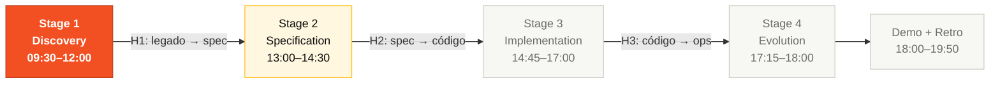

# Kit del Equipo — Español (LATAM)

> 🌐 **Idiomas:** [English 🇬🇧](../en/README.md) · [Português 🇧🇷](../pt-br/README.md) · **Español 🇲🇽 (aquí)**

> **EMPIEZA AQUÍ** si eres participante del workshop.
>
> 1. Lee [`TEAM-FLOW.md`](TEAM-FLOW.md) — cómo los 5 de ustedes cubren 10 personas en 5 Pairs (10 minutos)
> 2. Lee tus dos cartas de persona en [`personas/`](personas/) (15 minutos)
> 3. Abre la guía del Stage 1 en [`01-arqueologia/GUIDE.md`](01-arqueologia/GUIDE.md)

## Cómo se organiza esta carpeta

El kit es **trilingüe**, pero usa una **estructura híbrida**: solo la documentación instruccional se traduce; los assets técnicos viven en la raíz del kit y se comparten.

```
06-kit-repositorio-times/
│
├── es/ ← ESTÁS AQUÍ (español LATAM neutral)
│ ├── README.md
│ ├── TEAM-FLOW.md
│ ├── 01-arqueologia/
│ ├── 02-spec-moderna/
│ ├── 03-implementacao/
│ ├── 04-evolucao/
│ ├── personas/
│ └── cheat-sheets/
│
├── pt-br/ (espejo en portugués BR)
├── en/ (original en inglés)
│
├── legacy/ ← compartido, NO traducido (parte de la inmersión 1997)
├── persona-kits/ ← compartido, NO traducido (definiciones de agentes Copilot)
├── .github/ ← compartido, NO traducido (workflows y templates)
├── scripts/ ← compartido, NO traducido (setup.sh y check.sh)
├── .devcontainer/ ← compartido, NO traducido
└── plugins/ ← compartido (en producción)
```

## Por qué estructura híbrida

- **Sin duplicación de código.** Los 15 programas Natural, los 4 DDMs y los 10 persona-kits viven en un solo lugar. Actualización en 1 lugar, no en 3.
- **Inmersión preservada.** Los documentos en `legacy/legacy-docs/` están en portugués de 1997–2018 a propósito. Traducirlos rompería la autenticidad del escenario.
- **Los agentes de Copilot son código.** Los archivos en `.github/` y `persona-kits/` los consumen herramientas, no humanos. Traducirlos no ayuda.
- **Cada idioma es navegable.** Dentro de `es/` tienes un kit completo de contenido didáctico, con enlaces relativos a los assets compartidos (`../legacy/`, `../persona-kits/`).

## Edición

**20 equipos · 5 personas por equipo · 2 personas por persona · 5 Pairs cubriendo el SDLC completo.**

Este kit se distribuye a cada equipo al inicio del workshop. Trae un scaffold de repositorio listo para usar con templates de GitHub, instrucciones de Copilot, 10 cartas de persona, 10 kits de agentes Copilot equivalentes, y guías de flujo etapa por etapa — para que los equipos gasten su tiempo aprendiendo y construyendo, no configurando.

> **Piensa en este kit como una caja de herramientas.** Cada persona tiene sus herramientas especializadas (agentes Copilot, prompts, skills), y cada stage tiene su propio flujo de trabajo. Tu trabajo es tomar la herramienta correcta en el momento correcto y hacer un handoff limpio al siguiente Pair.

---

## Los 5 Pairs y las 10 Personas

Cada equipo tiene 5 personas. Cada persona elige **un Pair** (dos personas) y se queda en ese Pair todo el día. Las dos personas en un Pair son corresponsables — no hay handoff interno, hay colaboración continua. Lee **las dos** cartas de tu Pair en [`personas/`](personas/) antes del evento.

| # | Pair | Personas (una persona) | Es dueño de | Fase SDLC | Hace handoff a |
|---|------|------------------------|-------------|-----------|----------------|
| 1 | **Vision** | Product Owner + Requirements Engineer | Alcance, prioridades, EARS specs con REQ-IDs | Discovery + Specification (S1, S2) | Pair 2 |
| 2 | **Architecture** | Enterprise Architect + Software Architect | C4 L1/L2/L3, bounded contexts, ADRs | Specification + Design (S2) | Pairs 3 y 4 |
| 3 | **Implementation** | Technical Lead + Developer | Estándares de código, Java + TypeScript, revisión de PR, orquestación de agentes | Implementation + Evolution (S3, S4) | Pair 5 |
| 4 | **Quality** | DBA + QA Engineer | Esquema, migraciones Flyway, escenarios BDD, gates de cobertura | Implementation (S3) | Pair 5 |
| 5 | **Operations** | DevOps Engineer + Tech Writer | Terraform, CI/CD, glosario, claridad de ADRs, runbook | Cross-cutting + Evolution (S1–S4) | Demo |

> **Cada persona tiene su kit de agente Copilot equivalente en [`../persona-kits/`](../persona-kits/).** El kit te da un agente preconfigurado (`.github/agents/*.agent.md`), prompts (`.github/prompts/*.prompt.md`) y skills (`.github/skills/*/SKILL.md`) — copia **los dos** kits de tus personas a la carpeta `.github/` del repo de tu equipo.

> **La coordinación está en [`TEAM-FLOW.md`](TEAM-FLOW.md)**: diagramas de handoff a nivel Pair, timeline del día, onboarding de los primeros 30 minutos y las reglas de "atascado por 20 minutos".

---

## Dónde encaja en el SDLC



El evento de 8 horas fluye por 4 stages. Cada persona contribuye en cada stage, pero la **persona líder** cambia por stage.

```mermaid
flowchart LR
 subgraph S1["Stage 1 — Archaeology (60 min)<br/>Lead: Pair 1 (Vision) + Pair 5 (Operations)"]
 A1["Leer SIFAP legado<br/>(Natural + Adabas)<br/>con Copilot Chat"]
 A2["Construir glosario<br/>+ catálogo de reglas"]
 A3["Descubrir misterios<br/>escondidos"]
 end
 subgraph S2["Stage 2 — Modern Spec (45 min)<br/>Lead: Pair 2 (Architecture)"]
 B1["Specs EARS<br/>con Spec-Kit"]
 B2["Diagramas C4<br/>+ ADRs"]
 B3["Bounded contexts<br/>+ contratos de API"]
 end
 subgraph S3["Stage 3 — Implementation (120 min)<br/>Lead: Pair 3 + Pair 4"]
 C1["Backend Java<br/>(Copilot Agent)"]
 C2["Frontend Next.js<br/>(Copilot Agent)"]
 C3["Tests + migraciones<br/>+ CI verde"]
 end
 subgraph S4["Stage 4 — Evolution (45 min)<br/>Lead: Pair 5 + Pair 3"]
 D1["Terraform IaC<br/>+ GitHub Actions"]
 D2["Agent-mode<br/>delegación vía Issues"]
 D3["Demo prep<br/>+ retrospectiva"]
 end

 S1 --> S2 --> S3 --> S4
```



---

## Estructura de carpetas

### Dentro del kit (lo que tu equipo edita)

| Path | Propósito |
|------|-----------|
| [`TEAM-FLOW.md`](TEAM-FLOW.md) | **LEER PRIMERO.** Timeline del día, handoffs, reglas de escalamiento |
| [`../legacy/`](../legacy/) | **EXPLORACIÓN OBLIGATORIA.** Copia del SIFAP legado (15 programas .NSN + 4 DDMs + 3 docs desactualizadas). Cada EARS del Stage 2 debe trazar hasta aquí. |
| [`01-arqueologia/`](01-arqueologia/) | Stage 1 — guía de arqueología de código legado, plantillas y el gate duro [`LEGACY-EXPLORATION-CHECKLIST.md`](01-arqueologia/LEGACY-EXPLORATION-CHECKLIST.md) |
| [`02-spec-moderna/`](02-spec-moderna/) | Stage 2 — especificación EARS (cada REQ necesita `source_legacy:`), plantilla de ADR, decisiones de alcance |
| [`03-implementacao/`](03-implementacao/) | Stage 3 — scaffolding de implementación y prompts para Copilot Agent |
| [`04-evolucao/`](04-evolucao/) | Stage 4 — guía de evolución con Terraform IaC y CI/CD |
| [`cheat-sheets/`](cheat-sheets/) | Tarjetas de referencia rápida: 3 modos de Copilot, Specky, model routing |
| [`personas/`](personas/) | Las 10 cartas de persona (lee la tuya antes de empezar) |
| [`../persona-kits/`](../persona-kits/) | 10 kits de agentes Copilot (uno por persona) con agentes, prompts, instrucciones y skills |
| [`../plugins/`](../plugins/) | Integraciones opcionales (GitHub Issues, Azure Boards) |
| [`../scripts/`](../scripts/) | `setup.sh` (bootstrap) y `check.sh` (correr todos los gates de CI localmente) |
| [`../.github/`](../.github/) | Workflows (incl. gate `legacy-traceability`), templates de issue, template de PR, copilot-instructions |
| [`../.devcontainer/`](../.devcontainer/) | Entorno de desarrollo preconfigurado (Java 21, Node 20, Docker) |

> **Por qué se incluye una copia del legado.** En la edición anterior del workshop algunos equipos escribieron specs sin leer el código legado. Sus prototipos perdieron reglas de negocio reales de 29 años de SIFAP. Esta vez el legado vive al lado tuyo y el Stage 2 no cierra sin trazabilidad.

### Materiales de referencia (clonados read-only por `scripts/setup.sh`)

Después de correr `./scripts/setup.sh`, los siguientes symlinks apuntan al repo principal del workshop:

| Symlink | Origen | Propósito |
|---------|--------|-----------|
| `prototype/` | [`04-prototipo-sifap-moderno/`](https://github.com/paulasilvatech/workshop-legacy-modernization-datacorp/tree/main/04-prototipo-sifap-moderno) | Prototipo de referencia Java + Next.js — clónalo en tu repo como punto de partida |
| `infra/` | [`05-terraform-azure/`](https://github.com/paulasilvatech/workshop-legacy-modernization-datacorp/tree/main/05-terraform-azure) | Módulos Terraform Azure — copia lo que necesites a tu carpeta `infra/` |

> **No edites nada dentro de `legacy/`.** Trátalo como una pieza de museo.
> El prototipo y la infra son puntos de partida — copia las partes que necesites al working tree de tu equipo.

---

## Reglas de traducción

| Se mantiene en inglés | Se traduce |
|-----------------------|------------|
| Nombres de productos: GitHub Copilot, Spec-Kit, Next.js, Spring Boot, Terraform, PostgreSQL, Azure, Docker | Verbos, narrativa, ejemplos |
| Términos técnicos consagrados: REQ-ID, EARS, ADR, C4, CI/CD, PR, commit, branch, MCP, DDM, OAuth2, JWT, IaC | Conceptos pedagógicos: "una especificación es como…" |
| Comandos shell, código, paths, nombres de archivo | Banners, encabezados, listas |
| Contenido de `.github/`, `persona-kits/`, `legacy/` | Definiciones, "Por qué", "Cómo pensar" |
| Nombres de Pairs (Vision, Architecture, Implementation, Quality, Operations) | — |

---

## Cómo usar este kit

```bash
# 1. Copia el kit al repositorio vacío de tu equipo
cp -r 06-kit-repositorio-times/. ~/team-XX-repo/

# 2. Bootstrap (clona materiales de referencia, configura symlinks, verifica herramientas)
cd ~/team-XX-repo
./scripts/setup.sh

# 3. Abre en VS Code
code .

# Luego: Ctrl+Shift+P > "Dev Containers: Reopen in Container"
```

Dentro del devcontainer:

```bash
# 1. Lee primero el team flow (10 minutos)
cat es/TEAM-FLOW.md

# 2. Lee LAS DOS cartas de tus personas (15 minutos)
cat es/personas/XX-persona-A.md
cat es/personas/YY-persona-B.md

# 3. Copia LOS DOS kits de agente Copilot a tu repo en .github/
cp -r persona-kits/XX-persona-A/.github/* .github/
cp -r persona-kits/YY-persona-B/.github/* .github/

# 4. Abre la guía del Stage 1 y arranca
cat es/01-arqueologia/GUIDE.md
```

---

## Referencias

- [Workshop Blueprint](../../01-blueprint/WORKSHOP-BLUEPRINT.md) — diseño general del evento
- [SIFAP Modern Specification](../../03-spec-sifap-moderno/SPECIFICATION.md) — ejemplo de spec gold-standard
- [Reference Prototype](../../04-prototipo-sifap-moderno/README.md) — codebase Java + Next.js corriendo
- [Facilitator Playbook](../../07-playbook-facilitacao/README.md) — qué hacen los facilitadores
- [Evaluation Rubric](../../07-playbook-facilitacao/EVALUATION-RUBRIC.md) — cómo se puntúa a tu equipo

---

## Navegación

| Anterior | Inicio | Siguiente |
|----------|--------|-----------|
| [05 - Terraform Azure](../../05-terraform-azure/README.md) | [Workspace Root](../../README.md) | [Team Flow (ES)](TEAM-FLOW.md) |

— Paula
