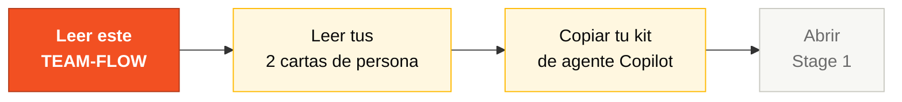
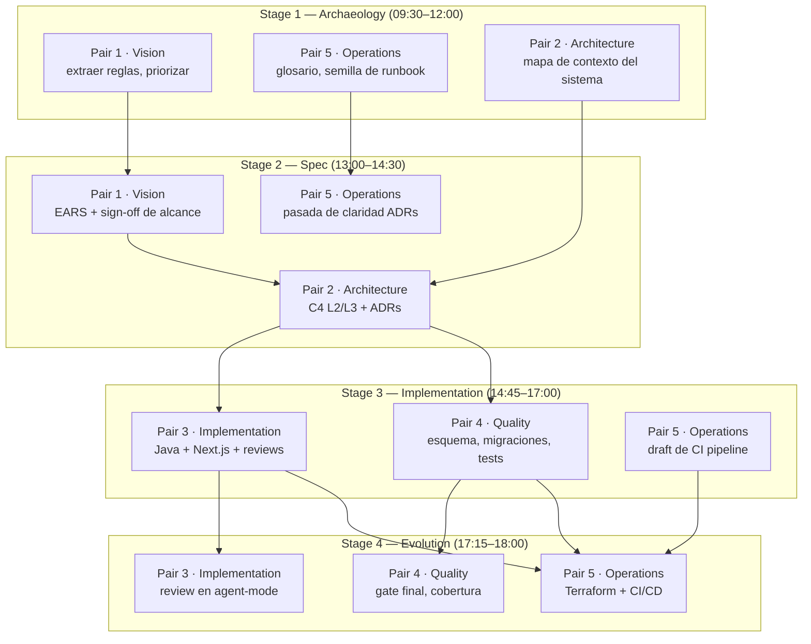

# Team Flow — Cómo los 5 de ustedes cubren 10 personas

> **Lee esto antes de leer tus cartas de persona.** Tus dos personas solo tienen sentido dentro del flujo del equipo.

**Edición: 20 equipos · 5 personas por equipo · 2 personas por persona · 5 Pairs cubriendo el SDLC completo.**

Un equipo de 5 con 10 personas solo funciona si cada persona sabe:

1. **Qué fase del SDLC** lidera cada una de sus dos personas.
2. **Quién le alimenta trabajo** (el Pair upstream).
3. **A quién le hace handoff** (el Pair downstream).
4. **Cuándo pedir ayuda** (la regla de los 20 minutos).

Este documento responde las cuatro. Pínealo a tu pantalla.

---

## Dónde encaja en el SDLC



**Estás en el momento previo al Stage 1.** Lo que decidas en estos primeros 30 minutos define la productividad del resto del día. Sin saber qué Pair eres y a quién le haces handoff, no hay equipo — hay 5 individuos.

---

## 1. Los 5 Pairs y su fase SDLC

Cada persona elige **un Pair** (dos personas). Las dos personas en un Pair son corresponsables — no hay handoff interno entre ellas, colaboran continuamente.

| # | Pair | Personas | Fase SDLC propia | Color |
|---|------|----------|------------------|-------|
| 1 | **Vision** | Product Owner + Requirements Engineer | Discovery + Specification | Rojo |
| 2 | **Architecture** | Enterprise Architect + Software Architect | Specification + Design | Amarillo |
| 3 | **Implementation** | Technical Lead + Developer | Implementation + Evolution | Verde |
| 4 | **Quality** | DBA + QA Engineer | Implementation (datos + tests) | Azul |
| 5 | **Operations** | DevOps Engineer + Tech Writer | Cross-cutting + Evolution | Negro |

> Cartas de persona: ver [`personas/`](personas/). Kits completos (prompts, MCP, hooks): ver [`../persona-kits/`](../persona-kits/).

### División interna del Pair (sugerida, no obligatoria)

| Pair | Foco persona A | Foco persona B |
|------|----------------|----------------|
| 1 · Vision | **PO**: alcance, valor, prioridades, demo script | **RE**: requerimientos EARS, criterios de aceptación, REQ-IDs |
| 2 · Architecture | **EA**: C4 L1 (system context), ADRs de topología | **SA**: C4 L2/L3 (contenedores + componentes), bounded contexts |
| 3 · Implementation | **TL**: estándares, revisión de PR, orquestación de agentes | **Dev**: código Java + TypeScript, tests unitarios |
| 4 · Quality | **DBA**: esquema PostgreSQL, migraciones Flyway | **QA**: escenarios BDD, gates de cobertura, contract tests |
| 5 · Operations | **DevOps**: Terraform, GitHub Actions, secretos | **TW**: glosario, pasada de claridad en ADRs, runbook, README |

Roten dentro del Pair cada ~45 min para que ninguna persona sola sea dueña de todo el conocimiento.

---

## 2. Timeline del día (8 horas, Día 2)

```
09:00 09:30 12:00 13:00 16:00 17:00
 |-----|-----------------------| |-----|------------|---------|
 | S1 Stage 1 Archaeology | ALMUERZO | S2 Spec S3 Implem S4 Evol
```

| Hora | Bloque | Pairs líderes | Pairs de apoyo |
|------|--------|---------------|----------------|
| **09:00–09:30** | Apertura + setup | Todos | Leer TEAM-FLOW, tus cartas de persona, copiar tu kit |
| **09:30–10:30** | Stage 1 — Archaeology (excavar) | **Pair 1** (PO+RE), **Pair 5** (TW) | Pair 2 mapea contexto de sistema; Pairs 3, 4 leen prototipo |
| **10:30–11:30** | Stage 1 — Síntesis | **Pair 1** (PO+RE) | Pair 2 inicia draft C4 L1; Pair 5 consolida glosario |
| **11:30–12:00** | **Handoff #1** legado → spec | Pair 1 → Pair 2 | Pair 5 apoya claridad de ADRs |
| **12:00–13:00** | ALMUERZO | — | — |
| **13:00–14:30** | Stage 2 — Modern Spec | **Pair 2** (EA+SA) | Pair 1 valida alcance; Pair 5 claridad de ADRs |
| **14:30–14:45** | **Handoff #2** spec → código | Pair 2 → Pairs 3 + 4 | Pair 1 firma el alcance |
| **14:45–17:00** | Stage 3 — Implementation | **Pair 3** (TL+Dev), **Pair 4** (DBA+QA) | Pair 5 arranca draft de pipeline |
| **17:00–17:15** | **Handoff #3** código → ops | Pair 3 → Pair 5 | Pair 4 sigue con tests finales |
| **17:15–18:00** | Stage 4 — Evolution | **Pair 5** (DevOps+TW), **Pair 3** (TL+Dev) | Pair 4 gate final de cobertura |
| **18:00–18:30** | Demo prep | Pair 1 + Pair 3 | Todos ensayan 30 segundos cada uno |
| **18:30–19:10** | **Demos** (20 equipos × ~3 min) | Equipo completo | — |
| **19:10–19:50** | Retrospectiva | Todos | Cada persona llena su formulario |
| **19:50–20:00** | Cierre | — | — |

> Nadie está ocioso. Los Pairs que no son "líderes" en un stage tienen trabajo de apoyo concreto — ver §4.

---

## 3. Mapa de handoffs (swimlanes a nivel Pair)



### Cómo leer el mapa

- **Las flechas son dependencias bloqueantes.** Sin que el Pair 2 entregue ADRs, los Pairs 3 y 4 no pueden arrancar el trabajo correcto.
- **La posición vertical es tiempo.** Más arriba = más temprano en el día.
- **Cada handoff es un walkthrough de 5 minutos** entre el Pair que sale y el que entra. Nada de "léelo después en el doc". Háblenlo cara a cara.

---

## 4. Qué hace cada Pair en cada stage

Ningún Pair se sienta. Aun cuando no es "líder", cada Pair tiene trabajo de apoyo explícito.

| Pair | Stage 1 (Archaeology) | Stage 2 (Spec) | Stage 3 (Implementation) | Stage 4 (Evolution) |
|------|----------------------|----------------|--------------------------|---------------------|
| **1 · Vision** | **Líder.** Extrae reglas; PO prioriza alcance. | Valida EARS; firma alcance en H2. | On-call para aclarar requerimientos. Construye narrativa del demo. | Ensayo del demo. |
| **2 · Architecture** | Mapea contexto del sistema (draft C4 L1). | **Líder.** C4 L2/L3 + ADRs. | On-call para preguntas de límites; revisa PRs que tocan contratos. | Valida IaC contra ADRs. |
| **3 · Implementation** | Lee prototipo, define convenciones (branches, PR template, DoD). | Comenta viabilidad; estima complejidad. | **Líder.** Código, tests, integración. | **Co-líder.** Delegación en agent-mode, revisión de PR. |
| **4 · Quality** | Lee DDMs, planea mapeo de esquema. | Comenta implicaciones de datos; escribe primeros escenarios BDD. | **Líder.** Esquema, migraciones, cobertura de tests. | Gate final de cobertura; contract tests en CI. |
| **5 · Operations** | Glosario, semilla de runbook, esqueleto de README. | Pasada de claridad de ADRs; voz consistente de escritura. | Draft del scaffolding del CI pipeline. | **Líder.** Terraform + CI/CD completos; runbook finalizado. |

---

## 5. Primeros 30 minutos — Checklist por Pair

A las 09:00, **cada Pair** hace las mismas 4 cosas en los primeros 30 minutos. Después arranca la especialización.

| Paso | Acción | Tiempo |
|------|--------|--------|
| 1 | Lee [`TEAM-FLOW.md`](TEAM-FLOW.md) (este archivo) | 10 min |
| 2 | Lee tus dos cartas en [`personas/`](personas/) | 10 min |
| 3 | Copia tu kit de Copilot: `cp -r persona-kits/XX-persona-A/.github/* .github/` (repite para la persona B) | 5 min |
| 4 | Abre Copilot Chat, corre el prompt smoke-test de una de tus cartas | 5 min |

### Movida inicial 09:30 por Pair

| Pair | Acción 09:30 |
|------|--------------|
| **1 · Vision** | PO abre [`01-blueprint/WORKSHOP-BLUEPRINT.md`](../../01-blueprint/WORKSHOP-BLUEPRINT.md); RE abre [`02-cenario-sifap-legado/natural-programs/`](../../02-cenario-sifap-legado/natural-programs/) y arranca el catálogo de reglas. |
| **2 · Architecture** | EA abre [`02-cenario-sifap-legado/legacy-docs/`](../../02-cenario-sifap-legado/legacy-docs/) y arranca C4 L1; SA prepara candidatos de bounded context. |
| **3 · Implementation** | TL define estrategia de branches, template de PR, definition of done; Dev corre `docker compose up` en el prototipo. |
| **4 · Quality** | DBA abre [`02-cenario-sifap-legado/adabas-ddms/`](../../02-cenario-sifap-legado/adabas-ddms/) y arranca el mapeo de campos; QA lee el layout de tests existente en [`04-prototipo-sifap-moderno/`](../../04-prototipo-sifap-moderno/). |
| **5 · Operations** | DevOps abre [`05-terraform-azure/`](../../05-terraform-azure/) y revisa módulos; TW abre el template [`01-arqueologia/glossary.md`](01-arqueologia/glossary.md). |

---

## 6. La regla de los 20 minutos

> **Si tú (o tu Pair) están atascados con el mismo problema por 20 minutos, paren y pidan ayuda.**

La regla aplica para todos. Pedir no es debilidad; sufrir en silencio sí lo es.

### Escalera de escalamiento

| Atascado por | Habla con |
|--------------|-----------|
| 5 min | Intenta Copilot Chat con otro framing, o con tu pareja del Pair |
| 10 min | Habla con tu Pair upstream/downstream directo (ver §3) |
| 20 min | Habla con el **Pair 3** (el TL coordina al equipo) |
| 30 min | Levanta la mano para un facilitador (cordón azul) |

### Cómo escalar (formato de 3 líneas)

```
1. Goal: Qué intento lograr
2. Tried: Qué ya intenté (con resultados)
3. Block: Qué me está bloqueando ahora
```

Mal: *"Esto no funciona."*
Bien: *"Goal: validar CPF en `BeneficiaryService`. Tried: regex + sugerencia de Copilot (los dos fallan con todos ceros). Block: no estoy seguro si mod-11 debe rechazar 00000000000 explícitamente."*

---

## 7. Definition of Done — Por handoff

### Handoff #1 — Legado → Spec (fin del Stage 1, ~12:00)

**Dueño:** Pair 1 (Vision)
**Receptores:** Pair 2 (Architecture), Pair 5 (Operations)

| Artefacto | Ubicado en | Done significa |
|-----------|------------|----------------|
| Glosario | [`01-arqueologia/glossary.md`](01-arqueologia/glossary.md) | ≥ 30 términos con definiciones (Pair 5 dueño de la voz) |
| Catálogo de reglas de negocio | [`01-arqueologia/business-rules-catalog.md`](01-arqueologia/business-rules-catalog.md) | ≥ 15 reglas con referencia al programa fuente |
| Mapa de dependencias | [`01-arqueologia/dependency-map.md`](01-arqueologia/dependency-map.md) | Diagrama Mermaid cubriendo los 15 Naturals |
| Misterios encontrados | [`01-arqueologia/mysteries-found.md`](01-arqueologia/mysteries-found.md) | ≥ 5 reglas escondidas identificadas con evidencia |

### Handoff #2 — Spec → Código (fin del Stage 2, ~14:30)

**Dueño:** Pair 2 (Architecture)
**Receptores:** Pair 3 (Implementation), Pair 4 (Quality)

| Artefacto | Ubicado en | Done significa |
|-----------|------------|----------------|
| Especificaciones EARS | [`02-spec-moderna/`](02-spec-moderna/) (por Spec-Kit) | ≥ 12 requerimientos con REQ-IDs |
| Diagramas C4 | `02-spec-moderna/diagrams/` | Niveles 1, 2, 3 en Mermaid |
| ADRs | `02-spec-moderna/ADRs/` | ≥ 3 ADRs (monolito modular, persistencia, autenticación) |
| Sign-off de alcance | Registrado en PR | Pair 1 (PO) aprobó el alcance |

### Handoff #3 — Código → Ops (fin del Stage 3, ~17:00)

**Dueño:** Pair 3 (Implementation)
**Receptores:** Pair 5 (Operations)

| Artefacto | Ubicado en | Done significa |
|-----------|------------|----------------|
| Backend funcionando | `04-prototipo-sifap-moderno/backend/` | `mvn test` verde; OpenAPI documentada |
| Frontend funcionando | `04-prototipo-sifap-moderno/frontend/` | `npm test` verde; flujos principales usables |
| Migraciones | `backend/src/main/resources/db/migration/` | Scripts Flyway numerados; idempotentes (Pair 4 dueño) |
| Reporte de cobertura | Artefacto CI | Backend ≥ 70%, frontend ≥ 60% líneas (Pair 4 verifica) |

---

## 8. Patrones de comunicación

| Patrón | Cuándo | Ejemplo |
|--------|--------|---------|
| **Stand-up** | En cada transición de stage (4×) | Ronda de 2 min, una frase por Pair: "Terminamos X, haciendo Y, bloqueados por Z" |
| **Check-in del Pair** | Cada 30 min dentro de un stage | "¿Los dos seguimos alineados?" |
| **Sync Pair-a-Pair** | En los handoffs | Walkthrough de 5 minutos, sin slides |
| **Comentarios de PR** | Async entre Pairs | Etiqueta al Pair receptor explícitamente (`@par-3`) |
| **Hora de silencio** | Últimos 30 min del Stage 3 | Sin reuniones; todos codean/testean |

---

## 9. Antipatrones (no hagas esto)

| ❌ Antipatrón | ✅ Hazlo así |
|--------------|--------------|
| Una persona del Pair hace todo | Roten cada ~45 min; la otra persona se mantiene caliente |
| Saltar un handoff — "yo cubro su parte también" | Walkthrough Pair-a-Pair de 5 minutos en cada transición |
| Pair 4 (Quality) espera al final del Stage 3 para empezar | Pair 4 escribe escenarios BDD apenas existen los REQ-IDs (mediados del Stage 2) |
| Pair 5 (Operations) ocioso hasta el Stage 4 | Pair 5 lidera glosario en S1, claridad de ADRs en S2, scaffolding CI en S3 |
| Pair 1 (Vision) desaparece después del Stage 1 | El PO valida alcance en H2 y dirige el ensayo del demo en S4 |
| Pair 3 mergea sin revisión | Cada PR tiene al menos una revisión cross-Pair |

---

## 10. Referencia rápida

```
¿Qué Pair soy? → §1 (tabla de los 5 Pairs)
¿Qué hace mi Pair en el stage N? → §4 (matriz Pair × stage)
¿Atascado? → regla de 20 minutos (§6)
¿Necesito hacer handoff? → criterios de done (§7)
¿Qué modo de Copilot? → cheat-sheets/copilot-3-modes.md
¿Qué modelo? → cheat-sheets/model-routing.md
¿Qué agente de Spec-Kit? → cheat-sheets/specky-workflow.md
```

---

## Navegación

| Anterior | Inicio | Siguiente |
|----------|--------|-----------|
| [Kit del Equipo (ES)](README.md) | [Workspace Root](../../README.md) | [Stage 1 — Archaeology (ES)](01-arqueologia/README.md) |

— Paula
