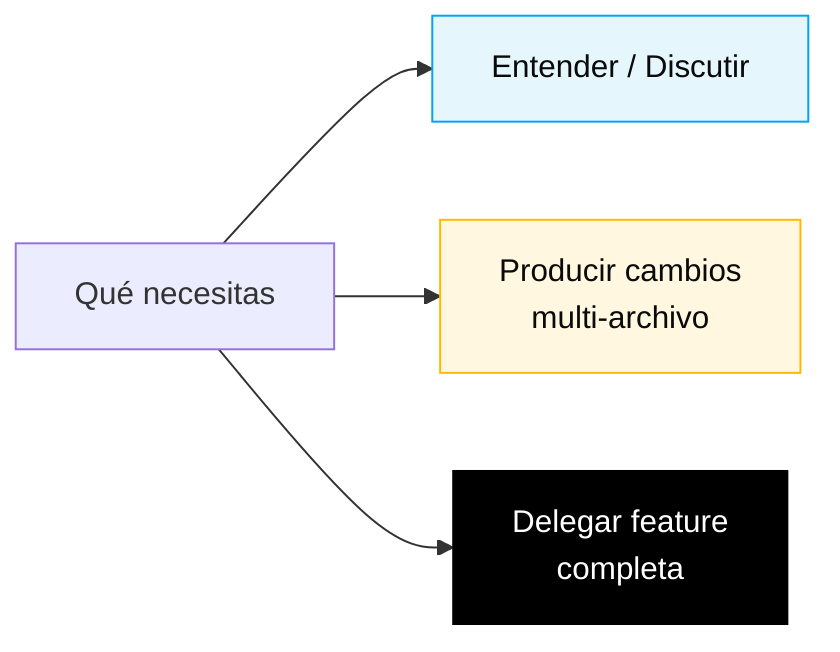

# GitHub Copilot en 3 modos — Cheat sheet

## Cómo pensar en esto

## Decisión rápida

| Situación | Modo | Por qué |
|-----------|------|---------|
| Entender código, discutir diseño, planear un approach | **Chat** | Conversación, costo bajo, reversible |
| Crear/editar varios archivos relacionados a la vez | **Edits** | Vista multi-archivo, tú revisas el diff |
| Delegar una tarea completa (issue → PR) | **Agent** | Trabaja solo, tú revisas al final |

## Chat — Conversación

**Úsalo cuando**: todavía no sabes qué quieres; quieres entender; quieres discutir; quieres evaluar un trade-off.

**Frases que funcionan:**
- "Explain what this Natural program does line by line."
- "What are the risks of using `JSONB` to store the history of bank accounts?"
- "Summarize this DDM in 5 lines for someone who doesn't know Adabas."
- "Challenge the following ADR: `{paste ADR}`."

**Errores comunes:**
- Usar Chat para generar un archivo. Usa Edits.
- Aceptar una respuesta sin validar. Copilot alucina — siempre verifica.
- Prompts demasiado cortos ("ayuda"). Da contexto: qué tienes, qué quieres, qué ya intentaste.

## Edits — Edición en bloque

**Úsalo cuando**: sabes qué quieres; necesitas cambios en varios archivos; tienes contexto estructurado.

**Frases que funcionan:**
- "Create the `beneficiary`, `agreement`, `payment` modules with a standard Spring Boot package structure."
- "Add a unit test for every public method of `PaymentService`."
- "Rename `Convenio` to `Agreement` across the whole project and update references."
- "For every existing Flyway migration, add a commented-out rollback."

**Errores comunes:**
- Alcance demasiado amplio. Divídelo en pasos.
- No revisar el diff. Siempre mira antes de aceptar.
- Mezclar cambios de lógica con renames. Un PR por propósito.

## Agent — Delegación con autonomía

**Úsalo cuando**: tienes un issue bien descrito, aceptas que va a tardar, y estás dispuesto a revisar un PR generado por alguien que no eres tú.

**Cómo prepararte**:
1. Escribe el issue con **contexto, criterios de aceptación y alcance**.
2. Apunta a los archivos relevantes ("read `docs/adr/001.md` before starting").
3. Di qué NO hacer ("do not change the PostgreSQL schema").

**Follow-up**: no operes mientras el Agent corre. Déjalo. Verifica cada ~10 minutos que el camino tenga sentido.

**Revisando un PR del Agent**: exactamente como revisar un PR humano. Una revisión rápida sigue siendo una revisión.

**Errores comunes:**
- Issue vago → el Agent entrega basura.
- Disparar al Agent para una tarea de 5 minutos que Edits resolvería.
- Mergear sin revisar porque "es el Agent".

## Regla de oro

> Si no hubieras sabido que era IA, ¿aceptarías este código en tu proyecto? Si no, rechaza o refínalo. Copilot acelera a quien sabe; no reemplaza el juicio.

---

## Navegación

| Anterior | Inicio | Siguiente |
|----------|--------|-----------|
| [Cheat Sheets](README.md) | [Kit del Equipo (ES)](../README.md) | [Model routing](model-routing.md) |

— Paula
