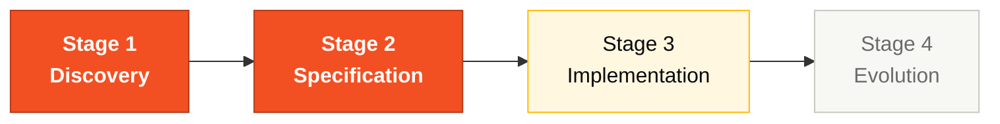

# Persona — Product Owner

## Dónde encaja en el SDLC

**Pair:** 1 · Vision · **Recibe de:** kick-off del día · **Hace handoff a:** Pair 2 (Architecture)

## Quién es esta persona

Dueña del "porqué". La que evita que el equipo se pierda construyendo código bonito para el problema equivocado. En el contexto del SIFAP 2.0, el PO sabe que 2.3 millones de beneficiarios dependen del sistema, sabe que el ciclo mensual es sagrado y carga esa prioridad a cada decisión técnica.

## Misión en el workshop

Traducir el escenario SIFAP en alcance ejecutable a lo largo de las ocho horas del día. Proteger el valor de negocio cuando el equipo empiece a querer reconstruir el legado línea por línea. Priorizar, recortar, explicar.

## Tu rol en el framework Agentic Legacy Modernization

Este workshop aplica el framework **Agentic Legacy Modernization** — un approach a modernización de sistemas legados usando agentes de IA especializados en cada fase. El pipeline completo está descrito en `01-blueprint/WORKSHOP-BLUEPRINT.md`. Tu persona mapea al pipeline así:

- **Agentes relevantes**: Discovery Agent (S1), Analysis Agent (S1–S2)
- **Fase del framework**: Assessment and Code Archaeology → Application Carving
- **Tu rol en el pipeline**: definir el alcance del carving y priorizar los bounded contexts para migración

## Dónde apareces por stage

| Stage | Tú haces esto | Entregable que depende de ti |
|-------|---------------|------------------------------|
| 1. Archaeology | Lideras la construcción del glosario y la captura de los "porqués" de las reglas. Mantienes una lista de preguntas de negocio abiertas. | Glosario + "lista de misterios" priorizada |
| 2. Greenfield Spec | Decides qué entra en v1 y qué se vuelve backlog. Tienes el voto final del alcance. | Sección "Alcance y no-alcance" de la spec |
| 3. Reconstruction | Validas que las user stories siguen reflejando el negocio a medida que sale el código. Desbloqueas preguntas funcionales. | Criterios de aceptación funcional por feature |
| 4. Evolution with Agent | Escribes los dos Issues que el Agent va a consumir. Validas que el PR entregado resuelve la necesidad de negocio. | Dos issues bien escritos en `.github/ISSUE_TEMPLATE/` |

## Herramientas y primitivas

- **Copilot Chat** para refinar user stories y criterios de aceptación.
- **Specky** en el Stage 2: la fase de Vision y Requirements es el terreno natural del PO.
- **Cowork** si necesitas escribir briefings ejecutivos o notas de decisión.
- **Templates** del repo `25-personas-primitives` — prompts listos para escribir historias, recortes de alcance y comunicación de riesgo.

## Cheat sheets que usas

- [`cheat-sheets/copilot-3-modes.md`](../cheat-sheets/copilot-3-modes.md) — para saber cuándo es Chat (la mayoría de tu día), cuándo Edits (raro para ti) y cuándo Agent (Stage 4).
- [`cheat-sheets/specky-workflow.md`](../cheat-sheets/specky-workflow.md) — especialmente las fases 1 (Vision) y 2 (Requirements).

## Cómo te va bien

- Decir "esto queda fuera de v1" tres veces al día sin parpadear.
- Conectar cada ADR a un impacto concreto en el beneficiario o en el operador.
- Proteger el foco del equipo cuando alguien sugiera refactorizar algo que ya funciona.
- Escribir los dos Issues del Stage 4 con suficiente contexto para que el Agent trabaje solo.

## Cómo te pierdes

- Atascarte en detalles técnicos que no son tuyos.
- Dejar que el equipo reconstruya el legado programa por programa.
- Escribir Issues vagos y que el Agent produzca basura.
- No recortar alcance y que el Stage 3 termine incompleto.

## Si tomaste dos personas

- PO + **Requirements Engineer** es la combinación natural. Tú escribes las reglas; el RE las estructura y las testea.
- PO + **Tech Writer** también funciona para equipos con perfil más comunicacional.

## 3 prompts de ejemplo

1. **(Chat)** "Analyze the CALCBENF.NSN program from legacy SIFAP and list the 5 business rules with the highest impact on the beneficiary. For each one, say whether it should be migrated, discarded, or evolved."
2. **(Chat)** "Review these 3 user stories and rewrite them as GitHub issues in the format Copilot Agent can consume. Include context, functional requirements as a checklist, and acceptance criteria."
3. **(Chat)** "The team wants to implement 8 features in 3 hours. Based on complexity, help me cut down to the 3 most critical for the monthly payment cycle."

## Si te atascas (defaults de emergencia)

- **¿Atascado en priorización?** Aplica la regla: "Si afecta al ciclo mensual de pagos → v1. Si no → backlog."
- **¿No sabes cómo escribir un Issue?** Copia el template de `04-evolucao/GUIDE.md` y adáptalo.
- **¿El equipo quiere todo en alcance?** Di: "tenemos 3 horas de implementación; elijan 3 features."
- **¿Pregunta de negocio sin respuesta?** Documenta como asunción y sigue.

## Dependencias — Quién depende de ti

| Persona | Relación | Artefacto |
|---------|----------|-----------|
| Requirements Engineer | Depende de TI | Priorización de reglas para convertir en EARS |
| Technical Lead | Depende de TI | Alcance definido para calibrar el Stage 3 |
| Developer | Depende de TI (S4) | Issues bien escritos para el Agent |
| Enterprise Architect | TÚ dependes de él | Mapa de integraciones para decisiones de alcance |

## Cómo te evalúan

- **Rúbrica A2 (Spec Coherence):** alcance claro, no-alcance documentado.
- **Rúbrica A7 (Agent Experience):** Issues con suficiente contexto para que el Agent produzca un PR útil.
- Evaluado indirectamente en **A6 (Collaboration):** PO que protege el foco del equipo.

---

## Navegación

| Anterior | Inicio | Siguiente |
|----------|--------|-----------|
| [Personas — README](README.md) | [Kit del Equipo (ES)](../README.md) | [Requirements Engineer](02-requirements-engineer.md) |

— Paula
