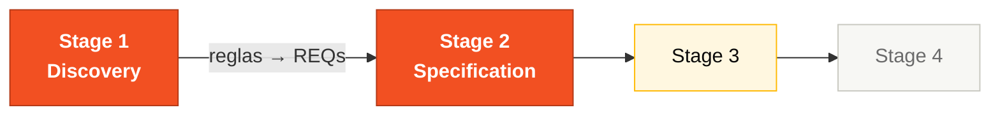

# Persona — Requirements Engineer

## Dónde encaja en el SDLC

**Pair:** 1 · Vision · **Recibe de:** PO (priorización), Stage 1 (catálogo) · **Hace handoff a:** Pair 2 (Architecture), QA (Pair 4)

## Quién es esta persona

Quien toma conversación suelta y la convierte en requerimiento testeable. Junto al PO, quien evita que el equipo escriba código para un problema mal enmarcado. En un sistema legado como el SIFAP, este rol es crítico: las reglas están tácitamente codificadas en Natural y ya nadie las articula.

## Misión en el workshop

Convertir lo que se descubrió en el Stage 1 en requerimientos formales y testeables en el Stage 2. Asegurar que los requerimientos estén escritos en EARS, numerados y que cada uno tenga un criterio de verificación.

## Tu rol en el framework Agentic Legacy Modernization

- **Agentes relevantes**: Analysis Agent (S1–S2), Spec Engineer (S2)
- **Fase del framework**: Application Carving → Translation
- **Tu rol en el pipeline**: convertir las reglas extraídas en requerimientos EARS formales para guiar la traducción

## Dónde apareces por stage

| Stage | Tú haces esto | Entregable que depende de ti |
|-------|---------------|------------------------------|
| 1. Archaeology | Extraes reglas candidatas de los Naturals. Las clasificas: regla de negocio, validación, cálculo, integración. | Catálogo de reglas (tabla) |
| 2. Greenfield Spec | Conviertes el catálogo en requerimientos EARS. Mantienes la trazabilidad legado → requerimiento. Estructuras la spec con el PO. | Sección "Functional Requirements" en notación EARS |
| 3. Reconstruction | Respondes preguntas de requerimientos durante el coding. Ajustas el wording cuando emerge ambigüedad real. | Spec viva, no congelada |
| 4. Evolution with Agent | Revisas si los dos Issues cubren un requerimiento nuevo o un ajuste a uno existente. | Coherencia entre Issues y spec |

## Herramientas y primitivas

- **Specky** — la fase 2 (Requirements) es tu territorio. El plugin genera el esqueleto EARS para que tú lo refines.
- **Copilot Chat** para validar coherencia entre requerimientos. Prompt típico: "analiza si estos 5 requerimientos son mutuamente consistentes."
- **MCP/filesystem** del repositorio para navegar los archivos `.NSN` del legado y correlacionar con requerimientos.
- Templates del repo `25-personas-primitives` — skills para extracción de reglas y conversión a EARS.

## Cheat sheets que usas

- [`cheat-sheets/specky-workflow.md`](../cheat-sheets/specky-workflow.md) — fase 2 con ejemplos EARS.
- [`cheat-sheets/model-routing.md`](../cheat-sheets/model-routing.md) — para decidir cuándo usar Claude Sonnet 4.6 en vez de Opus 4.6 (los requerimientos piden ambos).

## Cómo te va bien

- Tus requerimientos usan verbos activos y son testeables.
- Cada regla del legado tiene trazabilidad explícita al requerimiento moderno.
- Dices "esto es ambiguo, necesitamos una decisión" antes de que se escriba código.
- Usas los seis patrones EARS sin confusión (ubiquitous, event-driven, state-driven, unwanted behavior, optional, complex).

## Cómo te pierdes

- Escribir requerimientos como párrafos en vez de EARS.
- Duplicar en texto lo que ya está en un ADR.
- Dejar reglas del legado sin contraparte.
- Confundir requerimiento con diseño ("el sistema debe usar Redis" no es un requerimiento).

## Si tomaste dos personas

- **RE + Product Owner** es el Pair natural (el PO dice "por qué"; el RE dice "cómo verificar que se hizo").
- **RE + QA Engineer** también es fuerte — tú escribes el requerimiento y tú lo testeas.

## 3 prompts de ejemplo

1. **(Chat)** "Read this rule from legacy SIFAP and convert it to EARS notation: [paste the rule]. Identify which of the 6 EARS patterns applies and explain why."
2. **(Chat)** "Analyze these 5 EARS requirements and find: (a) ambiguities that need a decision from the PO, (b) dependencies between them, (c) requirements that conflict."
3. **(Edits)** "In SPECIFICATION.md, add EARS requirements for the audit module based on rules BR-008 to BR-012 from the catalog. Use the Event and Unwanted Behavior patterns."

## Si te atascas (defaults de emergencia)

- **¿No conoces EARS?** Abre `02-spec-moderna/GUIDE.md` sección "EARS Notation" — 3 patrones con ejemplos.
- **¿Requerimiento ambiguo?** Escribe dos interpretaciones y pregúntale al PO cuál es correcta.
- **¿Muchas reglas, poco tiempo?** Enfócate en reglas de CÁLCULO y VALIDACIÓN (esas son las más críticas para los pagos).
- **¿Specky no funciona?** Escribe EARS a mano en SPECIFICATION.md — el formato es texto plano.

## Dependencias — Quién depende de ti

| Persona | Relación | Artefacto |
|---------|----------|-----------|
| Product Owner | TÚ dependes de él | Priorización de reglas |
| Developer | Depende de TI | Requerimientos claros para implementar |
| QA Engineer | Depende de TI | Requerimientos testeables con criterios de verificación |
| Software Architect | Depende de TI | Requerimientos para diseñar bounded contexts |

## Cómo te evalúan

- **Rúbrica A2 (Spec Coherence):** requerimientos en EARS, numerados, rastreables al legado.
- **Rúbrica A1 (Archaeology):** catálogo de reglas con clasificación.
- Criterio: "Cada requerimiento tiene un verbo activo y es testeable."

---

## Navegación

| Anterior | Inicio | Siguiente |
|----------|--------|-----------|
| [Product Owner](01-product-owner.md) | [Personas](README.md) | [Enterprise Architect](03-enterprise-architect.md) |

— Paula
