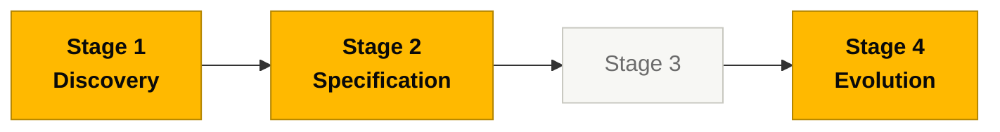

# Persona — Enterprise Architect

## Dónde encaja en el SDLC

**Pair:** 2 · Architecture · **Recibe de:** Pair 1 en H1, RE (integraciones) · **Hace handoff a:** SA (mismo Pair), Pair 3 + Pair 4 en H2, DevOps (topología)

## Quién es esta persona

Quien ve el sistema dentro de su ecosistema. En el SIFAP eso significa: SIAFI, Banco do Brasil, INCRA, MDA y otros sistemas gubernamentales internos. El EA sabe dónde están los contratos, cuáles son frágiles y cuáles pueden tocarse sin disparar toda la cadena.

## Misión en el workshop

Asegurar que SIFAP 2.0 no rompa el mundo a su alrededor. Dibujar el mapa de dependencias. Validar que la arquitectura objetivo respeta los contratos externos (sincrónico con SIAFI, asincrónico con BB) y que la estrategia de coexistencia con el legado es viable.

## Tu rol en el framework Agentic Legacy Modernization

- **Agentes relevantes**: Discovery Agent (S1), Deployment Agent (S4)
- **Fase del framework**: Assessment → Coexistence and Traffic Migration
- **Tu rol en el pipeline**: mapear dependencias externas y definir la estrategia de coexistencia (Strangler Fig)

## Dónde apareces por stage

| Stage | Tú haces esto | Entregable que depende de ti |
|-------|---------------|------------------------------|
| 1. Archaeology | Construyes el mapa de dependencias e integraciones (C4 nivel 1 — sistema en contexto). Identificas contratos externos. | Diagrama C4 Level 1 + inventario de integraciones |
| 2. Greenfield Spec | Defines decisiones de topología (dónde vive el sistema en la nube, quién es cliente de quién, qué APIs son sincrónicas y por qué). | ADRs de topología e integración (1–2) |
| 3. Reconstruction | Validas que la implementación respeta los contratos diseñados. Ayudas a DevOps con el Terraform de alto nivel. | Validación del layout desplegado |
| 4. Evolution with Agent | Evalúas si los Issues del Stage 4 tienen implicaciones arquitectónicas que necesitan revisarse primero. | Assessment de impacto |

## Herramientas y primitivas

- **Mermaid** y **C4** para diagramas.
- **Copilot Chat** para validar decisiones de topología con prompts de presión ("¿qué riesgo carga este diseño si SIAFI cae?").
- **Specky** en la fase 3 (Context/Architecture) — produce el C4 y el ADR automáticamente desde la spec.
- Skills del repo `25-personas-primitives` — prompts estructurados para análisis de dependencias.

## Cheat sheets que usas

- [`cheat-sheets/specky-workflow.md`](../cheat-sheets/specky-workflow.md) — fase 3.
- [`cheat-sheets/model-routing.md`](../cheat-sheets/model-routing.md) — usa **Opus 4.6** cuando hagas análisis de impacto arquitectónico.

## Cómo te va bien

- El C4 nivel 1 es legible por cualquier persona no-técnica del equipo en 30 segundos.
- Tus ADRs nombran el "camino no tomado" y dicen por qué.
- Anclas el Monolito Modular en el argumento — no como moda, sino por encaje con el contexto cliente.
- Te alineas con el Software Architect sobre dónde termina tu alcance y empieza el suyo.

## Cómo te pierdes

- Dibujar un diagrama que solo tú entiendes.
- Proponer microservicios (la arquitectura está fija — un ADR explicándolo es legítimo; insistir es esfuerzo desperdiciado).
- Olvidar las integraciones reales (SIAFI, BB) y que el Stage 3 lo descubra tarde.
- Duplicar el trabajo del Software Architect en vez de trazar una frontera clara.

## Si tomaste dos personas

- **EA + Software Architect** es la combinación más común en un equipo pequeño. Tú llevas C4 Level 1; tu pareja lleva los Levels 2 y 3.
- **EA + Technical Lead** también funciona si quieres involucrarte más hands-on.

## 3 prompts de ejemplo

1. **(Chat)** "Create a C4 Level 1 diagram in Mermaid for SIFAP 2.0 showing: 3 user types, the central system, and 4 external systems (SIAFI, Receita Federal, Banco do Brasil, CadUnico)."
2. **(Chat)** "If SIAFI goes offline for 2 hours during the monthly payment cycle, what is the impact? Propose 3 fallback strategies and recommend one."
3. **(Chat)** "Compare these 3 integration options with Banco do Brasil: CNAB batch, synchronous REST API, asynchronous messaging. Write an ADR recommending one."

## Si te atascas (defaults de emergencia)

- **¿No conoces C4?** Usa un flowchart simple en Mermaid: cajas = sistemas, flechas = integraciones. Etiqueta las flechas.
- **¿Tiempo quemado en C4 Level 3?** Detente. Level 1 + Level 2 alcanzan. Los equipos raramente necesitan L3.
- **¿No conoces Mermaid?** Pregúntale a Copilot: "Create a C4 level 1 diagram in Mermaid for a payment system that integrates with SIAFI and Banco do Brasil."
- **¿Discrepas con el Software Architect?** Escribe un ADR con las dos opciones y pídele al equipo que vote.

## Dependencias — Quién depende de ti

| Persona | Relación | Artefacto |
|---------|----------|-----------|
| Software Architect | Depende de TI | C4 L1 para dibujar L2/L3 |
| DevOps Engineer | Depende de TI | Topología para Terraform |
| Developer | Depende de TI (indirecto) | Contratos de integración |
| Requirements Engineer | TÚ dependes de él | Requerimientos de integración |

## Cómo te evalúan

- **Rúbrica A1 (Archaeology):** mapa de dependencias legible por lectores no-técnicos.
- **Rúbrica A2 (Spec Coherence):** los ADRs nombran el "camino no tomado".
- Criterio: "C4 L1 entendido en 30 segundos por cualquier persona del equipo."

---

## Navegación

| Anterior | Inicio | Siguiente |
|----------|--------|-----------|
| [Requirements Engineer](02-requirements-engineer.md) | [Personas](README.md) | [Software Architect](04-software-architect.md) |

— Paula
