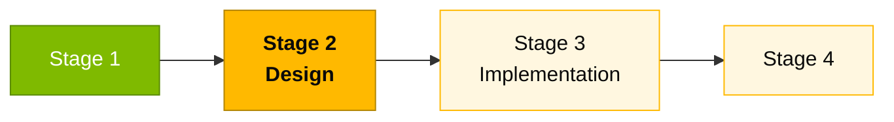

# Persona — Software Architect

## Dónde encaja en el SDLC

**Pair:** 2 · Architecture · **Recibe de:** EA (mismo Pair), RE (REQ-IDs) · **Hace handoff a:** Developer (estructura de paquetes), TL (patrones de módulo)

## Quién es esta persona

Dueña de la estructura interna del sistema. Decide cómo se organizan los módulos, dónde empiezan y terminan los bounded contexts, qué abstracciones se exponen y cuáles quedan privadas. Quien mantiene al Modular Monolith realmente modular.

## Misión en el workshop

Producir C4 niveles 2 y 3 coherentes con la spec. Definir los bounded contexts de SIFAP 2.0 (Beneficiary, Agreement, Payment, Adjustment, Cycle, Audit) y el patrón de comunicación entre ellos. Asegurar que el código del Stage 3 respeta los límites trazados.

## Tu rol en el framework Agentic Legacy Modernization

- **Agentes relevantes**: Analysis Agent (S2), Review Agent (S3)
- **Fase del framework**: Application Carving → Translation
- **Tu rol en el pipeline**: definir bounded contexts y asegurar un Monolito Modular coherente

## Dónde apareces por stage

| Stage | Tú haces esto | Entregable que depende de ti |
|-------|---------------|------------------------------|
| 1. Archaeology | Identificas conceptos recurrentes en los Naturals y empiezas a proponer bounded contexts candidatos. | Lista inicial de módulos/contextos |
| 2. Greenfield Spec | Dibujas C4 Level 2 y Level 3 para al menos dos contextos. Escribes el ADR de Monolito Modular. | Diagramas C4 + ADRs 1 y 2 |
| 3. Reconstruction | Estableces la estructura inicial del proyecto Spring (paquetes, capas). Revisas los PRs que cruzan fronteras de contexto. | `pom.xml` + layout de módulos + revisiones estructurales de PR |
| 4. Evolution with Agent | Validas que el PR del Agent respeta las fronteras. Rechazas merges que rompen la modularidad. | Modularidad preservada |

## Herramientas y primitivas

- **Copilot Edits** para crear esqueletos de módulo en paralelo.
- **Specky** — la fase 3 (Context) y la fase 4 (Architecture Decisions) son tu terreno.
- **Mermaid / C4** para diagramas.
- Skills específicas del SA en `25-personas-primitives` — prompts para decidir entre patrones (hexagonal vs. capas, por ejemplo).

## Cheat sheets que usas

- [`cheat-sheets/specky-workflow.md`](../cheat-sheets/specky-workflow.md) — fases 3 y 4.
- [`cheat-sheets/model-routing.md`](../cheat-sheets/model-routing.md) — Opus 4.6 para decisiones; Sonnet 4.6 para edición en batch.

## Cómo te va bien

- El layout de paquetes refleja los bounded contexts, no las capas técnicas.
- Tus ADRs son cortos, específicos y citan el documento 13 sección 5 cuando aplica.
- El Modular Monolith se mantiene monolito en deploy pero modular en código.
- Rediseñas las fronteras cuando hace falta, en vez de "pedir perdón después".

## Cómo te pierdes

- Dejar que el equipo organice por capas técnicas (controller/service/repository) en vez de por contextos.
- Escribir un ADR genérico ("usaremos Spring Boot") que no es una decisión real.
- Permitir que dos contextos importen clases del otro directamente.
- Intentar forzar hexagonal estricto donde no hay beneficio.

## Si tomaste dos personas

- **SA + Enterprise Architect** si el equipo es pequeño (haces C4 1 y 2/3).
- **SA + Technical Lead** es la combinación más productiva — diseñas y tocas el código.

## 3 prompts de ejemplo

1. **(Chat)** "Based on these EARS requirements, propose the bounded contexts of SIFAP 2.0. For each context list: entities, exposed services, and dependencies on other contexts."
2. **(Edits)** "In the Spring Boot project, create the package structure for a new bounded context 'notification' following the pattern of the existing ones (domain/application/infrastructure)."
3. **(Chat)** "Review this PR and identify imports that cross bounded context boundaries. For each violation, suggest how to isolate."

## Si te atascas (defaults de emergencia)

- **¿Bounded contexts confusos?** Empieza con 4: Beneficiary, Payment, Audit, Admin. Es lo que el prototipo ya usa.
- **¿Diagrama C4 L2 atascado?** Usa el ejemplo de `02-spec-moderna/GUIDE.md` como punto de partida.
- **¿El equipo se organizó por capas en vez de contextos?** No refactorices ahora — documéntalo en el ADR y arréglalo si queda tiempo.
- **¿Dudas si algo es domain o application?** "Si es regla de negocio pura, es domain. Si orquesta, es application."

## Dependencias — Quién depende de ti

| Persona | Relación | Artefacto |
|---------|----------|-----------|
| Enterprise Architect | TÚ dependes de él | C4 L1 para dibujar L2/L3 |
| Developer | Depende de TI | Estructura de paquetes para implementar |
| Technical Lead | Depende de TI | Patrones de módulo para enforcement |
| DBA | Depende de TI | Fronteras de contexto para el modelo de datos |

## Cómo te evalúan

- **Rúbrica A2 (Spec):** C4 L2/L3 coherente con los requerimientos.
- **Rúbrica A3 (Technical Integrity):** bounded contexts respetados en el código.
- Criterio: "Ningún import cruza una frontera de contexto sin justificación."

---

## Navegación

| Anterior | Inicio | Siguiente |
|----------|--------|-----------|
| [Enterprise Architect](03-enterprise-architect.md) | [Personas](README.md) | [Technical Lead](05-technical-lead.md) |

— Paula
