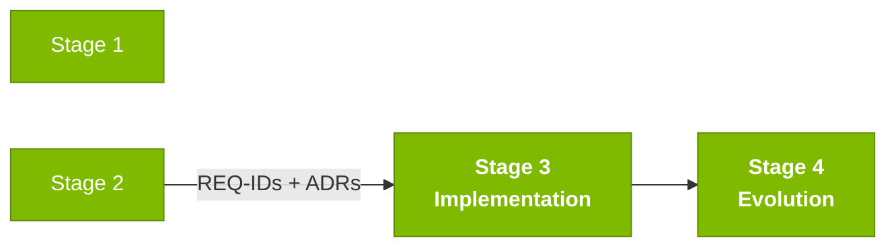

# Persona — Technical Lead

## Dónde encaja en el SDLC

**Pair:** 3 · Implementation · **Recibe de:** Pair 2 (Architecture), PO (alcance) · **Hace handoff a:** Pair 5 (Operations) en H3

## Quién es esta persona

El enlace entre arquitectura y el código del día a día. Decide patrones de implementación (convenciones de código, estilo de tests, estructura de módulos), desbloquea al equipo cuando alguien se atasca en un detalle técnico, y es responsable de que al final del Stage 3 la aplicación realmente arranque con `docker compose up`.

## Misión en el workshop

Mantener la velocidad de ejecución en el Stage 3. Elegir batallas técnicas que valgan la pena. Desbloquear rápido. Revisar PRs con rigor pero sin obstruir.

## Tu rol en el framework Agentic Legacy Modernization

- **Agentes relevantes**: Review Agent (S3), Test Gen Agent (S3)
- **Fase del framework**: Translation and Test Generation
- **Tu rol en el pipeline**: asegurar la calidad de la traducción y coordinar la implementación paralela

## Dónde apareces por stage

| Stage | Tú haces esto | Entregable que depende de ti |
|-------|---------------|------------------------------|
| 1. Archaeology | Participas en el análisis del legado priorizando programas críticos. Estimas complejidad. | Priorización basada en esfuerzo |
| 2. Greenfield Spec | Validas que la spec es realista para las 3 horas del Stage 3. Marcas "esto no entra". | Calibración de alcance |
| 3. Reconstruction | Desbloqueas. Decides patrones (estilo de tests, transacciones, manejo de errores). Revisas cada PR. | Aplicación corriendo end-to-end |
| 4. Evolution with Agent | Revisas el PR del Agent línea por línea antes de mergear. | PR con calidad de producción |

## Herramientas y primitivas

- **Copilot Edits** para refactorización en batch.
- **Copilot Chat** como par para decisiones de diseño locales.
- **Specky** — soporte en las fases 5 (Implementation Plan) y 6 (Task Breakdown).
- **Git MCP** para revisión de PR.

## Cheat sheets que usas

- Las tres cheat sheets. Eres la persona más versátil.
- [`cheat-sheets/copilot-3-modes.md`](../cheat-sheets/copilot-3-modes.md) especialmente — alternas entre las tres constantemente.

## Cómo te va bien

- Responder una pregunta técnica en menos de 5 minutos. No dejes a nadie atascado.
- Reviews que mueven el PR hacia adelante, no reviews que lo bloquean.
- Elegir dos patrones clave al inicio del Stage 3 y defenderlos sin negociar (ej: "todo transaccional vía `@Transactional` en la capa de service").
- Mantener `main` verde todo el tiempo.

## Cómo te pierdes

- Intentar escribir la mitad del código tú mismo.
- Bloquear el review por detalles estéticos.
- Cambiar patrones a mitad del Stage 3.
- No detectar un cuello de botella y que `docker compose up` no arranque al final.

## Si tomaste dos personas

- **TL + Developer** es el Pair natural — lideras y sigues escribiendo código.
- **TL + Software Architect** si el equipo tiene a alguien cubriendo dev.
- Evita **TL + QA** en la misma cabeza: el rol de "¿cubriste el test?" es más fuerte cuando lo lleva otra persona.

## 3 prompts de ejemplo

1. **(Chat)** "Review this PR: check whether it follows the 3 layers (domain/application/infrastructure), whether the test covers happy path + error, and whether there's any import crossing a bounded context."
2. **(Chat)** "We have 3 devs and 3 hours. Pending features: [list]. Create a plan distributing them across devs considering dependencies and complexity."
3. **(Chat)** "`docker compose up` fails with this error: [paste]. Diagnose the root cause and propose a fix."

## Si te atascas (defaults de emergencia)

- **¿Docker no arranca?** Verifica: ¿puerto 5432 ocupado? ¿`docker ps` muestra containers viejos? `docker compose down && docker compose up -d`.
- **¿Equipo lento?** Para, redistribuye: "Dev A hace el endpoint, Dev B hace la migración, QA hace el test. Merge en 45 min."
- **¿PR con conflicto?** `git pull --rebase` y resuelve. No dejes una branch divergir más de 2 horas.
- **¿No sabes cómo decidir un patrón?** Elige lo que el prototipo ya usa. Copia el estilo de `BeneficiaryService.java`.

## Dependencias — Quién depende de ti

| Persona | Relación | Artefacto |
|---------|----------|-----------|
| Software Architect | TÚ dependes de él | Estructura de paquetes definida |
| Product Owner | TÚ dependes de él | Alcance calibrado |
| Developer | Depende de TI | Patrones y reviews |
| QA Engineer | Depende de TI | Pipeline verde para correr tests |
| DevOps Engineer | Depende de TI | Build estable para el pipeline |

## Cómo te evalúan

- **Rúbrica A3 (Technical Integrity):** la aplicación arranca con `docker compose up`.
- **Rúbrica A6 (Collaboration):** nadie atascado por más de 20 minutos.
- Criterio: "`main` verde todo el tiempo, PRs revisados en menos de 15 minutos."

---

## Navegación

| Anterior | Inicio | Siguiente |
|----------|--------|-----------|
| [Software Architect](04-software-architect.md) | [Personas](README.md) | [Developer](06-developer.md) |

— Paula
