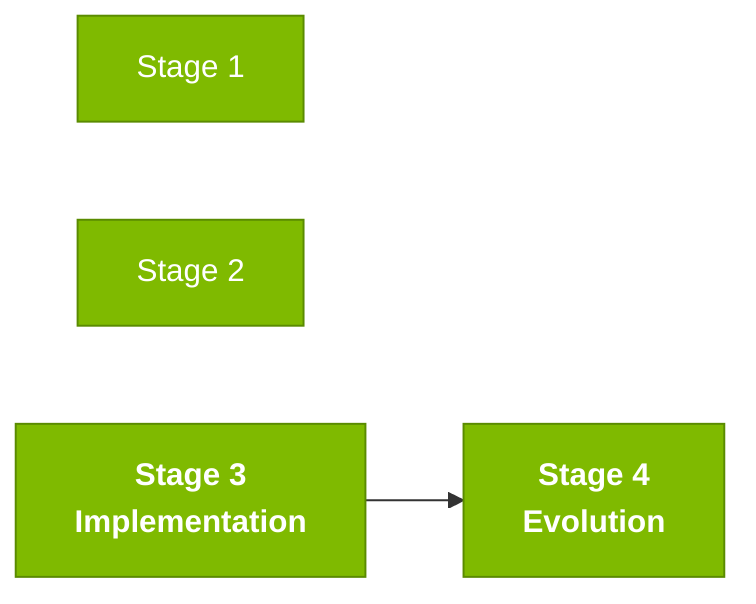

# Persona — Developer

## Dónde encaja en el SDLC

**Pair:** 3 · Implementation · **Recibe de:** SA (estructura), RE (REQ-IDs), DBA (esquema) · **Hace handoff a:** QA, TL

## Quién es esta persona

Tú escribes el código. Más que eso: eres quien usa Copilot todo el día en los tres modos y traduce ideas en diff. En el Stage 3 cargas el peso pesado de la producción.

## Misión en el workshop

Transformar la spec en código que corre. Usar Copilot deliberadamente — Chat para entender, Edits para producir, Agent para delegar. Hacer push todos los días.

## Tu rol en el framework Agentic Legacy Modernization

- **Agentes relevantes**: Translation Agent (S3), Review Agent (S3)
- **Fase del framework**: Translation and Test Generation
- **Tu rol en el pipeline**: implementar la traducción Natural → Java guiada por la spec EARS

## Dónde apareces por stage

| Stage | Tú haces esto | Entregable que depende de ti |
|-------|---------------|------------------------------|
| 1. Archaeology | Lees programas Natural con Copilot Chat. Produces un resumen legible para el resto del equipo. | Resúmenes narrativos de los programas |
| 2. Greenfield Spec | Pareas con el Requirements Engineer para anticipar problemas de implementación. | Señales preventivas en la spec |
| 3. Reconstruction | Implementas, testeas, abres PR, revisas PR, implementas otra vez. | Backend + frontend de tu slice |
| 4. Evolution with Agent | Miras al Agent trabajar. Intervienes cuando se pierde. Terminas lo que no completó. | PR del Agent en estado mergeable |

## Herramientas y primitivas

- **Copilot Chat** — entendimiento y discusión de diseño.
- **Copilot Edits** — tu herramienta principal en el Stage 3.
- **Copilot Agent** — en el Stage 4, eres quien maneja al Agent por el equipo o junto al TL.
- **Specky** — consumidor de los artefactos del SA y el RE; produce código guiado por la spec.
- **GitHub MCP** para trabajar con issues y PRs sin salir de VS Code.

## Cheat sheets que usas

- [`cheat-sheets/copilot-3-modes.md`](../cheat-sheets/copilot-3-modes.md) — este es tu mapa del día.
- [`cheat-sheets/specky-workflow.md`](../cheat-sheets/specky-workflow.md) — fases 5 a 10.
- [`cheat-sheets/model-routing.md`](../cheat-sheets/model-routing.md) — Haiku 4.5 para snippets simples, Sonnet 4.6 como default, Opus 4.6 para diseño.

## Cómo te va bien

- Usar los tres modos de Copilot deliberadamente — no siempre es Chat.
- Commits pequeños y pull requests pequeños.
- Escribir tests al mismo tiempo que el código.
- No enamorarte de una abstracción a mitad del Stage 3.

## Cómo te pierdes

- Trabajar ocho horas en una sola branch gigante.
- Usar al Agent para una tarea que Edits resolvería en 5 minutos.
- Escribir código sin tests y descubrir a las 16:30 que nada funciona.
- Siempre ir a Opus 4.6 — vas a gastar demasiado tiempo esperando.

## Si tomaste dos personas

- **Developer + Technical Lead** — muy común.
- **Developer + QA Engineer** — escribes la feature y los tests en la misma cabeza.
- **Developer + DevOps Engineer** en un equipo pequeño — tú empaquetas y deployas.

## 3 prompts de ejemplo

1. **(Chat)** "Explain the CALCDSCT.NSN program from legacy SIFAP and identify the discount cap rule. Then help me implement the equivalent in Java following the existing PaymentService pattern."
2. **(Edits)** "Select BeneficiaryEntity.java, BeneficiaryService.java, and BeneficiaryController.java. Add an 'email' field to the beneficiary: entity, service, controller, migration, and test."
3. **(Agent)** "Implement the feature described in this Issue: [paste the issue]. Respect the 3-layer architecture and include tests."

## Si te atascas (defaults de emergencia)

- ¿Código no compila? `mvn test-compile` para ver el error exacto. Usualmente es un import faltante.
- ¿No sabes la estructura de paquetes? Mira `beneficiary/` como referencia: domain/ → application/ → infrastructure/.
- ¿Copilot generando código malo? Cambia de Chat a Edits — selecciona los archivos relevantes y describe el cambio.
- ¿Test falla? Lee el mensaje de error. Si es NPE, probablemente te falta un mock. Si es assertion, el valor esperado está mal.

## Dependencias — Quién depende de ti

| Persona | Relación | Artefacto |
|---------|----------|-----------|
| Software Architect | TÚ dependes de él | Estructura de paquetes y bounded contexts |
| Requirements Engineer | TÚ dependes de él | Requerimientos claros para implementar |
| Technical Lead | Depende de TI | PRs para revisar |
| QA Engineer | Depende de TI | Código testeable |
| DBA | TÚ dependes de él | Migraciones y modelo de datos |

## Cómo te evalúan

- Rúbrica A3 (Technical Integrity): endpoints funcionales, tests pasando
- Rúbrica A4 (Conscious Use of Copilot): switching deliberado entre Chat, Edits y Agent
- Criterio: "Commits pequeños, PRs revisables, tests escritos junto al código"

---

## Navegación

| Anterior | Inicio | Siguiente |
|----------|--------|-----------|
| [Technical Lead](05-technical-lead.md) | [Personas](README.md) | [DBA](07-dba.md) |

— Paula
