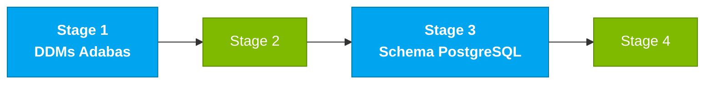

# Persona — DBA

## Dónde encaja en el SDLC

**Pair:** 4 · Quality · **Recibe de:** SA (fronteras), Stage 1 (DDMs) · **Hace handoff a:** Developer (migraciones), DevOps (esquema), QA (seed)

## Quién es esta persona

Dueña de los datos. En el SIFAP legado, eso significa entender los 4 DDMs Adabas con MU y PE, con denormalización pragmática, con índices ancestrales. En el SIFAP 2.0 significa diseñar un esquema PostgreSQL 16 que preserva la integridad lógica del negocio sin heredar las cicatrices de Adabas.

## Misión en el workshop

Traducir el modelo Adabas en un esquema relacional que funcione. Asegurar migraciones idempotentes (Flyway). Diseñar índices y particionamiento para que el ciclo mensual quepa en 2 horas. Proteger la trazabilidad (audit store).

## Tu rol en el framework Agentic Legacy Modernization

- **Agentes relevantes**: Analysis Agent (S1), Translation Agent (S3)
- **Fase del framework**: Assessment → Translation (data layer)
- **Tu rol en el pipeline**: traducir DDMs Adabas → esquema PostgreSQL preservando la integridad

## Dónde apareces por stage

| Stage | Tú haces esto | Entregable que depende de ti |
|-------|---------------|------------------------------|
| 1. Archaeology | Lees los 4 DDMs. Mapeas MU/PE a entidades relacionales candidatas. Identificas campos clave. | Mapa DDM → entidad relacional |
| 2. Greenfield Spec | Diseñas el modelo lógico de datos. Escribes el ADR de PostgreSQL (ADR 2 de la referencia). | Modelo de datos + ADR 002 |
| 3. Reconstruction | Escribes migraciones Flyway. Defines índices. Populas data de pruebas. Respondes preguntas de JPA/Hibernate. | Esquema PostgreSQL + seed |
| 4. Evolution with Agent | Revisas si el PR del Agent toca el esquema de forma segura (nueva migración, no cambio retroactivo). | Integridad del esquema |

## Herramientas y primitivas

- **Copilot Chat** para traducir Adabas DDM → SQL PostgreSQL.
- **Copilot Edits** para generar migraciones en batch.
- **PostgreSQL MCP** (si está disponible en el devcontainer) para introspección y queries.
- **Specky** — la fase 4 consume tu modelo de datos.

## Cheat sheets que usas

- [`cheat-sheets/specky-workflow.md`](../cheat-sheets/specky-workflow.md) — cómo declarar un modelo de datos que Specky valida en la fase 4.
- [`cheat-sheets/model-routing.md`](../cheat-sheets/model-routing.md) — Sonnet 4.6 alcanza para la mayoría de tu trabajo.

## Cómo te va bien

- Todas las migraciones son reversibles o se reemplazan con una nueva migración en vez de alterarse.
- Descubres (y documentas) qué MU de Adabas necesita volverse tabla relacionada, y no una columna `JSONB`.
- Tus índices cubren las queries críticas del ciclo mensual.
- El audit store es verdaderamente append-only — sin DELETE en ningún lado.

## Cómo te pierdes

- Denormalizar por costumbre Adabas.
- Olvidarte de indexar y la query del ciclo se vuelve lenta.
- Usar `JSONB` para todo porque "es flexible".
- Dejar una migración no idempotente y romper el devcontainer de un compañero.

## Si tomaste dos personas

- **DBA + Developer** es común; escribes tus migraciones y algunas queries.
- **DBA + DevOps Engineer** si el equipo tiene más perfil de ops — cuidas PostgreSQL y el Terraform que lo provisiona.

## 3 prompts de ejemplo

1. **(Chat)** "Read the BENEFICIARIO.ddm DDM from Adabas and translate it to PostgreSQL 16 schema. Should the PE (periodic) group of dependents become a separate table or JSONB? Justify."
2. **(Edits)** "Create a Flyway migration V5__add_indexes.sql with indexes for: search by CPF, listing payments by cycle+status, audit by type+date."
3. **(Chat)** "Review this schema and identify: fields without NOT NULL that need it, missing foreign keys, and indexes for the monthly cycle of 3.8M payments."

## Si te atascas (defaults de emergencia)

- ¿No conoces el formato DDM? Abre `02-cenario-sifap-legado/adabas-ddms/BENEFICIARIO.ddm` — tiene comentarios explicando cada campo.
- ¿Se rompió una migración? NUNCA edites una migración existente. Crea una nueva: `V5__fix_xxx.sql`.
- ¿Qué índice crear? Regla: "Si aparece en WHERE o JOIN y la tabla tiene >100K filas, crea un índice."
- ¿PostgreSQL offline? Verifica que Docker esté corriendo: `docker ps | grep postgres`.

## Dependencias — Quién depende de ti

| Persona | Relación | Artefacto |
|---------|----------|-----------|
| Software Architect | TÚ dependes de él | Fronteras de contexto para el modelo |
| Developer | Depende de TI | Migraciones listas para código JPA |
| DevOps Engineer | Depende de TI | Esquema estable para Terraform |
| QA Engineer | Depende de TI | Data de pruebas (seed) |

## Cómo te evalúan

- Rúbrica A3 (Technical Integrity): migraciones idempotentes, esquema consistente con entidades JPA
- Rúbrica A1 (Archaeology): mapa DDM → entidad relacional documentado
- Criterio: "El audit store es append-only. No hay DELETE en el esquema de auditoría."

---

## Navegación

| Anterior | Inicio | Siguiente |
|----------|--------|-----------|
| [Developer](06-developer.md) | [Personas](README.md) | [QA Engineer](08-qa-engineer.md) |

— Paula
