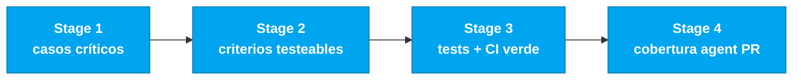

# Persona — QA Engineer

## Dónde encaja en el SDLC

**Pair:** 4 · Quality · **Recibe de:** RE (REQ-IDs), Developer (código) · **Hace handoff a:** TL (pipeline verde), DevOps (CI)

## Quién es esta persona

Quien convierte un requerimiento en test ejecutable. En el SIFAP 2.0, quien asegura que la regla de cálculo de pago sobreviva a cualquier refactor del Stage 3 y que el batch del ciclo mensual funcione dentro de los límites esperados.

## Misión en el workshop

Definir la estrategia de testing del proyecto. Escribir tests críticos (no 100% cobertura; los correctos). Validar la trazabilidad spec → test. Proteger al equipo de un CI verde falso.

## Tu rol en el framework Agentic Legacy Modernization

- **Agentes relevantes**: Test Gen Agent (S3), Security Agent (S3)
- **Fase del framework**: Translation and Test Generation → Validation
- **Tu rol en el pipeline**: asegurar cobertura de tests y validar equivalencia funcional legado → moderno

## Dónde apareces por stage

| Stage | Tú haces esto | Entregable que depende de ti |
|-------|---------------|------------------------------|
| 1. Archaeology | Identificas escenarios críticos de los Naturals (corner cases del ciclo mensual, rechazo del BB). | Lista de escenarios críticos |
| 2. Greenfield Spec | Validas que cada requerimiento EARS es testeable. Propones criterios de aceptación concretos. | Criterios de test por requerimiento |
| 3. Reconstruction | Escribes tests unitarios e integración para el core (cálculo de pago, ajuste, reconciliación). Mantienes el CI verde. | Suite de tests + pipeline verde |
| 4. Evolution with Agent | Exiges que el PR del Agent venga con sus propios tests. Validas la cobertura de los nuevos escenarios. | Cobertura coherente con la feature |

## Herramientas y primitivas

- **Copilot Chat** para generar escenarios de test desde requerimientos EARS.
- **Copilot Edits** para generar esqueletos JUnit en batch.
- **Testcontainers** para integración con PostgreSQL real.
- **Specky** — la fase 9 (Test Strategy) es tu territorio.
- **GitHub Actions MCP** para monitorear el CI.

## Cheat sheets que usas

- [`cheat-sheets/specky-workflow.md`](../cheat-sheets/specky-workflow.md) — fase 9.
- [`cheat-sheets/copilot-3-modes.md`](../cheat-sheets/copilot-3-modes.md) — usas Edits para crear el esqueleto y Chat para discutir qué falta.

## Cómo te va bien

- Cobertura en los caminos que importan: cálculo de pago, reconciliación BB, ajustes con dual approval.
- Tests rápidos — toda la suite corre en menos de dos minutos.
- Tests que rompen al primer bug, no "tests que siempre pasan".
- Dices "este PR no entra sin test" sin drama.

## Cómo te pierdes

- Perseguir 100% cobertura y perder el Stage 3.
- Escribir tests que testean el framework, no el dominio.
- Aceptar mocks donde Testcontainers era la opción correcta.
- Dejar el CI rojo 20 minutos esperando que alguien lo mire.

## Si tomaste dos personas

- **QA + Developer** es la más común y productiva.
- **QA + Requirements Engineer** también funciona — escribes el requerimiento y el test.
- Evita **QA + DevOps** en la misma cabeza: sobrecarga demasiado el Stage 3.

## 3 prompts de ejemplo

1. **(Chat)** "For the EARS requirement 'When a cycle is generated, create payments for ACTIVE': generate 5 test scenarios covering happy path, no actives, suspended beneficiary, zero value, and database error."
2. **(Edits)** "In PaymentCycleServiceTest.java, add integration tests with Testcontainers that: insert a beneficiary, create a cycle, generate payments, and verify values."
3. **(Chat)** "Analyze current test coverage and identify the 3 most critical paths without tests. Prioritize by impact on the beneficiary."

## Si te atascas (defaults de emergencia)

- ¿No conoces JUnit 5? Copia el patrón de `CpfTest.java` — @Test, @DisplayName, asserciones AssertJ.
- ¿Testcontainers no funciona? Necesitas Docker corriendo. Alternativa: test unitario con Mockito.
- ¿Muchos escenarios, poco tiempo? Enfócate en 3: (a) crear beneficiario, (b) generar pago, (c) cambio de estado. Esos son los críticos.
- ¿CI rojo? Corre `mvn test` localmente primero. Si pasa localmente pero falla en CI, es un problema de ambiente (Docker/Testcontainers).

## Dependencias — Quién depende de ti

| Persona | Relación | Artefacto |
|---------|----------|-----------|
| Requirements Engineer | TÚ dependes de él | Requerimientos testeables con criterios |
| Developer | TÚ dependes de él | Código para testear |
| Technical Lead | Depende de TI | Pipeline verde |
| DevOps Engineer | Depende de TI | CI confiable |

## Cómo te evalúan

- Rúbrica A3 (Technical Integrity): tests pasando, CI verde
- Rúbrica A2 (Spec): cada requerimiento tiene un criterio de verificación
- Criterio: "Tests que rompen al primer bug, no tests que siempre pasan"

---

## Navegación

| Anterior | Inicio | Siguiente |
|----------|--------|-----------|
| [DBA](07-dba.md) | [Personas](README.md) | [DevOps Engineer](09-devops-engineer.md) |

— Paula
