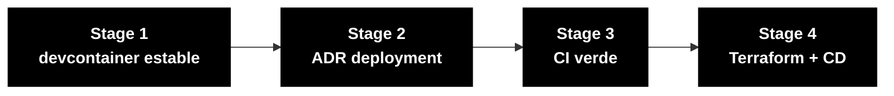

# Persona — DevOps Engineer

## Dónde encaja en el SDLC

**Pair:** 5 · Operations · **Recibe de:** TL (build estable), EA (topología) · **Hace handoff a:** Demo, valida PR Agent

## Quién es esta persona

Dueño del camino desde el código hasta algo que corre. En el workshop, eres quien asegura que `docker compose up` funcione en cualquier máquina del equipo, que el CI valide lo que importa y que Terraform describa la topología objetivo en Azure aunque no se aplique en el día.

## Misión en el workshop

Pipeline verde. Build reproducible. Deploy descrito como código. Observabilidad funcional mínima (health check, logs estructurados).

## Tu rol en el framework Agentic Legacy Modernization

- **Agentes relevantes**: Deployment Agent (S4), Security Agent (S3)
- **Fase del framework**: Coexistence and Traffic Migration
- **Tu rol en el pipeline**: provisionar infraestructura y configurar el pipeline CI/CD para deploy continuo

## Dónde apareces por stage

| Stage | Tú haces esto | Entregable que depende de ti |
|-------|---------------|------------------------------|
| 1. Archaeology | Estabilizas el devcontainer si algo está roto. Preparas docker-compose para PostgreSQL y herramientas auxiliares. | Devcontainer y compose estables |
| 2. Greenfield Spec | Escribes el ADR de estrategia de deployment (ADR 5 de la referencia) y participas en el diseño de infra. | ADR 005 + draft de Terraform |
| 3. Reconstruction | Mantienes GitHub Actions para build y tests. Publicas imagen Docker. Mantienes Terraform descrito. | Pipeline verde + `terraform plan` válido |
| 4. Evolution with Agent | Si el PR del Agent toca el pipeline o la infra, eres la persona que valida. | Pipeline aún verde después del Agent |

## Herramientas y primitivas

- **Copilot Chat** para generar workflows de GitHub Actions.
- **Copilot Edits** para Terraform en batch.
- **Azure / Terraform MCP** si está habilitado en el devcontainer.
- **Specky** — la fase 10 (Deployment) pasa por ti.
- **Dev Containers** spec — eres quien entiende el `devcontainer.json`.

## Cheat sheets que usas

- [`cheat-sheets/specky-workflow.md`](../cheat-sheets/specky-workflow.md) — fase 10.
- [`cheat-sheets/copilot-3-modes.md`](../cheat-sheets/copilot-3-modes.md) — usas Agent bastante para cadenas largas de CI.

## Cómo te va bien

- `docker compose up -d` levanta aplicación + base de datos en menos de 60s.
- El pipeline de `main` corre lint + test + image build.
- `terraform plan` corre sin error aunque no se aplique.
- Logs estructurados (JSON) y endpoint `/actuator/health` ya funcionan en el Stage 3.

## Cómo te pierdes

- Dejar el devcontainer inestable y el equipo pierde 1 hora al inicio.
- CI que solo corre tests unitarios (sin image build, sin lint).
- Terraform de 500 líneas y ningún output que tenga sentido.
- Un secreto real en un `.env` versionado.

## Si tomaste dos personas

- **DevOps + DBA** — cuidas Postgres + provisioning.
- **DevOps + Tech Writer** — en el Stage 4, documentas el runbook mientras monitoreas al Agent.

## 3 prompts de ejemplo

1. **(Chat)** "Create a GitHub Actions workflow .github/workflows/ci.yml that: runs on push, sets up Java 21 with Maven cache, runs tests, and builds a Docker image."
2. **(Edits)** "Optimize the backend Dockerfile: add a Maven dependency cache, shrink the final image with Alpine, and add a health check."
3. **(Chat)** "`docker compose up` takes 3 minutes to start. Analyze the Dockerfiles and docker-compose.yml and propose 3 optimizations."

## Si te atascas (defaults de emergencia)

- ¿Docker compose no arranca? Checklist: (1) ¿Docker Desktop corriendo? (2) ¿Puertos 5432/8080/3000 libres? (3) `docker compose down && docker compose up -d` (4) `docker compose logs` para ver el error.
- ¿CI fallando? Mira los logs de GitHub Actions. El error más común: versión de Java incorrecta o cache miss.
- ¿Terraform plan fallando? Verifica: (1) ¿corrió `terraform init`? (2) ¿versión de provider compatible? (3) ¿variables requeridas llenas?
- ¿No conoces GitHub Actions? Copia el workflow en `.github/workflows/build.yml` y adáptalo.

## Dependencias — Quién depende de ti

| Persona | Relación | Artefacto |
|---------|----------|-----------|
| Technical Lead | TÚ dependes de él | Build estable para el pipeline |
| Enterprise Architect | TÚ dependes de él | Topología para Terraform |
| Developer | Depende de TI | Devcontainer funcionando, CI verde |
| DBA | Depende de TI (infra) | PostgreSQL provisionado |
| QA Engineer | Depende de TI | Pipeline para correr tests |

## Cómo te evalúan

- Rúbrica A3 (Technical Integrity): `docker compose up` funciona, CI verde
- Rúbrica A4 (Copilot): uso de Agent para pipelines complejos
- Criterio: "Build reproducible. Cualquier máquina del equipo corre el compose en menos de 60s."

---

## Navegación

| Anterior | Inicio | Siguiente |
|----------|--------|-----------|
| [QA Engineer](08-qa-engineer.md) | [Personas](README.md) | [Tech Writer](10-tech-writer.md) |

— Paula
