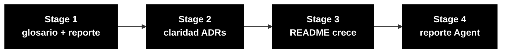

# Persona — Tech Writer

## Dónde encaja en el SDLC

**Pair:** 5 · Operations · **Recibe de:** todos los Pairs · **Hace handoff a:** Pair 1 (glosario), facilitadores (reporte final)

## Quién es esta persona

Quien convierte una decisión en memoria durable. Sin un Tech Writer deliberado, los ADRs se vuelven archivos vacíos, el README se queda en "instalar las dependencias", y nada de lo que se descubrió sobrevive a la última hora del workshop.

## Misión en el workshop

Mantener la documentación viva durante todo el día — no al final. Un README que crece, ADRs escritos en el momento de la decisión, un changelog presente. Escribir el reporte de experiencia con el Agent en el Stage 4.

## Tu rol en el framework Agentic Legacy Modernization

- **Agentes relevantes**: Documentation Agent (cross-cutting)
- **Fase del framework**: todas las fases (documentación continua)
- **Tu rol en el pipeline**: mantener trazabilidad y documentar decisiones para el audit trail

## Dónde apareces por stage

| Stage | Tú haces esto | Entregable que depende de ti |
|-------|---------------|------------------------------|
| 1. Archaeology | Mantienes glosario y catálogo en formato legible. Escribes el reporte de descubrimiento al final del stage. | Reporte del Stage 1 |
| 2. Greenfield Spec | Revisas la spec por consistencia, terminología y claridad. Formateas los ADRs con el template. | Spec y ADRs en formato estándar |
| 3. Reconstruction | El README del proyecto se vuelve real, no un placeholder. Documentas decisiones en `docs/` a medida que emergen. | README poblado + `docs/` |
| 4. Evolution with Agent | Miras al Agent trabajar y escribes un reporte honesto de la experiencia (qué fue bueno, qué fue malo, qué aprendiste). | Reporte final del Stage 4 |

## Herramientas y primitivas

- **Copilot Chat** para revisión de estilo y claridad.
- **Cowork** si necesitas escribir un documento más largo.
- Skill **markdown-writer** para READMEs y ADRs estructurados.
- **GitHub MCP** para commits en `docs/` mientras otros tocan el código.

## Cheat sheets que usas

- [`cheat-sheets/specky-workflow.md`](../cheat-sheets/specky-workflow.md) — el plugin genera documentación en cada fase, y tú mantienes la consistencia entre lo que produce y lo que el equipo escribe a mano.
- [`cheat-sheets/model-routing.md`](../cheat-sheets/model-routing.md) — Haiku 4.5 para revisión de estilo, Sonnet 4.6 para escritura.

## Cómo te va bien

- Cada ADR tiene: contexto, decisión, consecuencias. Ni más, ni menos.
- El README evoluciona cada hora, no solo al final.
- La terminología del proyecto es consistente (si se llamó "cycle", no se vuelve "round" en el siguiente párrafo).
- El reporte del Stage 4 es honesto sobre el Agent — no intenta vender.

## Cómo te pierdes

- Esperar a que termine el Stage 3 para empezar a escribir.
- ADRs de una línea ("decidimos usar X").
- Un README que sigue diciendo "TODO: agregar instrucciones" al final.
- Un reporte de Agent que solo dice "funcionó bien".

## Si tomaste dos personas

- **Tech Writer + Product Owner** — escribes el "por qué" del proyecto.
- **Tech Writer + DevOps Engineer** — documentas mientras el pipeline corre.
- **Tech Writer + Requirements Engineer** es fuerte para un equipo pequeño — estructuras y escribes.

## 3 prompts de ejemplo

1. **(Chat)** "Review this README and identify: sections with TODO, inconsistent terminology, outdated information (ports, credentials, endpoints). Propose corrections."
2. **(Edits)** "In the file ADR-001.md, complete the Context, Decision, and Consequences sections using the template at 02-spec-moderna/ADR-TEMPLATE.md."
3. **(Chat)** "Create an honest report of the experience with Copilot Agent: what worked, what surprised, what failed. Base it on the template at 04-evolucao/agent-experience-report.md."

## Si te atascas (defaults de emergencia)

- ¿No conoces el formato ADR? Abre `02-spec-moderna/ADR-TEMPLATE.md` — copia y llena.
- ¿README vacío? Empieza con: (1) qué es el sistema, (2) cómo correrlo, (3) endpoints disponibles. El resto puede crecer.
- ¿Glosario estancado? Pregúntale a Copilot: "List all the abbreviations found in the SIFAP `.NSN` files and expand each one."
- ¿Reporte del Agent vacío? Abre `04-evolucao/agent-experience-report.md` — el template tiene secciones listas para llenar.

## Dependencias — Quién depende de ti

| Persona | Relación | Artefacto |
|---------|----------|-----------|
| Todos | TÚ dependes de ellos | Decisiones y código para documentar |
| Product Owner | Depende de TI | Glosario y reportes legibles |
| QA Engineer | Depende de TI (indirecto) | Terminología consistente en la spec |
| Facilitador (Paula) | Depende de TI | Reporte final del Stage 4 |

## Cómo te evalúan

- Rúbrica A2 (Spec): documentación consistente, terminología estandarizada
- Rúbrica A7 (Agent): reporte honesto y detallado
- Criterio: "README evolucionó cada hora. Los ADRs tienen contexto, decisión y consecuencias. Nada dice TODO."

---

## Navegación

| Anterior | Inicio | Siguiente |
|----------|--------|-----------|
| [DevOps Engineer](09-devops-engineer.md) | [Personas](README.md) | [Cheat Sheets](../cheat-sheets/README.md) |

— Paula
