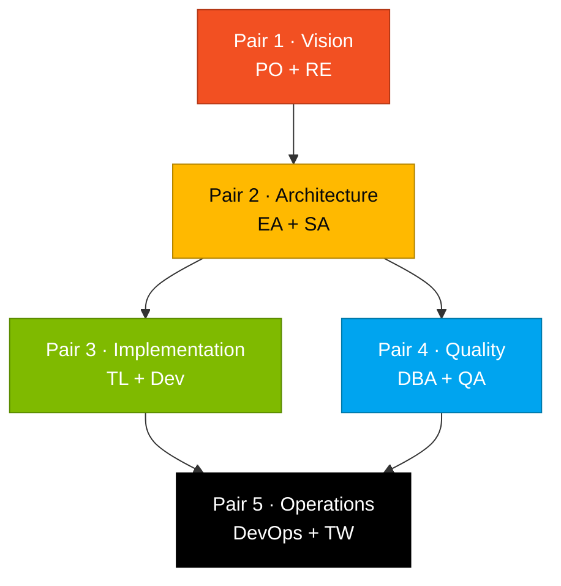

# Personas

> Cartas de persona específicas por rol para cada miembro del equipo. Definen expertise de dominio, responsabilidades y comportamiento del agente Copilot para el workshop.

## Cómo pensar en esto

Cada persona del equipo viste **dos** personas durante el día (un Pair). Las cartas existen para que sepas, en cada momento, **qué se espera de ti y qué herramienta usar**. Sin la carta, eres "un dev haciendo cosas"; con la carta, eres una pieza específica del equipo que se conecta con otras piezas específicas vía handoffs.

## Contenido

| Archivo | Rol | SDLC | Pair |
|---------|-----|------|------|
| [`01-product-owner.md`](01-product-owner.md) | Product Owner — priorización de backlog y alineación con stakeholders | Discovery + Specification | Pair 1 |
| [`02-requirements-engineer.md`](02-requirements-engineer.md) | Requirements Engineer — notación EARS y escritura de specs | Specification | Pair 1 |
| [`03-enterprise-architect.md`](03-enterprise-architect.md) | Enterprise Architect — decisiones de diseño a nivel sistema | Specification + Design | Pair 2 |
| [`04-software-architect.md`](04-software-architect.md) | Software Architect — arquitectura a nivel componente | Design | Pair 2 |
| [`05-technical-lead.md`](05-technical-lead.md) | Technical Lead — estándares de código y coordinación de equipo | Implementation | Pair 3 |
| [`06-developer.md`](06-developer.md) | Developer — implementación y testing | Implementation | Pair 3 |
| [`07-dba.md`](07-dba.md) | DBA — diseño de base de datos y migraciones | Implementation | Pair 4 |
| [`08-qa-engineer.md`](08-qa-engineer.md) | QA Engineer — estrategia de testing y cobertura | Implementation | Pair 4 |
| [`09-devops-engineer.md`](09-devops-engineer.md) | DevOps Engineer — CI/CD, IaC y deployment | Cross-cutting + Evolution | Pair 5 |
| [`10-tech-writer.md`](10-tech-writer.md) | Tech Writer — documentación y ADRs | Cross-cutting | Pair 5 |

## Mapa visual de Pairs

## Persona Kits extendidos

Para implementaciones completas de persona con agentes custom, prompts y configs MCP, ver [`../../persona-kits/`](../../persona-kits/).

## Navegación

| Anterior | Inicio | Siguiente |
|----------|--------|-----------|
| [Team Flow (ES)](../TEAM-FLOW.md) | [Kit del Equipo (ES)](../README.md) | [Product Owner](01-product-owner.md) |
