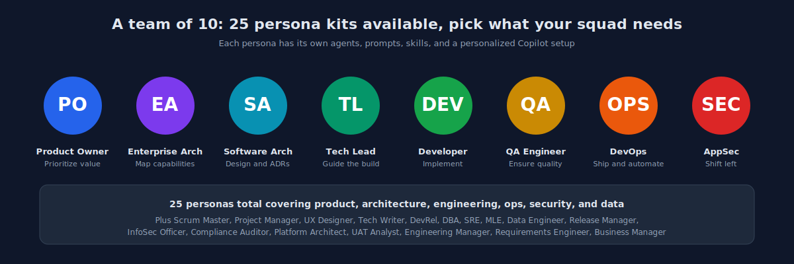
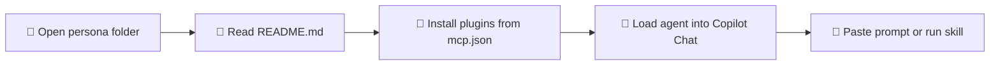

# 🎭 Persona Kits

> A hackathon team is not a homogenous squad. Different roles need different prompts, different agents, different Copilot setups. This folder contains 25 role-tailored kits so every hat in the room has a matching Copilot configuration.

  

---

## 📑 Table of Contents

1. [Why Personas Matter](#-why-personas-matter)
2. [What Each Kit Contains](#-what-each-kit-contains)
3. [The 25 Personas](#-the-25-personas)
4. [How to Activate a Persona](#-how-to-activate-a-persona)
5. [Navigation](#-navigation)

---

## 🎯 Why Personas Matter

The legacy SIFAP system has touched every discipline in the organization over 30 years. Modernizing it touches every discipline again. A Product Owner frames value. A DBA protects data. An SRE keeps lights on. A DevRel tells the story.

If all of them use the same generic Copilot prompts, they will all get the same generic output. Persona kits solve that.

> 💡 **Analogia.** Um chef nao usa a mesma faca para filetar peixe e cortar legumes. O Copilot tambem precisa de instrumentos diferentes para papeis diferentes.

---

## 📦 What Each Kit Contains

Each persona folder ships with a consistent structure:

| 📄 Artifact | 🎯 Purpose |
|---|---|
| `README.md` | Role overview, day-in-the-life, Copilot activation guide |
| `mcp.json` | MCP plugin recommendations for this role |
| `agents/*.md` | Role-tuned chat modes |
| `skills/*.md` | Reusable mental models for the role |
| `prompts/*.md` | Ready-to-paste prompts for recurring tasks |
| `workflows/*.md` (optional) | Multi-step playbooks |

---

## 👥 The 25 Personas

Grouped by domain for easier navigation.

### 🧭 Strategy and Discovery

| # | Persona | Focus |
|---|---|---|
| 01 | [Product Owner](./01-product-owner/) | Value framing, backlog curation |
| 02 | [Business Manager](./02-business-manager/) | Business outcomes, KPIs |
| 03 | [Requirements Engineer](./03-requirements-engineer/) | EARS, traceability |

### 🏗️ Architecture

| # | Persona | Focus |
|---|---|---|
| 04 | [Enterprise Architect](./04-enterprise-architect/) | Cross-system fit, standards |
| 05 | [Software Architect](./05-software-architect/) | System design, ADRs |
| 12 | [Platform Architect](./12-platform-architect/) | Internal developer platform |

### 👨‍💻 Engineering Leadership

| # | Persona | Focus |
|---|---|---|
| 06 | [Technical Lead](./06-technical-lead/) | Team delivery, code quality |
| 07 | [Engineering Manager](./07-engineering-manager/) | People, cadence, capacity |
| 09 | [Scrum Master](./09-scrum-master/) | Flow, ceremonies, impediments |
| 10 | [Project Manager](./10-project-manager/) | Scope, schedule, risk |

### 🎨 Experience

| # | Persona | Focus |
|---|---|---|
| 08 | [UX Designer](./08-ux-designer/) | Flows, wireframes, research |

### 🛠️ Build and Run

| # | Persona | Focus |
|---|---|---|
| 11 | [DevOps Engineer](./11-devops-engineer/) | Pipelines, IaC, automation |
| 13 | [QA Engineer](./13-qa-engineer/) | Test design, coverage |
| 14 | [UAT Analyst](./14-uat-analyst/) | Acceptance, real-world validation |
| 17 | [Release Manager](./17-release-manager/) | Release trains, rollouts |
| 20 | [SRE](./20-sre/) | Reliability, SLOs, incident response |
| 22 | [Developer](./22-developer/) | Feature implementation |

### 📊 Data and AI

| # | Persona | Focus |
|---|---|---|
| 15 | [Data Engineer](./15-data-engineer/) | Pipelines, ETL, warehouses |
| 16 | [ML/AI Engineer](./16-ml-ai-engineer/) | Models, evaluation, MLOps |
| 21 | [DBA](./21-dba/) | Database performance, schema |

### 🛡️ Security and Compliance

| # | Persona | Focus |
|---|---|---|
| 18 | [InfoSec Officer](./18-infosec-officer/) | Threat model, policy |
| 19 | [Compliance Auditor](./19-compliance-auditor/) | Controls, evidence |
| 25 | [AppSec Engineer](./25-appsec-engineer/) | Secure SDLC, SAST/DAST |

### 📣 Communication

| # | Persona | Focus |
|---|---|---|
| 23 | [Tech Writer](./23-tech-writer/) | Docs, tutorials, API references |
| 24 | [DevRel](./24-devrel/) | Community, demos, evangelism |

---

## 🚀 How to Activate a Persona

Step by step:

1. Pick the role you are playing in this hackathon.
2. Open the persona README to understand the day-in-the-life context.
3. Install MCP plugins from `mcp.json` if your Copilot client supports MCP.
4. Copy the relevant agent to your chat mode library.
5. Use the prompts from the `prompts/` folder for recurring tasks.

---

## Navigation

| Previous | Home | Next |
|---|---|---|
| [Design System](../design-system/README.md) | [Kit README](../README.md) | [Stage 1: Archaeology](../01-arqueologia/GUIDE.md) |

> Author: Paula Silva, AI-Native Software Engineer, Americas Global Black Belt at Microsoft.
