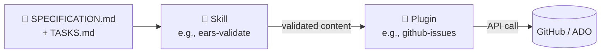

# Shared Plugins

[Persona Kits](../persona-kits/) | [Kit Home](../) | [Next: Cheat Sheets](../cheat-sheets/)

## What lives here

Plugins are reusable Copilot extensions available to **every persona on every team**, not scoped to a single role. They fill the gap between per-persona skills (role-specific know-how) and the underlying tool APIs (GitHub, Azure DevOps, etc.).

Think of it like this:
- **Agent** = who the AI acts as.
- **Skill** = what the AI knows how to do in a domain.
- **Prompt** = a pre-written recipe the AI can run.
- **Plugin** = a bridge to an external system the AI can drive.

A plugin wraps an external API with opinionated defaults so a persona does not have to learn the raw SDK every time.

## Available plugins

| Plugin | Purpose | When to use |
|--------|---------|-------------|
| [github-issues](github-issues.plugin.md) | Create and sync GitHub issues from SDD specification tasks | Turning `TASKS.md` into tracked work |
| [azure-boards](azure-boards.plugin.md) | Sync SDD work items with Azure DevOps Boards | ADO-based teams needing Epic/Feature/Story hierarchy |

## How plugins relate to skills

A **skill** prepares the content (validates EARS, refines stories). A **plugin** delivers the content to the target system (GitHub, ADO, Jira). This separation keeps the knowledge reusable and the delivery swappable.

## Security model

Every plugin follows these non-negotiables:

- **Credentials from environment variables only**. Never inline.
- **`dry_run: true` by default**. Preview before writing.
- **REQ-ID traceability preserved** in every sync direction.
- **Read-only minimum scope** where possible; write scopes justified per tool.

## Adding a new plugin

1. Copy one of the existing plugin files as a template.
2. Keep the same 5-section structure: What / When / Tools / Configuration / Security.
3. List every tool the plugin exposes, one subsection per tool.
4. Document the authentication method and required scope.
5. Open a PR referencing the REQ-ID that motivated the plugin.

## Navigation

[Persona Kits](../persona-kits/) | [Kit Home](../) | [Next: Cheat Sheets](../cheat-sheets/)
