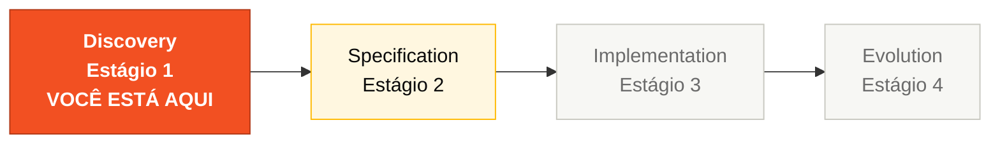

# Estágio 1 — Arqueologia

> **LEIA PRIMEIRO:** [`LEGACY-EXPLORATION-CHECKLIST.md`](LEGACY-EXPLORATION-CHECKLIST.md) — portão duro antes do Estágio 2.
>
> Explore o sistema SIFAP legado com Copilot Chat e Specky Research. Extraia regras de negócio, construa um glossário e mapeie dependências. Todo artefato produzido aqui alimenta o Estágio 2; especificações sem rastreabilidade ao legado são rejeitadas pelo CI.

## Onde isso encaixa no SDLC

## Quem trabalha aqui

Todos os 5 pares trabalham em paralelo, cada um responsável por 3 programas Natural. O **Par 1 (Visão)** lidera a síntese ao final do estágio. Veja [`GUIDE.md`](GUIDE.md) para a divisão completa.

## Conteúdo

| Arquivo | Propósito |
|---------|-----------|
| [`LEGACY-EXPLORATION-CHECKLIST.md`](LEGACY-EXPLORATION-CHECKLIST.md) | **PORTÃO DURO.** Posse de programa por par + DoD para abrir o Estágio 2 |
| [`GUIDE.md`](GUIDE.md) | Guia passo a passo deste estágio |
| [`glossary.md`](glossary.md) | Template de glossário de termos do domínio |
| [`business-rules-catalog.md`](business-rules-catalog.md) | Catálogo de regras de negócio extraídas (`Programa Fonte` obrigatório) |
| [`dependency-map.md`](dependency-map.md) | Template de mapeamento de dependências do sistema |
| [`discovery-report.md`](discovery-report.md) | Template de relatório de descobertas |
| [`mysteries-checklist.md`](mysteries-checklist.md) | Checklist de lógica escondida para os times |
| [`mysteries-found.md`](mysteries-found.md) | Template para registrar mistérios descobertos |

O código legado em si fica em [`../../legacy/`](../../legacy/) (compartilhado pelo kit).

## Navegação

| Anterior | Início | Próximo |
|----------|--------|---------|
| [Team Flow](../TEAM-FLOW.md) | [Kit PT-BR](../README.md) | [Estágio 2 — Spec Moderna](../02-spec-moderna/README.md) |

— Paula
