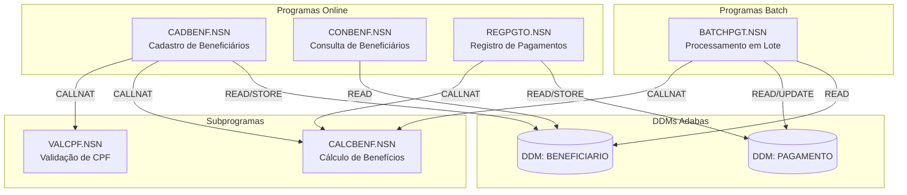
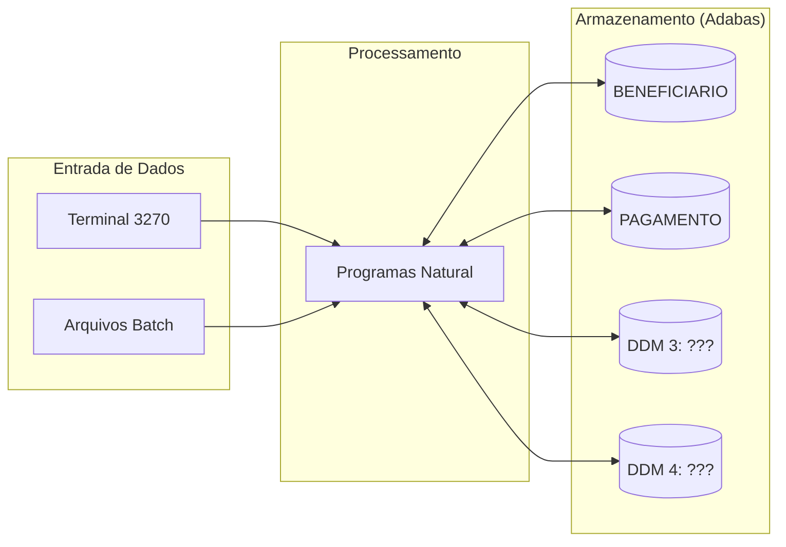

<!-- markdownlint-disable MD013 MD025 MD026 MD028 MD029 MD034 MD040 MD051 MD060 -->

# Mapa de Dependências — SIFAP Legado

> Use diagramas Mermaid para mapear as dependências entre programas Natural e DDMs Adabas.
> O objetivo é visualizar "quem chama quem" e "quem lê/escreve o quê".

## Como descobrir dependências

- Use `grep` ou Copilot Chat para listar todas as ocorrências de `CALLNAT` nos 15 arquivos `.NSN`.
- Prompt útil: _"Liste todas as ocorrências de CALLNAT nestes arquivos e desenhe um diagrama Mermaid."_
- Para leitura/escrita em DDMs: procure por `READ`, `READ LOGICAL`, `STORE`, `UPDATE`, `DELETE`.

## Diagrama de Dependências entre Programas

> Substitua o exemplo abaixo pelo mapa real do seu time. **Meta:** cobrir todos os 15 programas, sem órfãos.

> **Instrução:** este é apenas um exemplo inicial com 6 programas.
> Seu time deve mapear **todos os 15 programas** e os **4 DDMs**.

## Diagrama de Fluxo de Dados (DDMs)

> Substitua "DDM 3: ???" e "DDM 4: ???" pelos nomes reais encontrados em [`../legado-natural/adabas-ddms/`](../legado-natural/adabas-ddms/).

## Tabela de Dependências

| Programa     | Chama (CALLNAT) | Lê (READ) DDMs | Escreve (STORE/UPDATE) DDMs | Observações |
| ------------ | --------------- | -------------- | --------------------------- | ----------- |
| CADBENF.NSN  |                 |                |                             |             |
| CONBENF.NSN  |                 |                |                             |             |
| REGPGTO.NSN  |                 |                |                             |             |
| BATCHPGT.NSN |                 |                |                             |             |
| CALCBENF.NSN |                 |                |                             |             |
| VALCPF.NSN   |                 |                |                             |             |
|              |                 |                |                             |             |
|              |                 |                |                             |             |
|              |                 |                |                             |             |
|              |                 |                |                             |             |
|              |                 |                |                             |             |
|              |                 |                |                             |             |
|              |                 |                |                             |             |
|              |                 |                |                             |             |
|              |                 |                |                             |             |

## Dependências Circulares

> Liste aqui qualquer dependência circular encontrada (programa A chama B que chama A):

- Nenhuma encontrada até agora.

## Programas Órfãos

> Programas que não são chamados por nenhum outro (possíveis pontos de entrada ou código morto):

- A investigar.
