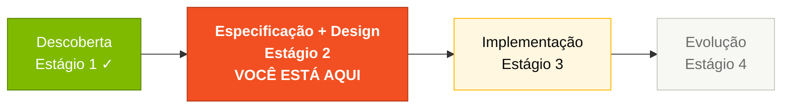
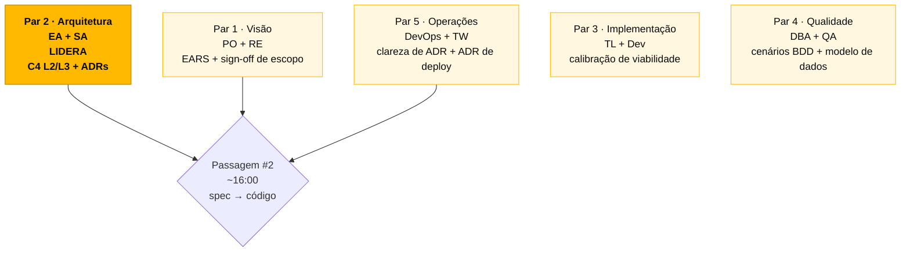

<!-- markdownlint-disable MD013 MD025 MD026 MD028 MD029 MD034 MD040 MD051 MD060 -->

# Estágio 2 — Spec Moderna

> Escreva a especificação modernizada do SIFAP usando notação EARS, crie Arquitetura Decision Records (ADRs) e defina as fronteiras de escopo.

## Onde isso encaixa no SDLC

## Quem trabalha aqui

## Conteúdo

| Arquivo                                    | Propósito                                |
| ------------------------------------------ | ---------------------------------------- |
| [`GUIDE.md`](GUIDE.md)                     | Guia passo a passo deste estágio         |
| [`ADR-TEMPLATE.md`](ADR-TEMPLATE.md)       | Modelo de Registro de Decisão Arquitetural |
| [`scope-decisions.md`](scope-decisions.md) | Modelo de decisões de escopo           |

## Navegação

| Anterior                                               | Início                    | Próximo                                                    |
| ------------------------------------------------------ | ------------------------- | ---------------------------------------------------------- |
| [Estágio 1 — Arqueologia](../01-arqueologia/README.md) | [Kit PT-BR](../README.md) | [Estágio 3 — Implementação](../03-implementacao/README.md) |

— Paula
