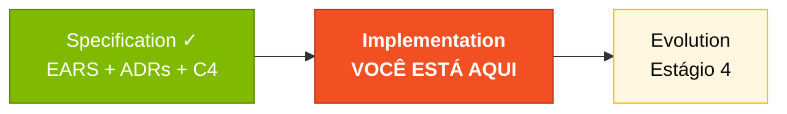
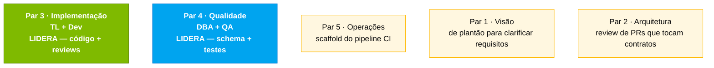

# Estágio 3 — Implementação

> Construa o protótipo do SIFAP 2.0 — backend Java 21 + Spring Boot 3, frontend Next.js 15, PostgreSQL 16 — usando o modo Agent do GitHub Copilot.

## Onde isso encaixa no SDLC

## Quem trabalha aqui

## Conteúdo

| Arquivo | Propósito |
|---------|-----------|
| [`GUIDE.md`](GUIDE.md) | Guia passo a passo deste estágio |

## Navegação

| Anterior | Início | Próximo |
|----------|--------|---------|
| [Estágio 2 — Spec Moderna](../02-spec-moderna/README.md) | [Kit PT-BR](../README.md) | [Estágio 4 — Evolution](../04-evolucao/README.md) |

— Paula
