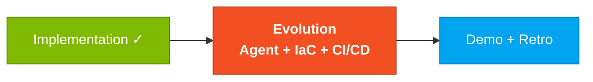
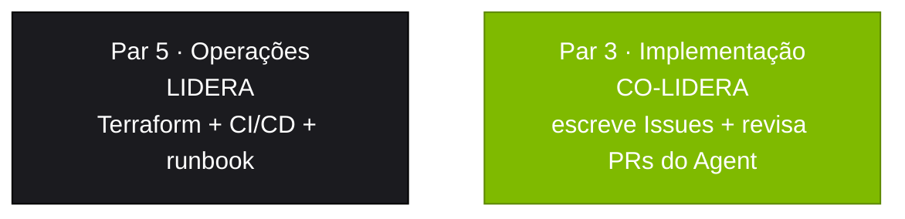

# Estágio 4 — Evolution com Agentes (3 horas)

## Onde isso encaixa no SDLC



## Quem trabalha aqui



## Objetivo

Usar o **modo Agent do GitHub Copilot** para implementar features completas via Issues e Pull Requests, e explorar infraestrutura como código (Terraform) para deploy no Azure.

## Por que isso importa

Até agora vocês usaram o Copilot como **assistente** (Chat) e como **co-autor** (Edits). No Estágio 4 vocês usam como **delegado**: escrevem uma Issue, deixam o Agent trabalhar sozinho, e revisam o PR ao final. É o mais perto que dá de "dirigir o time de IA". A qualidade do seu Issue determina a qualidade do PR — garbage in, garbage out.

## Como pensar nisso

Pense no Agent como **um dev júnior muito rápido e literal**: ele faz exatamente o que está escrito. Não infere. Não pergunta. Se você não disse "respeite a arquitetura modular", ele talvez não respeite. Se você não disse "inclua testes", ele talvez não inclua. **A Issue é o seu contrato com ele.**

---

## Parte 1: GitHub Copilot Agent Mode (2 horas)

### O que é o Agent Mode?

**Copilot Agent Mode** é o terceiro modo do GitHub Copilot (além de Chat e Edits). No modo Agent você:

1. **Escreve uma GitHub Issue** descrevendo a feature completa
2. **Dispara o Agent** no VS Code (via painel do Copilot → "Start Agent" ou pelo Copilot Workspace no github.com)
3. **O Agent analisa o codebase inteiro**, planeja as mudanças e implementa código + testes + docs
4. **Abre um Pull Request** para você revisar

Pense no Agent como **um dev júnior muito rápido** — ele faz o trabalho pesado, mas VOCÊ precisa revisar tudo antes do merge.

> **Diferença entre os 3 modos:**
> - **Chat**: você pergunta, o Copilot responde (exploração, dúvidas)
> - **Edits**: você seleciona arquivos e descreve a mudança, o Copilot edita (implementação guiada)
> - **Agent**: você descreve a feature inteira via Issue, o Copilot implementa sozinho (delegação)

### Como escrever uma boa Issue para o Agent

Uma Issue bem escrita é 80% do sucesso. Siga este formato:

---

#### Exemplo real: notificação de pagamento por e-mail

```markdown
## Title
Add email notification on payment confirmation

## Description
When a payment is confirmed (status changing from PENDING to APPROVED),
the system must send a notification email to the beneficiary informing
them of the amount and the payment date.

## Functional Requirements
- [ ] When a payment's status changes to APPROVED, send an email
- [ ] The email must contain: beneficiary name, amount, date, payment number
- [ ] If sending fails, log it in the audit log (do not block the payment)
- [ ] The email template must be configurable

## Technical Requirements
- [ ] Create an EmailService in the payment/application module
- [ ] Use Spring Mail configured via application.yml
- [ ] Create a unit test mocking the email send
- [ ] Create an integration test with MailHog (Docker container)
- [ ] Add the SMTP_HOST variable to docker-compose.yml

## Architecture
- Follow the existing modular structure (domain/application/infrastructure)
- The EmailService must be injected into PaymentService
- Use Spring events (ApplicationEvent) to decouple

## Acceptance Criteria
- [ ] Unit test passing
- [ ] Integration test passing
- [ ] Working docker compose up with MailHog
- [ ] Email received in MailHog when approving a payment via Swagger

## Context
- Backend: Java 21 + Spring Boot 3
- Relevant module: src/.../payment/
- References: PaymentService.java, PaymentController.java
- Related REQ-ID: REQ-PAY-NOTIF-01
```

---

### Checklist para escrever Issues

Antes de submeter a Issue para o Agent, verifique:

- [ ] **Título claro** — descreve a feature em uma frase
- [ ] **Descrição com contexto** — o Agent precisa entender o "por quê"
- [ ] **Requirements como checklist** — itens verificáveis
- [ ] **Technical requirements** — onde no código, quais padrões seguir
- [ ] **Acceptance criteria** — como saber que está pronto
- [ ] **Referências de arquivo** — ajudam o Agent a achar o código certo
- [ ] **REQ-ID rastreada** — se a feature vem do Estágio 2

### Workflow do Agent

1. **Crie a Issue** no GitHub usando o formato acima
2. **Dispare o Agent** (via Copilot Workspace ou VS Code)
3. **Espere o PR** — o Agent trabalha e abre um PR
4. **Revise o PR** usando o checklist abaixo
5. **Solicite ajustes** se necessário (comente no PR)
6. **Merge** quando estiver satisfeito

---

### Como revisar um PR do Agent (checklist de qualidade)

Quando o Agent abre um PR, revise com cuidado:

#### Correctness
- [ ] O código compila sem erros?
- [ ] Os testes passam? (`./mvnw test`)
- [ ] A feature funciona como descrito na Issue?

#### Arquitetura
- [ ] Segue a estrutura modular (domain/application/infrastructure)?
- [ ] Não há imports circulares entre módulos?
- [ ] A camada domain evita importar classes de infrastructure?

#### Qualidade
- [ ] Nomes de classes, métodos e variáveis estão claros?
- [ ] Tem tratamento de erro adequado?
- [ ] Tem validação de input (Bean Validation)?
- [ ] Não há credenciais hardcoded?

#### Testes
- [ ] Há testes unitários para a lógica de negócio?
- [ ] Há testes de integração para os endpoints?
- [ ] Os testes cobrem casos de erro (não só o happy path)?

#### Documentação
- [ ] Novos endpoints aparecem no Swagger?
- [ ] Há JavaDoc nos métodos públicos?
- [ ] O README foi atualizado se necessário?

---

## Parte 2: Terraform e Infraestrutura (1 hora)

### Visão geral

Os módulos Terraform para deploy no Azure ficam em:

```
05-terraform-azure/
├── main.tf # Módulo raiz
├── variables.tf # Variáveis de entrada
├── outputs.tf # Outputs
└── modules/
 ├── resource-group/ # Resource group do Azure
 ├── container-registry/ # ACR para imagens Docker
 ├── container-apps/ # Azure Container Apps
 ├── postgresql/ # Azure Database for PostgreSQL
 ├── key-vault/ # Azure Key Vault para secrets
 └── monitoring/ # Application Insights + Log Analytics
```

### O que explorar

1. **Leia `main.tf`** — entenda como os módulos se conectam
2. **Olhe as variables** — quais parâmetros são configuráveis?
3. **Estude os outputs** — que informações o Terraform exporta?
4. **Veja o Key Vault** — como secrets são gerenciados?

### Terraform na prática

| Módulo | O que provisiona | Recurso Azure |
|--------|-------------------|----------------|
| `compute/` | Backend Java | App Service (B1 dev, P1v3 prod) |
| `database/` | Banco | PostgreSQL Flexible Server |
| `frontend/` | Frontend Next.js | Static Web App |
| `registry/` | Imagens Docker | Azure Container Registry |
| `security/` | Secrets | Key Vault |
| `observability/` | Monitoramento | Application Insights + Log Analytics |
| `identity/` | Identidade | Azure AD / Entra ID |

#### Para explorar (não precisa aplicar):

```bash
cd 05-terraform-azure/envs/dev
terraform init # Inicializa providers
terraform plan # Mostra o que SERIA criado (sem aplicar)
```

Exemplo de saída de `terraform plan`:
```
Plan: 12 to add, 0 to change, 0 to destroy.

 + azurerm_resource_group.sifap
 + azurerm_postgresql_flexible_server.sifap
 + azurerm_service_plan.sifap
 + azurerm_linux_web_app.sifap_backend
 + azurerm_static_web_app.sifap_frontend
 + azurerm_key_vault.sifap
 + azurerm_application_insights.sifap
 + azurerm_container_registry.sifap
 ...
```

> **Escopo do workshop**: explore e entenda os módulos. NÃO faça `terraform apply` — isso criaria recursos Azure reais com custo real. `terraform plan` é suficiente para demonstrar conhecimento.

### Quando o Agent falha

O Copilot Agent não é perfeito. Problemas comuns:

| Sintoma | Causa provável | O que fazer |
|---------|----------------|--------------|
| PR não compila | Issue faltou contexto técnico | Adicione: arquitetura esperada, arquivos de referência, padrões a seguir |
| Testes faltando no PR | Issue não pediu testes | Adicione checkbox: "Include unit and integration tests" |
| Imports cruzando bounded contexts | Agent ignora fronteiras de módulo | Rejeite o PR; adicione na Issue: "Respect domain/application/infrastructure boundaries" |
| PR com lógica errada | Requisito ambíguo | Reescreva o requisito em EARS e abra nova Issue |
| Agent trava ou demora demais | Codebase grande demais | Estreite o escopo: aponte para arquivos específicos na Issue |

**Regra de ouro**: quando o Agent erra, a causa quase sempre está na Issue. Melhore a Issue antes de tentar de novo.

### CI/CD: GitHub Actions

Os workflows de CI/CD ficam em:

```
.github/workflows/
├── ci.yml # Build + test em cada PR
├── cd-staging.yml # Deploy automático para staging
└── cd-production.yml # Deploy de produção (aprovação manual)
```

#### Workflow CI (ci.yml)

- Roda em cada Pull Request
- Steps: checkout → setup Java 21 → build → test → lint
- Se falhar, o PR não pode ser mergeado

#### Workflow CD (cd-staging.yml)

- Roda após merge na branch `develop`
- Steps: build Docker image → push para ACR → deploy para Container Apps (staging)

---

## Armadilhas comuns

| ❌ Se você está fazendo isso | ✅ Faça assim |
|------------------------------|----------------|
| Issue vaga ("adicione notificação") | Issue completa com functional + technical + acceptance |
| Aceitar PR do Agent sem revisar | Revisar como se fosse PR humano. Quick review é review |
| Disparar Agent para tarefa de 5 minutos | Use Edits para tarefas pequenas. Agent é para features completas |
| Rodar `terraform apply` no workshop | Só `plan`. Não criar recursos Azure reais |
| Hardcode de SMTP_HOST no application.yml | Sempre via env var, com fallback em Key Vault |

---

## Como saber que terminou (Definition of Done)

Ao final do Estágio 4, seu time deve ter:

- [ ] **2 Issues** criadas no formato correto para o Agent
- [ ] **2 PRs** gerados pelo Agent (um para cada Issue)
- [ ] **1 feature mergeada** — pelo menos um PR aprovado e mergeado
- [ ] **Relatório de experiência com o Agent** (arquivo: [`agent-experience-report.md`](agent-experience-report.md))
- [ ] `terraform plan` rodando sem erro em `05-terraform-azure/envs/dev/`
- [ ] CI verde na branch `develop` (build + test passando)

## Próximo passo

Demo (18:30) + Retrospectiva (19:10). Cada time tem ~3 minutos. O Par 1 (PO) conduz o demo; todos preparam 30 segundos cada. Veja [`../../07-playbook-facilitacao/DAY-SCRIPT.md`](../../../07-playbook-facilitacao/DAY-SCRIPT.md) para o roteiro completo.

## Prompts para Copilot Chat

1. *"Crie uma GitHub Issue para o Copilot Agent implementar [funcionalidade]. Use o formato com functional requirements, technical requirements e acceptance criteria."*
2. *"Revise este PR gerado pelo Agent e liste problemas de qualidade."*
3. *"Explique este módulo Terraform: [cole o código]."*
4. *"Que recursos Azure este Terraform vai criar?"*
5. *"Crie um diagrama dos recursos Azure definidos neste Terraform."*
6. *"Como este workflow CI/CD garante qualidade antes do deploy?"*
7. *"Sugira melhorias de segurança para esta configuração Terraform."*

## Dica de ouro

O Agent é só tão bom quanto a Issue que você escreve. Gaste **mais tempo na Issue** e **menos tempo consertando o PR**. Uma Issue com contexto claro, requisitos específicos e referências a arquivos produz PRs muito melhores.

---

## Navegação

| Anterior | Início | Próximo |
|----------|--------|---------|
| [Estágio 3 — GUIDE](../03-implementacao/GUIDE.md) | [Kit PT-BR](../README.md) | [Relatório do Agent](agent-experience-report.md) |

— Paula
