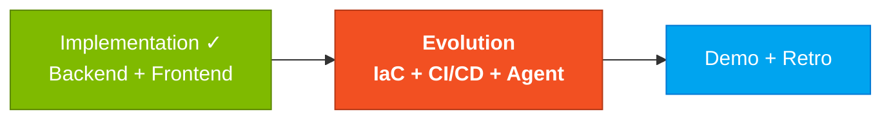
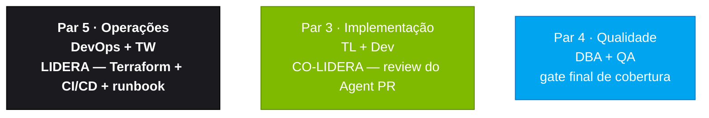

<!-- markdownlint-disable MD013 MD025 MD026 MD028 MD029 MD034 MD040 MD051 MD060 -->

# Estágio 4 — Evolution

> Adicione infraestrutura como código (Terraform), pipeline CI/CD (GitHub Actions) e itere usando workflows com o modo Agent do GitHub Copilot.

## Onde isso encaixa no SDLC

## Quem trabalha aqui

## Conteúdo

| Arquivo                                                    | Propósito                                        |
| ---------------------------------------------------------- | ------------------------------------------------ |
| [`GUIDE.md`](GUIDE.md)                                     | Guia passo a passo deste estágio                 |
| [`agent-experience-report.md`](agent-experience-report.md) | Template de relatório de experiência com o Agent |

## Navegação

| Anterior                                                   | Início                    | Próximo              |
| ---------------------------------------------------------- | ------------------------- | -------------------- |
| [Estágio 3 — Implementação](../03-implementacao/README.md) | [Kit PT-BR](../README.md) | Demo + Retrospectiva |

— Paula
