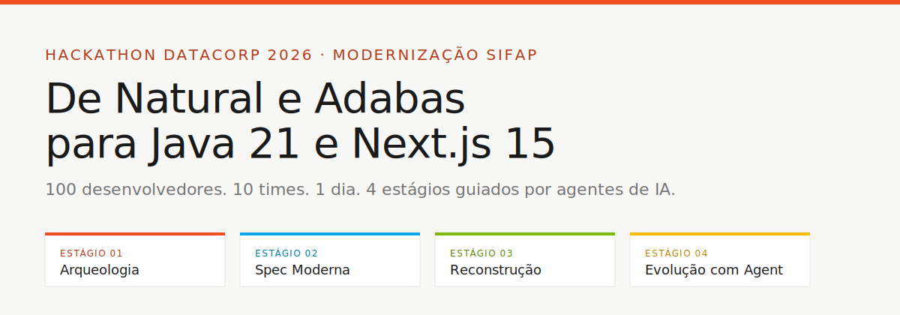
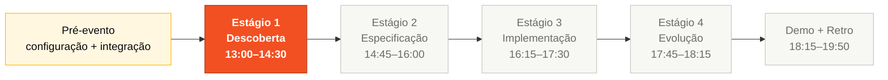
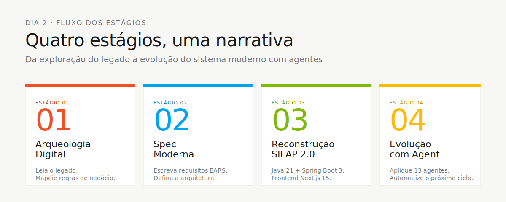
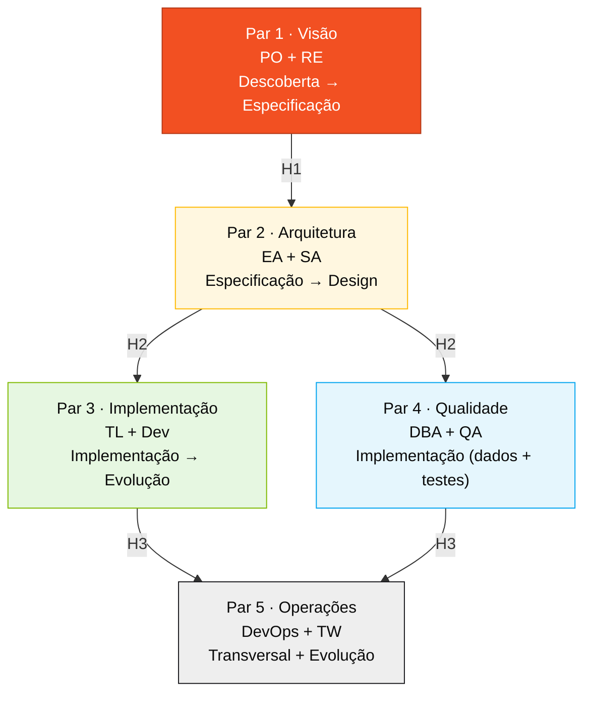
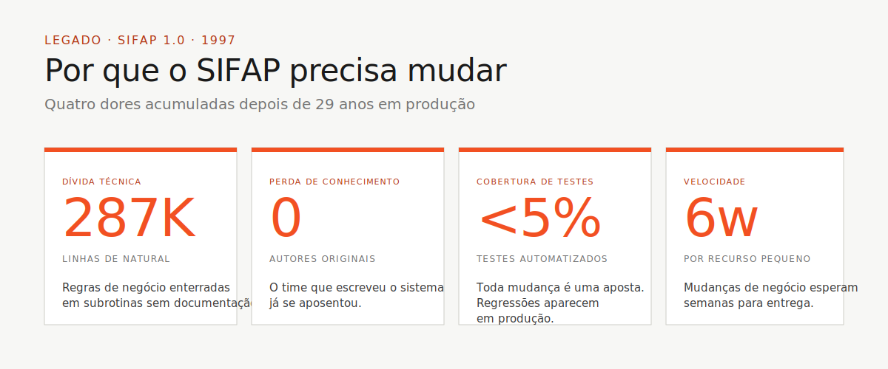
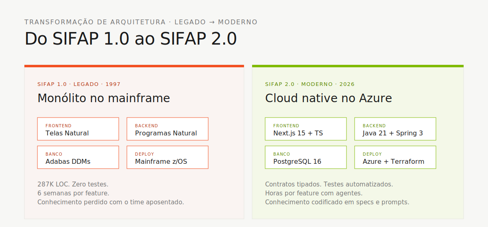

<!-- markdownlint-disable MD013 MD025 MD026 MD028 MD029 MD034 MD040 MD051 MD060 -->

# Kit do Time — Português (BR)



> 🌐 **Idiomas:** [English 🇬🇧](../en/README.md) · **Português 🇧🇷 (aqui)** · [Español 🇲🇽](../es/README.md)

> **Comece aqui se você é participante do workshop.**
>
> 0. 🆕 **Primeira vez aqui ou não-técnico?** Comece por [`FIRST-15-MINUTES.md`](FIRST-15-MINUTES.md) — roteiro de 15 minutos que te leva de "recém-cheguei" até "sei o que faço hoje".
> 1. Leia [`TEAM-FLOW.md`](TEAM-FLOW.md) — como 5 pessoas cobrem 10 personas em 5 pares (10 minutos).
> 2. Abra suas duas pastas em [`persona-kits/`](persona-kits/) e leia o `PERSONA.md` de cada uma (15 minutos).
> 3. Abra o guia do Estágio 1 em [`01-arqueologia/GUIDE.md`](01-arqueologia/GUIDE.md).
>
> 📖 **Recursos didáticos transversais** (consulte quando precisar):
>
> - [`docs/glossario-visual.md`](docs/glossario-visual.md) — 30+ termos técnicos com analogia em 3 linhas (EARS, ADR, DDM, JPA, Flyway, MU, PE...).
> - [`legado-natural/COMO-LER-NATURAL.md`](legado-natural/COMO-LER-NATURAL.md) — como extrair regras de `.NSN` sem saber Natural.
> - [`exemplos-preenchidos/`](exemplos-preenchidos/) — artefatos completos (spec, ADR, Flyway, service, Issue) que mostram o nível de profundidade esperado.

## Ferramentas aprovadas — somente estas

O workshop roda em **stack fixa**. Misturar ferramentas alternativas fragmenta o time e quebra a rastreabilidade spec → código → teste.

| Use                                                                    | Não use                                                                           |
| ---------------------------------------------------------------------- | --------------------------------------------------------------------------------- |
| **VS Code** (ou Insiders)                                              | Cursor, Windsurf, Antigravity, IntelliJ, Eclipse, Sublime, plugins de Neovim      |
| **GitHub Copilot** — modos Ask + Plan + Agent (Copilot Workspace OK)   | Codex, Claude Code, Cline, Continue, Aider, Codeium, Tabnine                      |
| **GitHub Copilot CLI** _(opcional)_                                    | ChatGPT / Claude.ai na web para gerar código (quebra o histórico do Copilot Chat) |
| **Spec-Kit** oficial do GitHub (`Specify CLI` + `/speckit.*`)           | Kiro, frameworks SDD alternativos e pipelines de SDD em YAML custom               |
| **GitHub** (Issues, PRs, Actions, Projects)                            | —                                                                                 |
| **Docker / Docker Compose**                                            | instalações locais de Postgres/Node/Java que divergem do devcontainer             |
| **Terraform** (Azure provider)                                         | —                                                                                 |

O racional completo e o que o CI verifica estão em [`.github/copilot-instructions.md`](.github/copilot-instructions.md).

## Duas camadas de agente — ambas obrigatórias

O kit traz **duas camadas de agente** que cobrem eixos diferentes (papel × estágio). Use as duas.

| Camada                                 | O que                                                                                | Quando                                 | Como                                                                                                                |
| -------------------------------------- | ------------------------------------------------------------------------------------ | -------------------------------------- | ------------------------------------------------------------------------------------------------------------------- |
| [`persona-kits/`](persona-kits/)       | Dez kits, um por persona do workshop (agent + prompts + skills + MCP)                | Carregado uma vez no setup, antes do Estágio 1 | Cada pessoa copia seus 2 kits via `cp -r persona-kits/XX-*/.github/* .github/`                                       |
| [`agent-kits/`](agent-kits/)           | Quatro agentes por estágio: `@archaeologist`, `@architect`, `@builder`, `@evolution` | Selecionado a cada estágio pelo time   | Abra o Copilot Chat → seletor de agentes → escolha o agente do estágio → cole o prompt de abertura do README do kit |

**Não são duplicados.** `persona-kits/` configura **seu Copilot para o seu papel**. `agent-kits/` coordena **o time para o estágio atual**. Um Estágio 1 típico fica assim:

1. Você já carregou seu persona-kit (ex.: Requirements Engineer) → slash commands como `/ears-convert` funcionam.
2. O time seleciona `@archaeologist` no chat → a conversa entra em modo arqueologia.
3. Você pergunta ao `@archaeologist` para resumir `BATCHPGT.NSN` → resposta com enquadramento de arqueologia.
4. Você roda `/ears-convert` sobre o que descobriu → seu persona-kit de RE assume e devolve YAML com a linha `source_legacy:`.

Diagrama completo da integração em [`.github/copilot-instructions.md`](.github/copilot-instructions.md).

Você e quatro colegas têm um dia para modernizar um sistema de pagamentos de 29 anos. Cinco pares, quatro estágios, dez artefatos, um demo. Este folder é o kit que mantém os cinco caminhando na mesma direção.

## Onde isso encaixa no SDLC



Este kit cobre tudo do momento em que você clona o repositório até o momento em que seu time faz a demonstração de um SIFAP 2.0 rodando. A manhã é para configuração, instalação dos kits e orientação; a arqueologia começa na parte da tarde, às 13:00.



## Quem trabalha aqui (os 5 pares)



Cada pessoa do time escolhe **um par (duas personas)** e fica nele o dia inteiro. As duas personas em um par são corresponsáveis — sem passagem interno, colaboração contínua. Os passagems horizontais (H1, H2, H3) são onde o dia flui ou quebra.

## Por que isso importa

A maioria dos projetos de modernização falha não porque o time não sabe escrever Java, mas porque escreve Java para o problema errado. Modernizam o brief, não o sistema. Perdem 29 anos de regras de negócio enterradas em código que ninguém lê. Demoam algo bonito que não substitui nada de real.



Este kit existe para impedir que isso aconteça com você. O código legado vai junto com vocês. A rastreabilidade é exigida pelo CI. Os passagems estão agendados. Os papéis são explícitos. Você não precisa inventar o processo; precisa executá-lo.

## Como pensar neste kit

Pense nele como uma **caixa de ferramentas mais um mapa**. A caixa são os persona-kits, prompts, devcontainer, scripts e gates de CI — tudo pré-configurado. O mapa é o `TEAM-FLOW.md` mais os quatro guias de estágio — o que o time faz junto, hora a hora.



Você não lê este kit de capa a capa. Lê as partes que seu par precisa, quando precisa. Três regras:

1. **Leia o `PERSONA.md` dos seus dois kits primeiro.** Sem isso, você vai pegar a ferramenta errada no estágio errado.
2. **Confie nos passagems.** O trabalho do Par 1 não é "terminar" a spec — é entregar para o Par 2 uma spec limpa. O Par 3 não faz deploy — quem faz é o Par 5. Cada par tem um receptor downstream.
3. **O legado é obrigatório.** Todo requisito no Estágio 2 traça de volta para um arquivo `.NSN` ou `.ddm`. O CI verifica. Pular o Estágio 1 = falhar no gate às 14:30.

## Estrutura de pastas

| Caminho                                  | Propósito                                                                                             |
| ---------------------------------------- | ----------------------------------------------------------------------------------------------------- |
| [`TEAM-FLOW.md`](TEAM-FLOW.md)           | **Leia primeiro.** Linha do tempo do dia, passagems, regras de escalação                               |
| [`01-arqueologia/`](01-arqueologia/)     | Estágio 1 — guia de arqueologia do código legado, templates e o gate forte                            |
| [`02-spec-moderna/`](02-spec-moderna/)   | Estágio 2 — especificação EARS (todo REQ precisa de `source_legacy:`), ADRs, escopo                   |
| [`03-implementacao/`](03-implementacao/) | Estágio 3 — guia de implementação Java + Next.js                                                      |
| [`04-evolucao/`](04-evolucao/)           | Estágio 4 — Terraform IaC, CI/CD, Copilot Agent Mode                                                  |
| [`docs/`](docs/)                         | Documentação transversal: fluxo SDLC, matriz persona-agente, glossário, runbook e ADRs                |
| [`legado-natural/`](legado-natural/)                     | Cópia local do legado SIFAP para exploração em português: Natural, DDMs, demo e documentos históricos |
| [`assets/`](assets/)                     | Imagens SVG localizadas em PT-BR para README, fluxo dos estágios, personas e transformação arquitetural |
| [`persona-kits/`](persona-kits/)         | Os 10 kits consolidados para as 5 pessoas do time: `PERSONA.md`, agentes, prompts, skills e MCP       |
| [`cheat-sheets/`](cheat-sheets/)         | Cartões de referência rápida: 3 modos do Copilot, Spec-Kit e model routing                            |
| [`specs/`](specs/)                       | Exemplo de estrutura Spec-Kit/SDD para orientar specs do time                                         |
| [`scripts/`](scripts/)                   | Scripts locais `setup.sh` e `check.sh`, com README em português                                       |
| [`exemplos-preenchidos/`](exemplos-preenchidos/) | **🆕 Artefatos completos prontos** (spec EARS, ADR, Flyway, service Java, Issue para Agent) — referência de profundidade ao escrever os seus |

Este folder foi preparado para ser **navegável por conta própria**: a documentação, o legado usado na arqueologia, os templates, os scripts auxiliares, `.github/`, `persona-kits/`, `agent-kits/`, `plugins/` e `assets/` estão dentro de `pt-br/`.

## O que tem neste espelho PT-BR

Este folder é a versão **didática** em português. Os arquivos originais em `06-kit-repositorio-times/<caminho-original>` são referências enxutas; os arquivos aqui são as versões expandidas, em tom de parceiro, que um dev pode ler e agir em cima.

Todo conteúdo PT-BR segue o mesmo contrato didático:

1. **Contexto primeiro.** Cada guia explica onde o assunto entra no SDLC e por que importa.
2. **Passo a passo executável.** Sempre que há uma ação, há comandos, checklist ou sequência numerada.
3. **Exemplo concreto.** Templates, prompts e guias mostram exemplos SIFAP em vez de instruções abstratas.
4. **Critério de pronto.** Passagems, stages e templates deixam claro como saber que terminou.
5. **Solução de problemas.** Onde há risco operacional, há seção de problemas comuns e como resolver.

| Você quer…                                    | Vá para                                             |
| --------------------------------------------- | --------------------------------------------------- |
| 🆕 Os 15 primeiros minutos passo a passo       | [`FIRST-15-MINUTES.md`](FIRST-15-MINUTES.md)        |
| A resposta de 10 minutos "o que eu faço hoje" | [`TEAM-FLOW.md`](TEAM-FLOW.md)                      |
| Instruções passo a passo do estágio atual     | [`0X-estagio/GUIDE.md`](01-arqueologia/GUIDE.md)    |
| 🆕 Decodificar siglas técnicas                 | [`docs/glossario-visual.md`](docs/glossario-visual.md) |
| 🆕 Ler programas Natural sem ser dev           | [`legado-natural/COMO-LER-NATURAL.md`](legado-natural/COMO-LER-NATURAL.md) |
| 🆕 Ver artefatos completos como exemplo        | [`exemplos-preenchidos/`](exemplos-preenchidos/)    |
| Um lembrete de 1 página durante o dia         | [`cheat-sheets/`](cheat-sheets/)                    |
| O código legado e os DDMs para investigar     | [`legado-natural/`](legado-natural/)                                |
| Templates e scripts auxiliares                | [`scripts/`](scripts/)                              |

## Como usar este kit

```bash
# 1. Copie o kit para o repositório vazio do seu time
cp -r 06-kit-repositorio-times/. ~/team-XX-repo/

# 2. Bootstrap (clona materiais de referência, configura symlinks, verifica ferramentas)
cd ~/team-XX-repo
./scripts/setup.sh

# 3. Abra no VS Code
code .
# Depois: Ctrl+Shift+P > "Dev Containers: Reopen in Container"
```

Dentro do devcontainer:

```bash
# 1. Leia o fluxo do time primeiro (10 minutos)
cat pt-br/TEAM-FLOW.md

# 2. Leia AS DUAS cartas de persona (15 minutos) — uma por persona do seu par
cat pt-br/persona-kits/XX-persona-A/PERSONA.md
cat pt-br/persona-kits/YY-persona-B/PERSONA.md

# 3. Copie OS DOIS kits de agente Copilot para o .github/ do seu repo
cp -r persona-kits/XX-persona-A/.github/* .github/
cp -r persona-kits/YY-persona-B/.github/* .github/

# 4. Abra o guia do Estágio 1 e comece
cat pt-br/01-arqueologia/GUIDE.md
```

## Navegação

| Anterior               | Início                            | Próximo                   |
| ---------------------- | --------------------------------- | ------------------------- |
| [Kit PT-BR](README.md) | [Workspace raiz](../../README.md) | [Team Flow](TEAM-FLOW.md) |

— Paula
