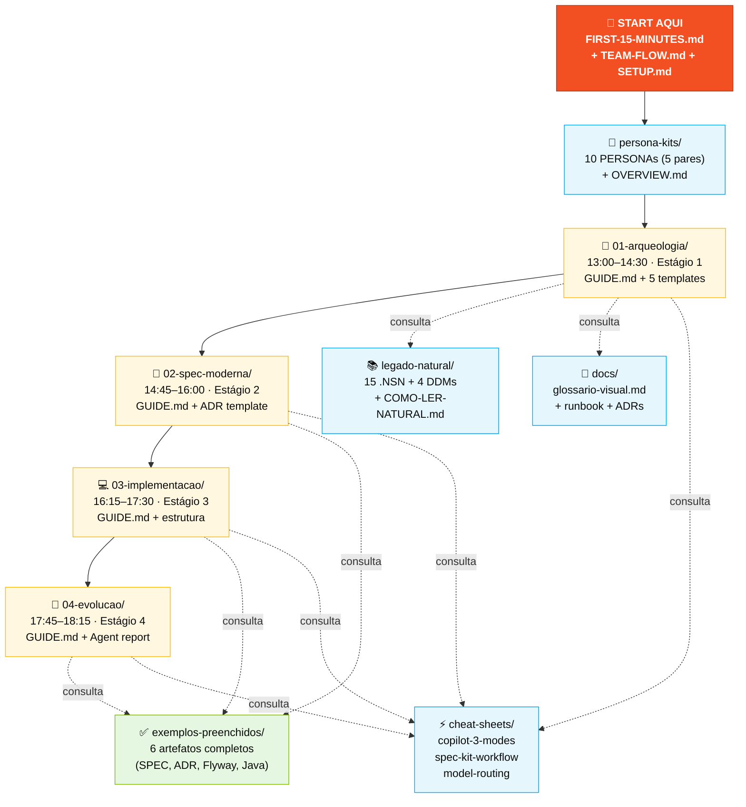
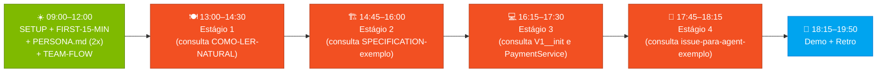

<!-- markdownlint-disable MD013 MD025 MD026 MD028 MD029 MD034 MD040 MD051 MD060 -->

# SITEMAP — Mapa Visual do Kit pt-br

> **Use esta página quando…** você se perdeu no meio do dia, ou quando alguém pergunta *"onde mesmo está aquele arquivo?"*. Esta é a vista de cima do kit inteiro.

## Estrutura do kit (em alto nível)

## Caminho recomendado por persona

| Você é… | Comece por… | Depois… | Depois… |
|---|---|---|---|
| **Qualquer pessoa, primeira vez** | [`FIRST-15-MINUTES.md`](FIRST-15-MINUTES.md) | [`TEAM-FLOW.md`](TEAM-FLOW.md) | seu `PERSONA.md` |
| **Líder do time** | [`SETUP.md`](SETUP.md) (setup completo) | [`TEAM-FLOW.md`](TEAM-FLOW.md) | [`persona-kits/OVERVIEW.md`](persona-kits/OVERVIEW.md) |
| **PO ou RE (Par 1)** | [`persona-kits/01-product-owner/PERSONA.md`](persona-kits/01-product-owner/PERSONA.md) | [`01-arqueologia/GUIDE.md`](01-arqueologia/GUIDE.md) | [`02-spec-moderna/GUIDE.md`](02-spec-moderna/GUIDE.md) |
| **EA ou SA (Par 2)** | [`persona-kits/03-enterprise-architect/PERSONA.md`](persona-kits/03-enterprise-architect/PERSONA.md) | [`exemplos-preenchidos/ADR-001-monolito-modular-exemplo.md`](exemplos-preenchidos/ADR-001-monolito-modular-exemplo.md) | [`02-spec-moderna/GUIDE.md`](02-spec-moderna/GUIDE.md) |
| **TL ou Dev (Par 3)** | [`persona-kits/06-developer/PERSONA.md`](persona-kits/06-developer/PERSONA.md) | [`exemplos-preenchidos/PaymentService-exemplo.java`](exemplos-preenchidos/PaymentService-exemplo.java) | [`03-implementacao/GUIDE.md`](03-implementacao/GUIDE.md) |
| **DBA ou QA (Par 4)** | [`persona-kits/07-dba/PERSONA.md`](persona-kits/07-dba/PERSONA.md) | [`exemplos-preenchidos/V1__init_payment_module-exemplo.sql`](exemplos-preenchidos/V1__init_payment_module-exemplo.sql) | [`03-implementacao/GUIDE.md`](03-implementacao/GUIDE.md) |
| **DevOps ou TW (Par 5)** | [`persona-kits/09-devops-engineer/PERSONA.md`](persona-kits/09-devops-engineer/PERSONA.md) | [`exemplos-preenchidos/issue-para-agent-exemplo.md`](exemplos-preenchidos/issue-para-agent-exemplo.md) | [`04-evolucao/GUIDE.md`](04-evolucao/GUIDE.md) |
| **Não programa em Natural** | [`legado-natural/COMO-LER-NATURAL.md`](legado-natural/COMO-LER-NATURAL.md) | [`01-arqueologia/GUIDE.md`](01-arqueologia/GUIDE.md) | (sua persona) |
| **Encontrou termo técnico estranho** | [`docs/glossario-visual.md`](docs/glossario-visual.md) | (volte de onde veio) | — |

## Tabela: onde mora cada coisa

| Pasta / Arquivo | O que tem | Quando abrir |
|---|---|---|
| [`README.md`](README.md) | Visão geral, links rápidos | Primeira chegada |
| [`FIRST-15-MINUTES.md`](FIRST-15-MINUTES.md) | Roteiro para não-técnicos | Primeira chegada (se nunca usou Copilot) |
| [`SETUP.md`](SETUP.md) | Setup completo do laptop, GitHub, Copilot, Spec-Kit | Manhã, 1 vez |
| [`TEAM-FLOW.md`](TEAM-FLOW.md) | Cronograma, passagens, regra dos 20 min, DoD | A toda hora |
| [`SITEMAP.md`](SITEMAP.md) | Este arquivo. Mapa visual | Quando se perder |
| [`persona-kits/`](persona-kits/) | 10 PERSONAs + agents/prompts/skills + OVERVIEW.md | Após setup, antes do Estágio 1 |
| [`agent-kits/`](agent-kits/) | 4 agentes Copilot (arch., archit., builder, evolution) | A cada estágio (seletor de agente no Chat) |
| [`01-arqueologia/`](01-arqueologia/) | GUIDE + 5 templates do Estágio 1 | 13:00–14:30 |
| [`02-spec-moderna/`](02-spec-moderna/) | GUIDE + ADR template + scope decisions | 14:45–16:00 |
| [`03-implementacao/`](03-implementacao/) | GUIDE do Estágio 3 (código + testes) | 16:15–17:30 |
| [`04-evolucao/`](04-evolucao/) | GUIDE + relatório do Agent | 17:45–18:15 |
| [`legado-natural/`](legado-natural/) | 15 .NSN + 4 DDMs + 3 docs históricos + demo terminal | Durante Estágio 1 |
| [`legado-natural/COMO-LER-NATURAL.md`](legado-natural/COMO-LER-NATURAL.md) | Como ler .NSN sem saber Natural | Antes do Estágio 1 se não-dev |
| [`exemplos-preenchidos/`](exemplos-preenchidos/) | 6 artefatos completos (catálogo BR, SPEC, ADR, Flyway, Java, Issue) | Sempre que for criar artefato novo |
| [`docs/`](docs/) | glossario-visual + sdlc-flow-guide + persona-agent-matrix + runbook | Transversal |
| [`docs/glossario-visual.md`](docs/glossario-visual.md) | 30+ siglas com analogia | Quando ver jargão |
| [`cheat-sheets/`](cheat-sheets/) | 3 cartões de 1 página: Copilot, Spec-Kit, model routing | A qualquer momento |
| [`specs/`](specs/) | Exemplo de estrutura Spec-Kit | Durante Estágio 2 |
| [`plugins/`](plugins/) | github-issues + azure-boards | Opcional (Estágio 4) |
| [`scripts/`](scripts/) | setup.sh + check.sh | Setup inicial e validação local |
| [`assets/`](assets/) | SVGs localizados (jornada, fluxo, personas) | Renderizam no README |

## Fluxo de leitura do dia

## Se você se perdeu

1. **Não sabe em qual estágio está?** Olhe o relógio + [`TEAM-FLOW.md`](TEAM-FLOW.md) §1 (cronograma).
2. **Não sabe o que sua persona faz?** Abra seu [`persona-kits/0X-.../PERSONA.md`](persona-kits/OVERVIEW.md) → seção "Onde você aparece em cada estágio".
3. **Não sabe o que entregar?** Abra o `GUIDE.md` do estágio atual → seção "Como saber que terminou (DoD)".
4. **Achou um termo estranho?** [`docs/glossario-visual.md`](docs/glossario-visual.md).
5. **Travou há mais de 20 min?** Levante a mão. **Regra do TEAM-FLOW.md §6.**

---

## 🧭 Navegação

| Anterior | Home | Próximo |
| --- | --- | --- |
| [← Kit PT-BR](README.md) | [Kit PT-BR](README.md) | [FIRST-15-MINUTES](FIRST-15-MINUTES.md) |
