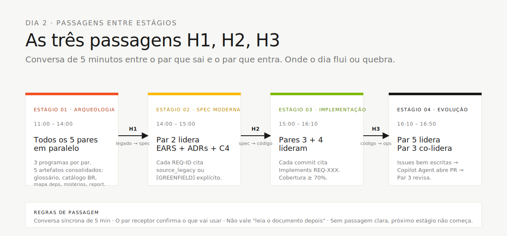

<!-- markdownlint-disable MD013 MD025 MD026 MD028 MD029 MD034 MD040 MD051 MD060 -->

# Fluxo do Time — Como 5 Pessoas Cobrem 10 Personas

> **Leia este documento antes de ler os cards de persona.** Suas duas personas só fazem sentido dentro do fluxo do time.

**Edição: 20 times · 5 pessoas por time · 2 personas por pessoa · 5 pares cobrindo todo o SDLC.**

Um time de 5 pessoas com 10 personas só funciona se cada pessoa souber:

1. **Qual fase do SDLC** cada uma de suas duas personas lidera.
2. **Quem alimenta o trabalho dela** (o par anterior).
3. **Para quem ela faz a passagem de bastão** (o par seguinte).
4. **Quando pedir ajuda** (regra dos 20 minutos).

Este documento responde às quatro. Fixe na sua tela.

---

## Onde isso encaixa no SDLC


Os 5 pares trabalham **em paralelo dentro de cada fase**, alternando liderança conforme o SDLC avança. As três passagens entre estágios (**H1** legado→spec, **H2** spec→código, **H3** código→ops) são pontos onde o dia flui ou quebra. Ninguém fica ocioso, ninguém repete trabalho.

---

## 1. Os 5 Pares e Suas Fases no SDLC

Cada pessoa escolhe **um par** (duas personas). As duas personas de um par são corresponsáveis — não há passagem interno entre elas, elas colaboram continuamente.

| #   | Par                                | Personas                                  | Fase do SDLC liderada           | Cor      |
| --- | ---------------------------------- | ----------------------------------------- | ------------------------------- | -------- |
| 1   | **Visão**                          | Product Owner + Requirements Engineer     | Descoberta + Especificação      | Vermelho |
| 2   | **Arquitetura**                    | Enterprise Architect + Software Architect | Especificação + Design          | Amarelo  |
| 3   | **Implementação**                  | Technical Lead + Developer                | Implementação + Evolução        | Verde    |
| 4   | **Qualidade**                      | DBA + QA Engineer                         | Implementação (dados + testes)  | Azul     |
| 5   | **Operações**                      | DevOps Engineer + Tech Writer             | Transversal + Evolução          | Preto    |

> Personas e kits Copilot ficam juntos em [`persona-kits/`](persona-kits/): leia o `PERSONA.md` do seu papel e copie os artefatos `.github/` do mesmo diretório.


### Divisão interna do par (sugerida, não obrigatória)

| Par               | Foco da persona A                                      | Foco da persona B                                             |
| ----------------- | ------------------------------------------------------ | ------------------------------------------------------------- |
| 1 · Visão         | **PO**: escopo, valor, prioridades, roteiro do demo    | **RE**: requisitos EARS, critérios de aceitação, REQ-IDs      |
| 2 · Arquitetura   | **EA**: C4 L1 (contexto do sistema), ADRs de topologia | **SA**: C4 L2/L3 (containers + components), bounded contexts  |
| 3 · Implementação | **TL**: padrões, revisão de PR, orquestração do agente | **Dev**: código Java + TypeScript, testes unitários           |
| 4 · Qualidade     | **DBA**: schema PostgreSQL, migrações Flyway           | **QA**: cenários BDD, gates de cobertura, contract tests      |
| 5 · Operações     | **DevOps**: Terraform, GitHub Actions, secrets         | **TW**: glossário, revisão de clareza de ADR, runbook, README |

Faça rotação dentro do par a cada ~45 min para nenhuma pessoa monopolizar conhecimento.

---

## 2. Linha do Tempo (8 horas, Dia 2)

```
09:00 09:30 12:00 13:00 14:30 16:00 17:30 18:15
 |-----|-----------------------| |-----|-----|-----|-----|------|
 | configuração + orientação técnica | ALMOÇO | S1 Arqueologia | S2 Spec | S3 Impl | S4 Evol
```

| Horário         | Bloco                               | Pares líderes                             | Pares de suporte                                            |
| --------------- | ----------------------------------- | ----------------------------------------- | ----------------------------------------------------------- |
| **09:00–09:30** | Abertura + configuração             | Todos                                     | Leiam TEAM-FLOW e confirmem o par de cada pessoa             |
| **09:30–10:30** | Instalação dos kits Copilot         | Todos                                     | Cada pessoa copia seus 2 persona-kits e valida Ask/Plan/Agent |
| **10:30–11:30** | Configuração técnica + testes de fumaça | Par 3 + Par 5                          | Docker, Spec-Kit, scripts, estratégia de branches e acesso ao GitHub |
| **11:30–12:00** | Orientação do legado                | Par 1 + Par 4                             | Apresentação dos Natural programs, DDMs e critérios de arqueologia |
| **12:00–13:00** | ALMOÇO                              | —                                         | —                                                           |
| **13:00–14:15** | Estágio 1 — Arqueologia (mineração) | **Par 1** (PO+RE), **Par 5** (TW)         | Par 2 mapeia contexto; Pares 3 e 4 leem protótipo e DDMs    |
| **14:15–14:30** | **Passagem #1** legado → spec        | Par 1 → Par 2                             | Par 5 dá suporte de clareza de ADR                          |
| **14:45–16:00** | Estágio 2 — Spec Moderna            | **Par 2** (EA+SA)                         | Par 1 valida escopo; Par 5 cuida da clareza dos ADRs        |
| **16:00–16:15** | **Passagem #2** spec → código        | Par 2 → Pares 3 + 4                       | Par 1 assina o escopo                                       |
| **16:15–17:30** | Estágio 3 — Implementação           | **Par 3** (TL+Dev), **Par 4** (DBA+QA)    | Par 5 inicia rascunho do pipeline                           |
| **17:30–17:45** | **Passagem #3** código → ops         | Par 3 → Par 5                             | Par 4 continua testes finais                                |
| **17:45–18:15** | Estágio 4 — Evolução                | **Par 5** (DevOps+TW), **Par 3** (TL+Dev) | Par 4 gate final de cobertura                               |
| **18:15–18:45** | Preparação do demo                  | Par 1 + Par 3                             | Todos ensaiam 30 segundos cada                              |
| **18:45–19:20** | **Demos** (20 times × ~3 min)       | Time todo                                 | —                                                           |
| **19:20–19:50** | Retrospectiva                       | Todos                                     | Cada persona preenche seu form                              |
| **19:50–20:00** | Encerramento                        | —                                         | —                                                           |

> Ninguém fica parado. Pares que não estão "liderando" um estágio têm trabalho concreto de suporte — veja §4.

---

## 3. Mapa de Passagens (raias por par)



Cada par tem trabalho concreto em todos os estágios — o quem-faz-o-quê fica detalhado nas tabelas §4 e §5 abaixo. Os pontos críticos são as três passagens (H1, H2, H3) e a regra é sempre a mesma: **conversa síncrona de 5 minutos** entre par que sai e par que entra.

### Como ler o mapa

- **Setas são dependências bloqueantes.** Sem o Par 2 entregar os ADRs, os Pares 3 e 4 não conseguem começar o trabalho certo.
- **Posição vertical = tempo.** Mais alto = mais cedo no dia.
- **Cada passagem é uma conversa de 5 minutos** entre o par que sai e o par que entra. Não vale "só leia o documento". Fale ao vivo.

---

## 4. O Que Cada Par Faz em Cada Estágio

Nenhum par fica parado. Mesmo quando não está "liderando", cada par tem trabalho explícito de suporte.

| Par                   | Estágio 1 (Arqueologia)                                          | Estágio 2 (Spec)                                                    | Estágio 3 (Implementação)                                               | Estágio 4 (Evolução)                                         |
| --------------------- | ---------------------------------------------------------------- | ------------------------------------------------------------------- | ----------------------------------------------------------------------- | ------------------------------------------------------------ |
| **1 · Visão**         | **Lidera.** Extrai regras; PO prioriza escopo.                   | Valida EARS; assina escopo no H2.                                   | De prontidão para esclarecer requisitos. Constrói narrativa da demonstração. | Ensaio da demonstração.                                  |
| **2 · Arquitetura**   | Mapeia contexto do sistema (rascunho C4 L1).                     | **Lidera.** C4 L2/L3 + ADRs.                                        | De prontidão para perguntas de fronteira; revisa PRs que tocam contratos. | Valida IaC contra ADRs.                                   |
| **3 · Implementação** | Lê protótipo, define convenções (branches, template de PR, DoD). | Comenta sobre viabilidade; estima complexidade.                     | **Lidera.** Código, testes, integração.                                 | **Co-lidera.** Delegação em modo Agent, revisão de PR.       |
| **4 · Qualidade**     | Lê DDMs, planeja mapeamento de schema.                           | Comenta sobre implicações de dados; escreve primeiros cenários BDD. | **Lidera.** Schema, migrações, cobertura de testes.                     | Gate final de cobertura; contract tests no CI.               |
| **5 · Operações**     | Glossário, semente do runbook, esqueleto do README.              | Revisão de clareza dos ADRs; voz consistente de escrita.            | Rascunho da estrutura do pipeline CI.                                   | **Lidera.** Terraform + CI/CD completos; runbook finalizado. |

---

## 5. Primeiros 30 Minutos — Checklist por Par

Às 09:00, **todo par** faz as mesmas 4 coisas nos primeiros 30 minutos. Depois começa a especialização.

| Passo | Ação                                                                                                      | Tempo  |
| ----- | --------------------------------------------------------------------------------------------------------- | ------ |
| 1     | Leia [`TEAM-FLOW.md`](TEAM-FLOW.md) (este arquivo)                                                        | 10 min |
| 2     | Leia o `PERSONA.md` dos seus dois kits em [`persona-kits/`](persona-kits/)                                | 10 min |
| 3     | Copie seu kit Copilot: `cp -r persona-kits/XX-persona-A/.github/* .github/` (repita para persona B) | 5 min  |
| 4     | Abra o Copilot Chat, rode o prompt de teste de fumaça de um dos seus cards                                | 5 min  |

### Primeira ação de cada par na arqueologia, às 13:00

| Par                   | Ação às 13:00                                                                                                                                                                                       |
| --------------------- | --------------------------------------------------------------------------------------------------------------------------------------------------------------------------------------------------- |
| **1 · Visão**         | PO abre [`../../01-blueprint/WORKSHOP-BLUEPRINT.md`](../../01-blueprint/WORKSHOP-BLUEPRINT.md); RE abre [`legado-natural/natural-programs/`](legado-natural/natural-programs/) e começa o catálogo de regras.       |
| **2 · Arquitetura**   | EA abre [`legado-natural/legacy-docs/`](legado-natural/legacy-docs/) e começa C4 L1; SA prepara candidatos a bounded context.                                                                                       |
| **3 · Implementação** | TL define estratégia de branches, template de PR, definição de pronto; Dev roda `docker compose up` no protótipo.                                                                                   |
| **4 · Qualidade**     | DBA abre [`legado-natural/adabas-ddms/`](legado-natural/adabas-ddms/) e começa o mapeamento de campos; QA lê o layout dos testes em [`../../04-prototipo-sifap-moderno/`](../../04-prototipo-sifap-moderno/).       |
| **5 · Operações**     | DevOps abre [`../../05-terraform-azure/`](../../05-terraform-azure/) e revisa módulos; TW abre o template em [`01-arqueologia/glossary.md`](01-arqueologia/glossary.md).                            |

---

## 6. A Regra dos 20 Minutos

> **Se você (ou seu par) está travado no mesmo problema por 20 minutos, pare e peça ajuda.**

A regra vale para todo mundo. Pedir não é fraqueza; sofrer calado é.

### Escala de escalação

| Travado há | Fale com                                                               |
| ---------- | ---------------------------------------------------------------------- |
| 5 min      | Tente Copilot Chat com framing diferente, ou com o parceiro do seu par |
| 10 min     | Fale com o **par** imediatamente anterior ou posterior (veja §3)       |
| 20 min     | Fale com o **Par 3** (TL coordena o time)                              |
| 30 min     | Levante a mão para um facilitador (cordão azul)                        |

### Como escalar (formato de 3 linhas)

```
1. Objetivo: O que estou tentando alcançar
2. Tentei: O que já tentei (com o resultado)
3. Bloqueio: O que está me impedindo agora
```

Ruim: _"Isso não está funcionando."_
Bom: _"Objetivo: validar CPF em `BeneficiaryService`. Tentei: regex + sugestão do Copilot (ambos falham em zeros). Bloqueio: não sei se o mod-11 deve rejeitar 00000000000 explicitamente."_

---

## 7. Definição de Pronto — Por Passagem

### Passagem #1 — Legado → Spec (fim do Estágio 1, ~14:30)

**Dono:** Par 1 (Visão)
**Receptores:** Par 2 (Arquitetura), Par 5 (Operações)

| Artefato              | Caminho                                                                                | Pronto significa                                  |
| --------------------- | -------------------------------------------------------------------------------------- | ------------------------------------------------- |
| Glossário             | [`01-arqueologia/glossary.md`](01-arqueologia/glossary.md)                             | ≥ 30 termos com definições (voz pelo Par 5)       |
| Catálogo de regras    | [`01-arqueologia/business-rules-catalog.md`](01-arqueologia/business-rules-catalog.md) | ≥ 15 regras com referência ao programa-fonte      |
| Mapa de dependências  | [`01-arqueologia/dependency-map.md`](01-arqueologia/dependency-map.md)                 | Diagrama Mermaid cobrindo os 15 Naturals          |
| Mistérios encontrados | [`01-arqueologia/mysteries-found.md`](01-arqueologia/mysteries-found.md)               | ≥ 5 regras escondidas identificadas com evidência |

### Passagem #2 — Spec → Código (fim do Estágio 2, ~16:00)

**Dono:** Par 2 (Arquitetura)
**Receptores:** Par 3 (Implementação), Par 4 (Qualidade)

| Artefato            | Caminho                                               | Pronto significa                                |
| ------------------- | ----------------------------------------------------- | ----------------------------------------------- |
| Especificações EARS | [`02-spec-moderna/`](02-spec-moderna/) (via Spec-Kit) | ≥ 12 requisitos com REQ-IDs                     |
| Diagramas C4        | `02-spec-moderna/diagrams/`                           | Níveis 1, 2, 3 em Mermaid                       |
| ADRs                | `02-spec-moderna/ADRs/`                               | ≥ 3 ADRs (monólito modular, persistência, auth) |
| Aprovação de escopo | Registrado no PR                                      | Par 1 (PO) aprovou escopo                       |

### Passagem #3 — Código → Ops (fim do Estágio 3, ~17:00)

**Dono:** Par 3 (Implementação)
**Receptores:** Par 5 (Operações)

| Artefato               | Caminho                                    | Pronto significa                                         |
| ---------------------- | ------------------------------------------ | -------------------------------------------------------- |
| Backend funcionando    | `04-prototipo-sifap-moderno/backend/`      | `mvn test` verde; OpenAPI documentada                    |
| Frontend funcionando   | `04-prototipo-sifap-moderno/frontend/`     | `npm test` verde; fluxos principais usáveis              |
| Migrações              | `backend/src/main/resources/db/migration/` | Scripts Flyway numerados; idempotentes (Par 4 cuida)     |
| Relatório de cobertura | Artefato do CI                             | Backend ≥ 70%, frontend ≥ 60% de linhas (Par 4 verifica) |

---

## 8. Padrões de Comunicação

| Padrão                | Quando                             | Exemplo                                                                                 |
| --------------------- | ---------------------------------- | --------------------------------------------------------------------------------------- |
| **Stand-up**          | A cada transição de estágio (4×)   | Rodada de 2 min, uma frase por par: "Terminamos X, estamos fazendo Y, bloqueados por Z" |
| **Check-in do par**   | A cada 30 min dentro de um estágio | "Nós dois ainda estamos alinhados?"                                                     |
| **Sync par-a-par**    | Nos passagems                       | Conversa guiada de 5 minutos, sem slide                                                     |
| **Comentários em PR** | Assíncrono entre pares             | Marque o par receptor explicitamente (`@par-3`)                                         |
| **Hora silenciosa**   | Últimos 30 min do Estágio 3        | Sem reuniões; todo mundo codifica/testa                                                 |

---

## 9. Anti-padrões (Não faça isso)

| ❌ Anti-padrão                                           | ✅ Faça assim                                                              |
| -------------------------------------------------------- | -------------------------------------------------------------------------- |
| Uma persona do par faz tudo                              | Rotacione a cada ~45 min; a outra fica aquecida                            |
| Pular um passagem — "eu descubro a parte deles também"    | Conversa guiada par-a-par de 5 min em toda transição                       |
| Par 4 (Qualidade) espera o fim do Estágio 3 para começar | Par 4 escreve cenários BDD assim que existirem REQ-IDs (meio do Estágio 2) |
| Par 5 (Operações) ocioso até o Estágio 4                 | Par 5 conduz glossário no S1, clareza de ADR no S2, scaffold de CI no S3   |
| Par 1 (Visão) some depois do Estágio 1                   | PO valida escopo no H2 e ensaia demo no S4                                 |
| Par 3 dá merge sem review                                | Todo PR tem pelo menos um review entre pares                               |

---

## 10. Referência rápida

```
Que par eu sou? → §1 (tabela dos 5 pares)
O que meu par faz no estágio N? → §4 (matriz por par e por estágio)
Travado? → regra dos 20 minutos (§6)
Preciso fazer passagem? → critérios de pronto (§7)
Qual modo do Copilot? → cheat-sheets/copilot-3-modes.md
Qual modelo? → cheat-sheets/model-routing.md
Qual comando do Spec-Kit? → cheat-sheets/spec-kit-workflow.md
```

---

## Navegação

| Pai                              | Início                       |
| -------------------------------- | ---------------------------- |
| [Kit do Time (PT-BR)](README.md) | [Workspace](../../README.md) |

— Paula
