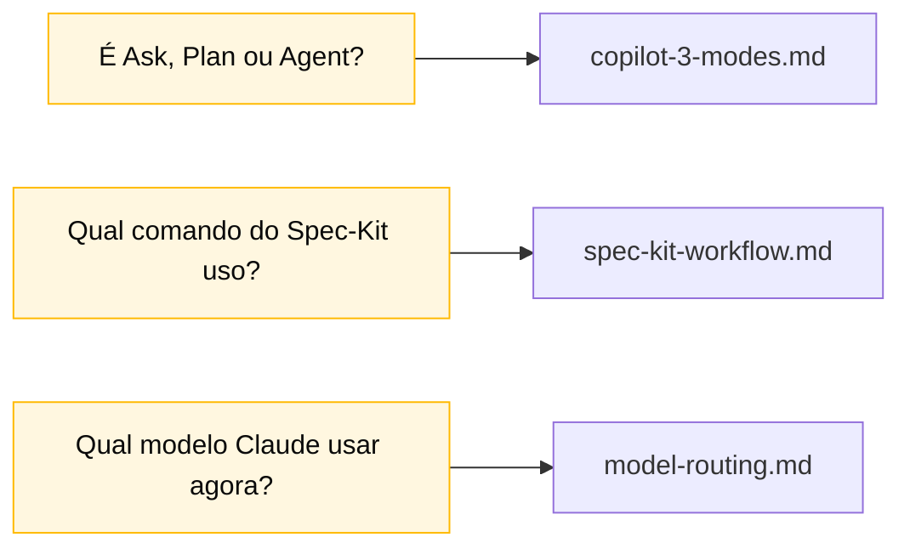

<!-- markdownlint-disable MD013 MD025 MD026 MD028 MD029 MD034 MD040 MD051 MD060 -->

# Cheat Sheets

> Cartões de uma página para impressão, desenhados para ficar na mesa de cada time.

## Quando usar isso

Você abre um cheat-sheet quando precisa de **resposta rápida** sem ler um guia completo. Cada um responde uma pergunta específica:

## Conteúdo

| Arquivo                                    | Tópico                                          | Use quando                                           |
| ------------------------------------------ | ----------------------------------------------- | ---------------------------------------------------- |
| [`copilot-3-modes.md`](copilot-3-modes.md) | GitHub Copilot: modos Ask, Plan e Agent         | Estiver na dúvida sobre qual modo do Copilot acionar |
| [`spec-kit-workflow.md`](spec-kit-workflow.md) | Fluxo Spec-Kit de relance                       | Não souber qual comando `/speckit.*` usar            |
| [`model-routing.md`](model-routing.md)     | Qual modelo de IA usar para cada tipo de tarefa | Estiver decidindo entre Haiku, Sonnet ou Opus        |

## Navegação

| Anterior                          | Início                    | Próximo                               |
| --------------------------------- | ------------------------- | ------------------------------------- |
| [Persona Kits](../persona-kits/README.md) | [Kit PT-BR](../README.md) | [Copilot 3 Modes](copilot-3-modes.md) |

— Paula
