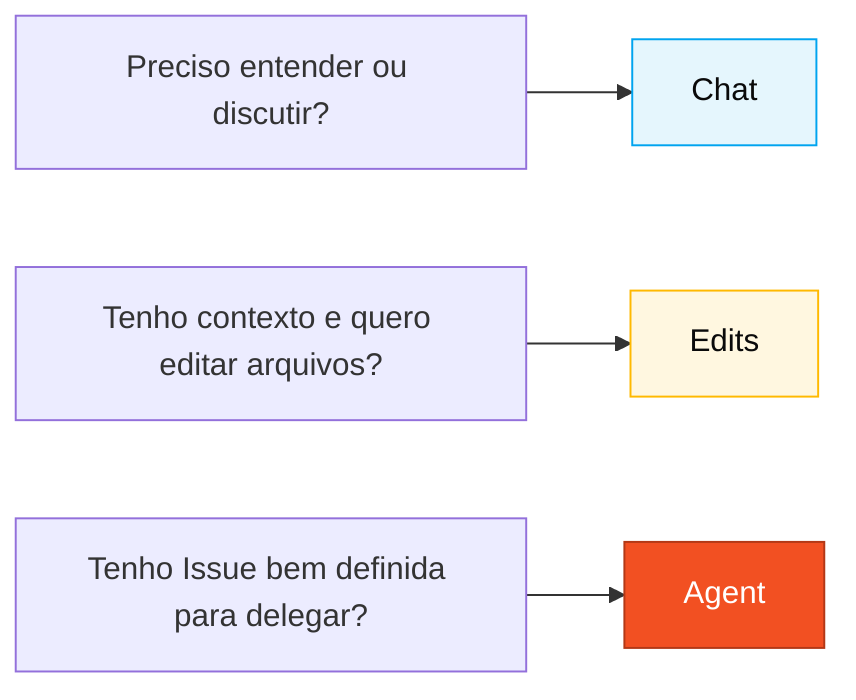

# GitHub Copilot em 3 modos — Cheat sheet

## Quando usar isso

Sempre que você for abrir o Copilot, pergunte primeiro: **Chat, Edits ou Agent?** O modo certo economiza tempo. O modo errado custa horas.

## Decisão rápida

| Situação | Modo | Por quê |
|----------|------|---------|
| Entender código, discutir design, planejar uma abordagem | **Chat** | Conversa, custo baixo, reversível |
| Criar/editar múltiplos arquivos relacionados de uma vez | **Edits** | Visão multi-arquivo, você revisa o diff |
| Delegar uma tarefa completa (issue → PR) | **Agent** | Trabalha sozinho, você revisa no final |

## Visual

---

## Chat — Conversa

**Use quando**: você ainda não sabe o que quer; quer entender; quer discutir; quer avaliar um trade-off.

**Frases que funcionam:**

- *"Explique o que este programa Natural faz linha por linha."*
- *"Quais riscos de usar `JSONB` para guardar histórico de contas bancárias?"*
- *"Resuma este DDM em 5 linhas para alguém que não conhece Adabas."*
- *"Desafie o seguinte ADR: `{cole o ADR}`."*

**Erros comuns:**

- Usar Chat para gerar arquivo. Use Edits.
- Aceitar resposta sem validar. Copilot alucina — sempre confira.
- Prompt curto demais ("ajuda"). Dê contexto: o que você tem, o que quer, o que já tentou.

---

## Edits — Edição em lote

**Use quando**: você sabe o que quer; precisa de mudanças em vários arquivos; tem contexto estruturado.

**Frases que funcionam:**

- *"Crie os módulos `beneficiary`, `agreement`, `payment` com estrutura padrão de pacote Spring Boot."*
- *"Adicione um teste unitário para cada método público de `PaymentService`."*
- *"Renomeie `Convenio` para `Agreement` no projeto inteiro e atualize as referências."*
- *"Para cada migração Flyway existente, adicione um rollback comentado."*

**Erros comuns:**

- Escopo amplo demais. Quebre em etapas.
- Não revisar o diff. Sempre olhe antes de aceitar.
- Misturar mudanças de lógica com renames. Um PR por propósito.

---

## Agent — Delegação com autonomia

**Use quando**: você tem uma Issue bem descrita, aceita que vai demorar, e está disposto a revisar um PR gerado por alguém que não é você.

**Como preparar:**

1. Escreva a Issue com **contexto, critérios de aceitação e escopo**.
2. Aponte para os arquivos relevantes (*"leia `docs/adr/001.md` antes de começar"*).
3. Diga o que NÃO fazer (*"não altere o schema do PostgreSQL"*).

**Acompanhamento**: não opere enquanto o Agent estiver rodando. Deixe ir. Cheque a cada ~10 minutos se o caminho faz sentido.

**Revisar PR do Agent**: exatamente como revisaria PR humano. Quick review continua sendo review.

**Erros comuns:**

- Issue vaga → Agent entrega lixo.
- Disparar Agent para tarefa de 5 minutos que Edits resolveria.
- Mergear sem revisar porque "foi o Agent".

---

## Exemplos visuais por persona

| Persona | Modo principal | Modo secundário |
|---------|----------------|-----------------|
| Product Owner | Chat (refinar stories) | — |
| Requirements Engineer | Chat (validar EARS) | Edits (gerar requisitos em lote) |
| Software Architect | Chat (decidir padrão) | Edits (criar esqueleto de módulo) |
| Developer | Edits (90% do Estágio 3) | Chat, Agent |
| QA Engineer | Edits (esqueleto JUnit) | Chat (gerar cenários) |
| DevOps | Agent (cadeias longas de CI) | Edits (Terraform) |
| Tech Writer | Chat (revisão de estilo) | Edits (formatar ADR) |

---

## Regra de bolso

> Se você não soubesse que era IA, aceitaria esse código no seu projeto? Se não, rejeite ou refine. O Copilot acelera quem sabe; não substitui julgamento.

— Paula
