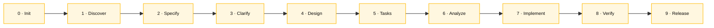

# Specky SDD v3.4 — Cheat sheet

> Repo: https://github.com/paulasilvatech/specky | Instalação: `npm install -g specky-sdd@latest`

## Quando usar isso

Antes de começar o Estágio 2 (e durante o Estágio 3 quando precisar gerar artefatos novos). Este cheat-sheet responde: "qual agente invocar?", "qual o formato EARS?", "em que fase estou?".

## O que é

Um engine de Spec-Driven Development. 13 agentes, 57 ferramentas MCP, 16 hooks. **O pipeline é forçado** — você não pula fase.

## Setup rápido

```bash
specky install --ide=copilot # VS Code + Copilot
specky install --ide=claude # Claude Code
specky doctor # valida instalação
```

## Os 6 padrões EARS

| # | Padrão | Template | Exemplo SIFAP |
|---|--------|----------|----------------|
| 1 | **Ubiquitous** | The system shall [action] | The SIFAP shall record an audit entry on every change |
| 2 | **Event-Driven** | When [X], the system shall [action] | When a cycle is generated, create payments for ACTIVE beneficiaries |
| 3 | **State-Driven** | While [X], the system shall [action] | While PENDING, allow cancellation |
| 4 | **Optional** | Where [choice], the system shall [action] | Where the user exports, generate UTF-8 CSV |
| 5 | **Unwanted** | The system shall not [action] | Do not allow DELETE on the audit log |
| 6 | **Complex** | While [X], when [Y], where [Z], the system shall [action] | In December, while ACTIVE, calculate the 13th-month bonus |

Validar: `sdd_validate_ears` (ferramenta MCP) ou `@spec-engineer` (agente)

## Pipeline — 10 fases



| # | Fase | Agente | Entregável | Persona dona | Estágio |
|---|------|--------|------------|---------------|---------|
| 0 | Init | `@sdd-init` | CONSTITUTION.md | TL | 2 |
| 1 | Discover | `@research-analyst` | RESEARCH.md | RE + EA | 2 |
| 2 | Specify | `@spec-engineer` | SPECIFICATION.md (EARS) | RE | 2 |
| 3 | Clarify | `@sdd-clarify` | CLARIFICATION-LOG.md | RE + PO | 2 |
| 4 | Design | `@design-architect` | DESIGN.md + C4 + ADRs | SA + EA | 2 |
| 5 | Tasks | `@task-planner` | TASKS.md + CHECKLIST.md | TL | 3 |
| 6 | Analyze | `@quality-reviewer` | ANALYSIS.md | QA | 3 |
| 7 | Implement | `@implementer` | Código | Dev | 3 |
| 8 | Verify | `@test-verifier` | Testes + cobertura | QA | 3 |
| 9 | Release | `@release-engineer` | PR + deploy | DevOps | 4 |

Gates LGTM: depois de Specify, Design e Tasks. Revise antes de avançar.

## Slash commands

| Comando | Quando usar |
|---------|--------------|
| `/specky-migration` | **PRINCIPAL** — modernização SIFAP |
| `/specky-specify` | Escrever requisitos EARS |
| `/specky-design` | Gerar arquitetura + diagramas |
| `/specky-tasks` | Quebrar design em tasks |
| `/specky-verify` | Validar testes contra spec |
| `/specky-release` | Criar PR final |

## Ferramentas MCP mais usadas

| Ferramenta | O que faz |
|------------|-----------|
| `sdd_init` | Cria `.specs/NNN-feature/` |
| `sdd_write_spec` | Gera SPECIFICATION.md |
| `sdd_validate_ears` | Valida os 6 padrões EARS |
| `sdd_generate_diagram` | Gera C4 em Mermaid |
| `sdd_write_design` | Gera DESIGN.md + ADRs |
| `sdd_write_tasks` | Gera TASKS.md sequenciado |
| `sdd_check_sync` | Detecta drift entre spec e código |

## Hooks que vão disparar

- **no-code-without-spec**: bloqueia PRs sem referência a spec
- **EARS-linter**: reclama de requisitos fora dos 6 padrões
- **ADR-completeness**: exige o "caminho não escolhido"
- **traceability-check**: amarra requisito → teste

Quando um hook te bloquear: **leia a mensagem**. Ajuste o artefato, não force override.

## Fluxo do workshop

```
Estágio 2 (2h):
 @specky-orchestrator → Init → Discover → Specify → Clarify → Design

Estágio 3 (3h):
 @task-planner → Tasks → @implementer → Código → @test-verifier → Verify

Estágio 4 (1h30):
 @release-engineer → Release → PR
```

## Dicas

- Não pule para Código sem passar por Specify + Design
- `specky doctor` deve estar todo verde antes de começar
- Se o Specky não estiver disponível: escreva EARS à mão — o formato é texto puro
- Use `@specky-orchestrator` para deixar o pipeline te guiar

— Paula
