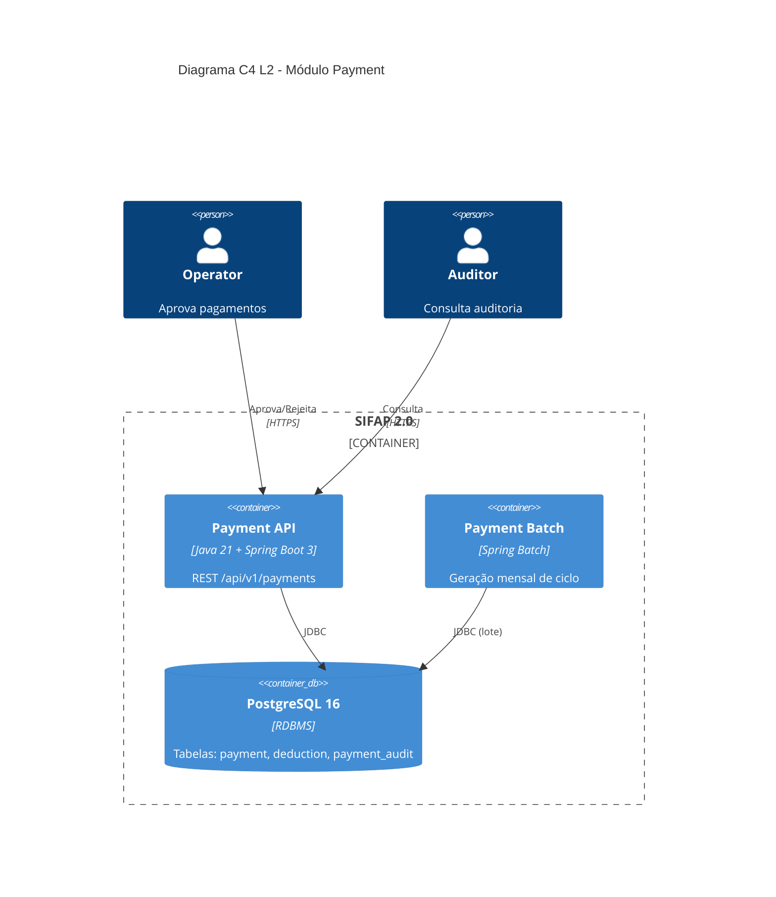

<!-- markdownlint-disable MD013 MD025 MD026 MD028 MD029 MD034 MD040 MD051 MD060 -->

# SPECIFICATION — SIFAP 2.0 · Módulo Payment (Exemplo Preenchido)

> **⚠️ Este é um EXEMPLO** mostrando como uma fatia da spec fica pronta. O seu time deve produzir 12+ REQ-IDs ao longo dos 4 módulos (beneficiary, payment, audit, admin).

## Metadados

- **Versão da spec:** 0.1.0 (Estágio 2 — fim)
- **Time:** Time Beta (exemplo)
- **Aprovado pelo Product Owner:** ☑ (Mariana Costa, 16:00)
- **Origem dos requisitos:** `01-arqueologia/business-rules-catalog.md` (BR-001 a BR-018)

---

## 1. Escopo deste módulo

O módulo **`payment`** cobre o ciclo de vida de pagamentos: geração mensal, aplicação de descontos, aprovação, cancelamento e auditoria de cada transição. **Fora de escopo:** integração com SIAFI (`REQ-INT-*` em outro módulo) e relatórios analíticos (`REQ-RPT-*`).

## 2. Requisitos (EARS)

### REQ-PAY-001 · Teto de descontos não judiciais

```yaml
REQ-PAY-001:
  pattern: unwanted          # padrão "Unwanted Behavior" — 5 dos 6 da EARS
  text: "O SIFAP não deve permitir que o total de descontos NÃO judiciais
         exceda 30% do valor bruto do pagamento."
  source_legacy: legado-natural/natural-programs/CALCDSCT.NSN#L142-L148
  business_rule: BR-001
  acceptance:
    - "Dado pagamento bruto R$ 1000 e desconto 'TAX' de R$ 400 → desconto aplicado é R$ 300 (truncado em 30%)."
    - "Dado pagamento bruto R$ 1000 e desconto 'JUDICIAL' de R$ 500 → desconto aplicado é R$ 500 (sem teto)."
    - "Dado pagamento bruto R$ 1000, desconto 'TAX' R$ 250 + 'JUDICIAL' R$ 400 → total R$ 650 aceito."
  priority: P0
  risk: CRÍTICO
```

### REQ-PAY-002 · Aplicação de desconto judicial sem teto

```yaml
REQ-PAY-002:
  pattern: event-driven
  text: "Quando um desconto do tipo 'JUDICIAL' é aplicado a um pagamento,
         o SIFAP deve adicionar o valor integralmente ao total de descontos,
         sem aplicar o teto de 30%."
  source_legacy: legado-natural/natural-programs/CALCDSCT.NSN#L142-L148
  business_rule: BR-001
  acceptance:
    - "Desconto judicial de 80% do bruto é aceito integralmente."
    - "Múltiplos descontos judiciais somam sem limite."
  priority: P0
  risk: CRÍTICO
```

### REQ-PAY-003 · Geração de ciclo mensal

```yaml
REQ-PAY-003:
  pattern: event-driven
  text: "Quando o ciclo de pagamento mensal é iniciado (no 5º dia útil do mês),
         o SIFAP deve criar um registro de Payment para cada beneficiário
         com status ACTIVE na data de corte (último dia do mês anterior)."
  source_legacy: legado-natural/natural-programs/BATCHPGT.NSN#L88-L142
  business_rule: BR-005
  acceptance:
    - "100 beneficiários ACTIVE + 30 INACTIVE → 100 pagamentos gerados."
    - "Beneficiário que ficou ACTIVE no dia 1º do mês corrente NÃO entra."
    - "Ciclo gerado no 5º dia útil mesmo que caia em feriado nacional."
  priority: P0
  risk: CRÍTICO
  notes: "Causa de auditorias em 2018 — data de corte é estratégica."
```

### REQ-PAY-004 · Status inicial de pagamento

```yaml
REQ-PAY-004:
  pattern: ubiquitous
  text: "O SIFAP deve criar todo novo Payment com status PENDING."
  source_legacy: legado-natural/natural-programs/BATCHPGT.NSN#L156
  business_rule: BR-006
  acceptance:
    - "Pagamento recém-criado tem status='PENDING'."
    - "Não há outro caminho de criação além de status='PENDING'."
  priority: P0
  risk: ALTO
```

### REQ-PAY-005 · Aprovação por operador autorizado

```yaml
REQ-PAY-005:
  pattern: state-driven
  text: "Enquanto um Payment estiver com status PENDING, o SIFAP deve permitir
         que um usuário com perfil OPERATOR ou ADMIN altere o status para
         APPROVED ou REJECTED."
  source_legacy: legado-natural/natural-programs/BATCHPGT.NSN#L210-L235
  business_rule: BR-007
  acceptance:
    - "OPERATOR aprova pagamento PENDING → status='APPROVED'."
    - "AUDITOR tenta aprovar → HTTP 403 Forbidden."
    - "OPERATOR tenta aprovar pagamento já APPROVED → HTTP 409 Conflict."
  priority: P0
  risk: ALTO
```

### REQ-PAY-006 · Auditoria de transição de status

```yaml
REQ-PAY-006:
  pattern: event-driven
  text: "Quando o status de um Payment é alterado, o SIFAP deve gravar
         um registro de auditoria contendo: estado anterior, estado novo,
         usuário que alterou, timestamp UTC, motivo (se informado)."
  source_legacy: legado-natural/natural-programs/RELAUDIT.NSN#L45-L72
  business_rule: BR-014
  acceptance:
    - "Mudar PENDING→APPROVED grava 1 registro de auditoria."
    - "Registro de auditoria contém todos os 5 campos."
    - "Auditoria não pode ser deletada (REQ-AUD-001)."
  priority: P0
  risk: CRÍTICO
```

### REQ-PAY-007 · Exportação de relatório

```yaml
REQ-PAY-007:
  pattern: optional
  text: "Onde o usuário escolher exportar o relatório de pagamentos do mês,
         o SIFAP deve gerar arquivo CSV com codificação UTF-8 contendo
         todas as colunas exibidas na tela."
  source_legacy: legado-natural/natural-programs/RELPGT.NSN#L120-L188
  business_rule: BR-015
  acceptance:
    - "Botão 'Exportar CSV' gera arquivo com header + linhas."
    - "Arquivo abre corretamente no Excel BR (UTF-8 com BOM)."
    - "Layout idêntico ao relatório legado aceito pelo TCU."
  priority: P1
  risk: MÉDIO
```

### REQ-PAY-008 · Mascaramento de CPF em logs

```yaml
REQ-PAY-008:
  pattern: ubiquitous
  text: "O SIFAP deve mascarar CPF em todos os logs no formato XXX.XXX.NNN-NN
         (mantendo apenas os 3 dígitos centrais e os dígitos verificadores)."
  source_legacy: "[GREENFIELD] LGPD Art. 6º (princípio da minimização) — não há equivalente no legado."
  business_rule: "—"
  acceptance:
    - "Log de DEBUG não imprime CPF cru."
    - "Endpoint /actuator/logfile não vaza CPF."
  priority: P0
  risk: CRÍTICO
  notes: "Único requisito GREENFIELD desta fatia. Justificativa LGPD documentada."
```

---

## 3. Rastreabilidade

| BR (legado) | REQ-ID (moderno) | Status |
|---|---|---|
| BR-001 | REQ-PAY-001, REQ-PAY-002 | ✅ coberta |
| BR-005 | REQ-PAY-003 | ✅ coberta |
| BR-006 | REQ-PAY-004 | ✅ coberta |
| BR-007 | REQ-PAY-005 | ✅ coberta |
| BR-014 | REQ-PAY-006 | ✅ coberta |
| BR-015 | REQ-PAY-007 | ✅ coberta |
| BR-013, BR-018 | — | ⏸ fora de escopo (justificativa em `scope-decisions.md`) |

> ✅ **8 de 8 REQ-IDs têm `source_legacy:`** (7 apontam para `.NSN`, 1 GREENFIELD justificado).

---

## 4. Atributos de qualidade (NFRs)

| Atributo | Meta | Como medir |
|---|---|---|
| Latência p95 | < 200ms para queries de listagem | Testes de performance no Estágio 4 |
| Cobertura de testes | ≥ 70% de linhas no módulo payment | JaCoCo no CI |
| Segurança | LGPD: mascaramento de PII | Code review + REQ-PAY-008 |
| Disponibilidade | 99,5% (excluindo janela batch) | Health check + Application Insights |

---

## 5. Diagrama C4 L2 (resumido)



---

## 6. O que torna esta spec "boa"

- ✅ **8 REQ-IDs**, todos em formato YAML estruturado
- ✅ **100% com `source_legacy:`** (7 NSN + 1 GREENFIELD justificado)
- ✅ Mistura dos 6 padrões EARS (ubiquitous, event-driven, state-driven, unwanted, optional)
- ✅ **Acceptance testável** em cada REQ-ID (cada item vira um teste no Estágio 3)
- ✅ Rastreabilidade BR → REQ-ID explícita
- ✅ Notas históricas preservadas (TCU 2002, auditorias 2018)
- ✅ NFRs separados dos requisitos funcionais
- ✅ Diagrama C4 L2 do módulo isolado
---

### Continuar a leitura

<table width="100%">
<tr>
<td width="50%" valign="top" align="left">
<sub><strong>← ANTERIOR</strong></sub><br/>
<a href="business-rules-catalog-exemplo.md"><strong>Catálogo de Regras (exemplo)</strong></a><br/>
<sub>Como BR-001 a BR-005 ficam bem documentadas.</sub>
</td>
<td width="50%" valign="top" align="right">
<sub><strong>PRÓXIMO →</strong></sub><br/>
<a href="ADR-001-monolito-modular-exemplo.md"><strong>ADR-001 (exemplo)</strong></a><br/>
<sub>Monolito modular vs microsserviços, com alternativas.</sub>
</td>
</tr>
</table>

<sub>↑ <a href="../README.md">Voltar ao Kit PT-BR</a></sub>
