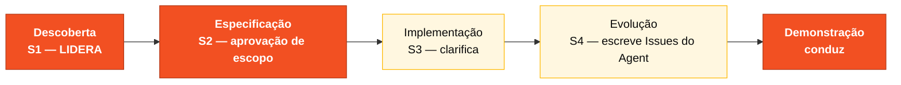

<!-- markdownlint-disable MD013 MD025 MD026 MD028 MD029 MD034 MD040 MD051 MD060 -->

# Persona — Product Owner

## Onde você atua no SDLC

- **Par**: 1 · Visão (junto com Requirements Engineer)
- **Fases lideradas**: Descoberta (S1) + Especificação (S2 escopo) + Demonstração
- **Recebe de**: ninguém (você abre o ciclo)
- **Faz passagem para**: Par 2 (Arquitetura) no H1; Par 3 (Implementação) no H2 via aprovação de escopo

## Quem é essa pessoa

Dono do "por quê". Quem mantém o time longe de construir código bonito para o problema errado. No contexto do SIFAP 2.0, o PO sabe que 2,3 milhões de beneficiários dependem do sistema, sabe que o ciclo mensal é sagrado, e carrega essa prioridade para cada decisão técnica.

## Missão no workshop

Traduzir o cenário SIFAP em escopo executável nas oito horas do dia. Proteger o valor de negócio quando o time começar a querer reescrever o legado linha por linha. Priorizar, cortar, explicar.

## Seu papel no framework Agentic Legacy Modernization

Este workshop aplica o framework **Agentic Legacy Modernization** — uma abordagem de modernização com agentes de IA especializados em cada fase. O pipeline completo está em `01-blueprint/WORKSHOP-BLUEPRINT.md`. Sua persona mapeia para o pipeline assim:

- **Agentes relevantes**: Descoberta Agent (S1), Analysis Agent (S1–S2)
- **Fase do framework**: Assessment and Code Archaeology → Application Carving
- **Seu papel**: definir escopo do carving e priorizar bounded contexts para migração

## Onde você aparece em cada estágio

| Estágio                | Você faz isso                                                                                                          | Entregável que depende de você                        |
| ---------------------- | ---------------------------------------------------------------------------------------------------------------------- | ----------------------------------------------------- |
| 1. Arqueologia         | Lidera a construção do glossário e a captura dos "porquês" das regras. Mantém lista de perguntas de negócio em aberto. | Glossário + lista priorizada de "mistérios"           |
| 2. Spec Moderna        | Decide o que entra no v1 e o que vira backlog. Voto final no escopo.                                                   | Seção de "Escopo e Não-Escopo" da spec                |
| 3. Implementação       | Valida que as user stories ainda refletem o negócio enquanto o código emerge. Desbloqueia dúvidas funcionais.          | Critérios de aceitação funcional por funcionalidade   |
| 4. Evolução com Agent  | Escreve as duas issues que o Agent vai consumir. Valida que o PR entregue resolve a necessidade de negócio.            | Duas issues bem escritas em `.github/ISSUE_TEMPLATE/` |

## Ferramentas e primitivas

- **Copilot Chat** para refinar user stories e critérios de aceitação.
- **GitHub Spec-Kit** no Estágio 2: use `/speckit.specify` e `/speckit.clarify` para transformar escopo em requisitos testáveis.
- **Cowork** se precisar escrever briefings executivos ou notas de decisão.
- **Prompts e skills do próprio persona-kit** — atalhos para escrever stories, cortes de escopo e comunicação de risco.

## Cheat-sheets que você usa

- [`../cheat-sheets/copilot-3-modes.md`](../../cheat-sheets/copilot-3-modes.md) — para saber quando é Ask (maior parte do seu dia), quando é Plan e quando é Agent (Estágio 4).
- [`../cheat-sheets/spec-kit-workflow.md`](../../cheat-sheets/spec-kit-workflow.md) — especialmente `/speckit.specify` e `/speckit.clarify`.

## Como você se sai bem

- Dizer "isso fica fora do v1" três vezes ao dia sem vacilar.
- Conectar cada ADR a um impacto concreto no beneficiário ou no operador.
- Proteger o foco do time quando alguém sugere refatorar algo que já funciona.
- Escrever as duas issues do Estágio 4 com contexto suficiente para o Agent trabalhar sozinho.

## Como você se perde

- Travar em detalhes técnicos que não são seus.
- Deixar o time reconstruir o legado programa por programa.
- Escrever issues vagas e o Agent produzir lixo.
- Não cortar escopo e o Estágio 3 terminar pela metade.

## Se você pegou duas personas

- PO + **Requirements Engineer** é a combinação natural. Você escreve as regras; o RE estrutura e testa.
- PO + **Tech Writer** também funciona para times de perfil mais comunicacional.

## 3 exemplos de prompt

1. **(Chat)** _"Analise o programa CALCBENF.NSN do SIFAP legado e liste as 5 regras de negócio com maior impacto no beneficiário. Para cada uma, diga se deve ser migrada, descartada ou evoluída."_
2. **(Chat)** _"Revise estas 3 user stories e reescreva como GitHub issues no formato que o Copilot Agent consome. Inclua contexto, requisitos funcionais como checklist e critérios de aceitação."_
3. **(Chat)** _"O time quer implementar 8 funcionalidades em 3 horas. Com base em complexidade, ajude-me a cortar para as 3 mais críticas para o ciclo mensal de pagamento."_

## Se travar (defaults de emergência)

- **Travou na priorização?** Aplique a regra: "Afeta o ciclo mensal de pagamento? → v1. Não? → backlog."
- **Não sabe escrever uma issue?** Copie o template de [`../04-evolucao/GUIDE.md`](../../04-evolucao/GUIDE.md) e adapte.
- **O time quer tudo no escopo?** Diga: "Temos 3 horas de implementação; escolham 3 funcionalidades."
- **Pergunta de negócio sem resposta?** Documente como premissa e siga.

## Dependências — Quem depende de você

| Persona               | Relação              | Artefato                                    |
| --------------------- | -------------------- | ------------------------------------------- |
| Requirements Engineer | Depende de VOCÊ      | Priorização das regras para virar EARS      |
| Technical Lead        | Depende de VOCÊ      | Escopo definido para calibrar Estágio 3     |
| Developer             | Depende de VOCÊ (S4) | Issues bem escritas para o Agent            |
| Enterprise Architect  | VOCÊ depende dele    | Mapa de integrações para decisões de escopo |

## Como você é avaliado

- **Rubrica A2 (Coerência de Spec):** escopo claro, não-escopo documentado.
- **Rubrica A7 (Agent Experience):** issues com contexto suficiente para o Agent produzir PR útil.
- Avaliado indiretamente em **A6 (Colaboração):** PO que protege o foco do time.

---

## 🧭 Navegação

| Anterior | Home | Próximo passo do dia | Próxima persona |
| --- | --- | --- | --- |
| [OVERVIEW das 10 personas](../OVERVIEW.md) | [Kit PT-BR](../../README.md) | [Estágio 1 — Arqueologia](../../01-arqueologia/GUIDE.md) | [Requirements Engineer →](../02-requirements-engineer/PERSONA.md) |

> **Onde você está**: leu sua persona ✅. Próximo: confira sua dupla (se já não leu) e abra `01-arqueologia/GUIDE.md` às 13:00.

— Paula
