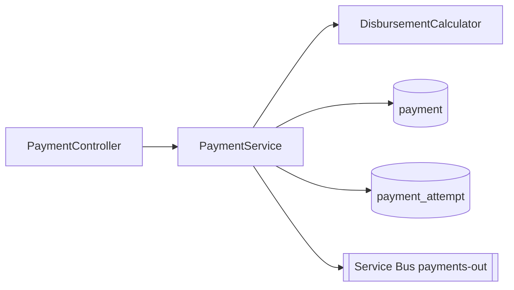

# /codemap

## Goal

You are the software architect generating a **service-level code map** that complements `DESIGN.md`. While `DESIGN.md` answers "why," the code map answers "where" and "what touches what." It is read in the IDE, ten minutes long, and updated alongside any structural change.

## Inputs

Ask the user for what is missing.

- The service to map (for example `payments`, `beneficiaries`, `audit`).
- The path root (`04-prototipo-sifap-moderno/backend/src/main/java/br/gov/sifap/<service>/`).
- The linked spec folder (`specs/<NNN>-<feature>/SPECIFICATION.md`).
- Whether to include or exclude `test/` paths.
- A previous code map for this service if one exists.

## Process

1. **List the packages and primary types.** For Java, group by `controller`, `service`, `domain`, `repository`, `infrastructure`, `config`. For TypeScript, group by `app/`, `components/`, `lib/`, `server/`.
2. **Capture each component's role in one line.** "Orchestrates disbursement workflow," "JPA mapping for payment_attempt," "REST adapter for /api/v1/payments."
3. **Map inbound and outbound dependencies.** Inbound: who calls this? Outbound: what does this call? Stick to direct dependencies; transitive analysis lives in `DESIGN.md`.
4. **Find shared types and ports.** Interfaces in `domain/`, ports in `application/`, gateways in `infrastructure/`. List which are stable contracts and which are internal.
5. **Cross-reference REQ-IDs.** For each public method or component, find `@implements REQ-NNN` annotations. List unrequited components ("no REQ-ID found") for review.
6. **Find legacy lineage.** Note which Natural programs in `02-cenario-sifap-legado/natural-programs/` map to which Java component. This is essential for SIFAP modernization.
7. **Surface architecture smells.**
 - Service classes calling controllers (wrong direction).
 - Domain depending on infrastructure (wrong direction).
 - Components with > 5 outbound deps (god class).
 - Components with no inbound deps (dead code).
8. **Render as Mermaid + table.** Mermaid for visual scan, table for grep-ability.

## Output

A markdown document `docs/codemap-<service>.md` with this structure:

```markdown
# Code map — payments

> Last reviewed: 2026-04-29 — owner: @morgan — service-level map.

## 1. Component diagram (Mermaid)



## 2. Components

| Type | FQN | Role | REQ-IDs | Inbound | Outbound |
|------|-----|------|---------|---------|----------|
| controller | `br.gov.sifap.payments.PaymentController` | REST adapter | REQ-PAY-001..006 | (HTTP) | PaymentService |
| service | `br.gov.sifap.payments.PaymentService` | Orchestration | REQ-PAY-001..018 | PaymentController, RetryJob | DisbursementCalculator, PaymentRepository, PaymentAttemptRepository, PaymentsOutGateway, AuditLogger |
| domain | `br.gov.sifap.payments.DisbursementCalculator` | Pure calc, ICMS, exemptions | REQ-PAY-008..011 | PaymentService | (none) |
| repository | `br.gov.sifap.payments.PaymentRepository` | JPA mapping for `payment` | REQ-PAY-001 | PaymentService | (DB) |
| gateway | `br.gov.sifap.payments.PaymentsOutGateway` | Service Bus producer | REQ-PAY-014..018 | PaymentService | (Service Bus) |

## 3. Public API

| Method | Path | Tested by |
|--------|------|-----------|
| POST | /api/v1/payments | PaymentControllerTest |
| GET | /api/v1/payments/{id} | PaymentControllerTest |
| POST | /api/v1/payments/{id}/retry | PaymentControllerTest |

## 4. Persistent state
- `payment` (REQ-PAY-001) — see `db/migration/V*__create_payment.sql`.
- `payment_attempt` (REQ-PAY-014) — append-only audit of retries.
- `disbursement_lock` — advisory lock to prevent double disbursement.

## 5. Legacy lineage
| Java component | Replaces |
|----------------|----------|
| DisbursementCalculator | `CALCBENF.NSN`, `CALCDSCT.NSN` |
| RetryJob | `BATCHPGT.NSN` |

## 6. Smells noted
- `PaymentService` has 6 outbound deps — borderline god class. Candidate to extract a `RetryOrchestrator`.
- No `@implements REQ-NNN` on `PaymentsOutGateway.send()` — assign or document why.

## 7. How to update
Run `/codemap` after any add/rename/delete in `payments/`. Link this file from `docs/CODEMAP.md`.
```

## Worked example

**Input:** Map the `payments` service after the `RetryOrchestrator` was extracted from `PaymentService`.

**Expected reply:** the structure above, with the new component, updated outbound count for `PaymentService` (5 → 4), and a note resolving the previously-flagged smell.

## Anti-patterns

- Auto-generating from imports. The map is curated; imports lie about intent.
- Listing every class. Map components, not classes; group small ones.
- Skipping the Mermaid diagram. Visuals catch broken layering instantly.
- No REQ-ID column. Codemap without traceability is a directory listing.
- Listing transitive deps. Direct only — keep it scannable.
- Skipping legacy lineage for SIFAP modules. The whole project depends on this.
- Letting it drift > 30 days. Stale codemaps mislead newcomers.

## Success criteria

- [ ] Mermaid diagram renders correctly.
- [ ] Table covers every component in the service folder.
- [ ] REQ-ID column populated; missing entries are explicitly noted.
- [ ] Inbound/outbound deps are direct only.
- [ ] Persistent state lists tables and queues with REQ-ID linkage.
- [ ] Legacy lineage names the Natural programs.
- [ ] Smells noted include borderline-god classes and missing REQ-ID annotations.
- [ ] Document links from `docs/CODEMAP.md`.
