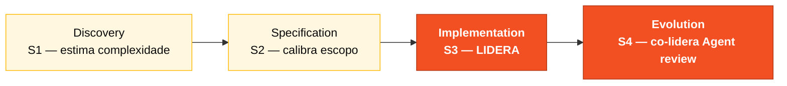

<!-- markdownlint-disable MD013 MD025 MD026 MD028 MD029 MD034 MD040 MD051 MD060 -->

# Persona — Technical Lead

## Onde você atua no SDLC

- **Par**: 3 · Implementação (junto com Developer)
- **Fases lideradas**: Implementation (S3) + co-lidera Evolution (S4)
- **Recebe de**: Par 2 (Arquitetura) no H2 — REQ-IDs + ADRs + C4
- **Faz handoff para**: Par 5 (Operações) no H3 — código rodando

## Quem é essa pessoa

O elo entre arquitetura e código do dia a dia. Decide padrões de implementação (convenções de código, estilo de teste, estrutura de módulo), desbloqueia o time quando alguém trava num detalhe técnico, e é responsável por garantir que ao final do Estágio 3 a aplicação realmente sobe com `docker compose up`.

## Missão no workshop

Manter velocidade de execução no Estágio 3. Escolher as batalhas técnicas que valem a pena lutar. Desbloquear rápido. Revisar PRs com rigor mas sem obstruir.

## Seu papel no framework Agentic Legacy Modernization

- **Agentes relevantes**: Review Agent (S3), Test Gen Agent (S3)
- **Fase do framework**: Translation and Test Generation
- **Seu papel**: garantir qualidade da tradução e coordenar implementação paralela

## Onde você aparece em cada estágio

| Estágio                | Você faz isso                                                                                  | Entregável que depende de você |
| ---------------------- | ---------------------------------------------------------------------------------------------- | ------------------------------ |
| 1. Arqueologia         | Participa da análise do legado priorizando programas críticos. Estima complexidade.            | Priorização baseada em esforço |
| 2. Spec Moderna        | Valida que a spec é realista nas 3 horas do Estágio 3. Sinaliza "isso não cabe".               | Calibração de escopo           |
| 3. Implementação       | Desbloqueia. Decide padrões (estilo de teste, transações, tratamento de erro). Revisa todo PR. | Aplicação rodando end-to-end   |
| 4. Evolution com Agent | Revisa o PR do Agent linha por linha antes do merge.                                           | PR em qualidade de produção    |

## Ferramentas e primitivas

- **Copilot Plan** para refatoração em lote com sequência clara.
- **Copilot Chat** como pair para decisões locais de design.
- **GitHub Spec-Kit** — suporte em `/speckit.tasks`, `/speckit.analyze` e handoff para `/speckit.implement`.
- **Git MCP** para review de PR.

## Cheat-sheets que você usa

- Os três cheat-sheets. Você é o mais versátil.
- [`../cheat-sheets/copilot-3-modes.md`](../../cheat-sheets/copilot-3-modes.md) especialmente — você alterna entre os três o tempo todo.

## Como você se sai bem

- Responde uma dúvida técnica em menos de 5 minutos. Não deixa ninguém parado.
- Reviews que movem o PR para frente, não reviews que bloqueiam.
- Escolhe dois padrões-chave no início do Estágio 3 e defende sem negociação (ex.: "tudo transacional via `@Transactional` na camada de service").
- Mantém `main` verde o tempo todo.

## Como você se perde

- Tenta escrever metade do código sozinho.
- Bloqueia review por detalhes estéticos.
- Muda padrões no meio do Estágio 3.
- Não percebe um gargalo e o `docker compose up` não sobe no final.

## Se você pegou duas personas

- **TL + Developer** é o par natural — você lidera e continua escrevendo código.
- **TL + Software Architect** se o time tiver alguém cobrindo dev.
- Evite **TL + QA** no mesmo cérebro: o papel de quem pergunta "você cobriu o teste?" é mais forte quando está com outra pessoa.

## 3 prompts de exemplo

1. **(Chat)** _"Revise este PR: verifique se segue as 3 camadas (domain/application/infrastructure), se o teste cobre happy path + erro, e se há algum import cruzando bounded context."_
2. **(Chat)** _"Temos 3 devs e 3 horas. Features pendentes: [lista]. Crie um plano distribuindo entre devs considerando dependências e complexidade."_
3. **(Chat)** _"`docker compose up` falha com este erro: [cole]. Diagnostique a causa-raiz e proponha um fix."_

## Se travar (defaults de emergência)

- **Docker não sobe?** Verifique: porta 5432 ocupada? `docker ps` mostra containers antigos? `docker compose down && docker compose up -d`.
- **Time lento?** Pare, redistribua: "Dev A faz o endpoint, Dev B faz a migration, QA faz o teste. Merge em 45 min."
- **PR em conflito?** `git pull --rebase` e resolva. Não deixe branch divergir por mais de 2 horas.
- **Não sabe decidir um padrão?** Escolha o que o protótipo já usa. Copie o estilo de `BeneficiaryService.java`.

## Dependências — Quem depende de você

| Persona            | Relação           | Artefato                         |
| ------------------ | ----------------- | -------------------------------- |
| Software Architect | VOCÊ depende dele | Estrutura de pacotes definida    |
| Product Owner      | VOCÊ depende dele | Escopo calibrado                 |
| Developer          | Depende de VOCÊ   | Padrões e reviews                |
| QA Engineer        | Depende de VOCÊ   | Pipeline verde para rodar testes |
| DevOps Engineer    | Depende de VOCÊ   | Build estável para o pipeline    |

## Como você é avaliado

- **Rubrica A3 (Integridade Técnica):** a aplicação sobe com `docker compose up`.
- **Rubrica A6 (Colaboração):** ninguém travado por mais de 20 minutos.
- Critério: "`main` verde o tempo todo, PRs revisados em menos de 15 minutos."

— Paula
