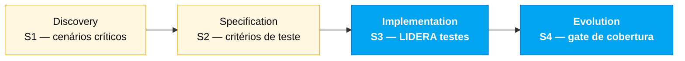

<!-- markdownlint-disable MD013 MD025 MD026 MD028 MD029 MD034 MD040 MD051 MD060 -->

# Persona — QA Engineer

## Onde você atua no SDLC

- **Par**: 4 · Qualidade (junto com DBA)
- **Fases lideradas**: Implementation (S3) — suite de testes + CI verde
- **Recebe de**: Requirements Engineer (REQ-IDs testáveis)
- **Faz handoff para**: DevOps (CI confiável); time todo (pipeline verde)

## Quem é essa pessoa

Quem transforma um requisito em teste executável. No SIFAP 2.0, quem garante que a regra de cálculo de pagamento sobrevive a qualquer refatoração do Estágio 3 e que o batch do ciclo mensal funciona dentro das fronteiras esperadas.

## Missão no workshop

Definir a estratégia de testes do projeto. Escrever testes críticos (não 100% de cobertura; os certos). Validar rastreabilidade spec → teste. Proteger o time de um CI verde falso.

## Seu papel no framework Agentic Legacy Modernization

- **Agentes relevantes**: Test Gen Agent (S3), Security Agent (S3)
- **Fase do framework**: Translation and Test Generation → Validation
- **Seu papel**: garantir cobertura de testes e validar equivalência funcional legado → moderno

## Onde você aparece em cada estágio

| Estágio                | Você faz isso                                                                                                        | Entregável que depende de você   |
| ---------------------- | -------------------------------------------------------------------------------------------------------------------- | -------------------------------- |
| 1. Arqueologia         | Identifica cenários críticos dos Naturals (casos de canto do ciclo mensal, rejeição BB).                             | Lista de cenários críticos       |
| 2. Spec Moderna        | Valida que cada requisito EARS é testável. Propõe critérios de aceitação concretos.                                  | Critérios de teste por requisito |
| 3. Implementação       | Escreve testes unitários e de integração para o core (cálculo de pagamento, ajuste, reconciliação). Mantém CI verde. | Suite de testes + pipeline verde |
| 4. Evolution com Agent | Exige que o PR do Agent venha com seus próprios testes. Valida cobertura dos cenários novos.                         | Cobertura coerente com a feature |

## Ferramentas e primitivas

- **Copilot Chat** para gerar cenários de teste a partir de requisitos EARS.
- **Copilot Plan** para planejar esqueletos JUnit em lote.
- **Testcontainers** para integração com PostgreSQL real.
- **GitHub Spec-Kit** — `/speckit.analyze` e os testes derivados de `tasks.md` são seu território.
- **GitHub Actions MCP** para monitorar o CI.

## Cheat-sheets que você usa

- [`../cheat-sheets/spec-kit-workflow.md`](../../cheat-sheets/spec-kit-workflow.md) — `/speckit.analyze` e tarefas de teste em `tasks.md`.
- [`../cheat-sheets/copilot-3-modes.md`](../../cheat-sheets/copilot-3-modes.md) — você usa Plan para criar o plano de cobertura e Ask para discutir o que falta.

## Como você se sai bem

- Cobertura nos caminhos que importam: cálculo de pagamento, reconciliação BB, ajustes com aprovação dupla.
- Testes rápidos — a suite inteira roda em menos de dois minutos.
- Testes que quebram no primeiro bug, não "testes que sempre passam".
- Você diz "esse PR não vai sem teste" sem drama.

## Como você se perde

- Persegue 100% de cobertura e perde o Estágio 3.
- Escreve testes que testam o framework, não o domínio.
- Aceita mocks onde Testcontainers era a escolha certa.
- Deixa o CI vermelho 20 minutos esperando alguém olhar.

## Se você pegou duas personas

- **QA + Developer** é o mais comum e produtivo.
- **QA + Requirements Engineer** também funciona — você escreve o requisito e o teste.
- Evite **QA + DevOps** no mesmo cérebro: sobrecarrega o Estágio 3 demais.

## 3 prompts de exemplo

1. **(Chat)** _"Para o requisito EARS 'When a cycle is generated, create payments for ACTIVE': gere 5 cenários de teste cobrindo happy path, sem ativos, beneficiário suspenso, valor zero e erro de banco."_
2. **(Plan)** _"No PaymentCycleServiceTest.java, planeje testes de integração com Testcontainers que: insiram um beneficiário, criem um ciclo, gerem pagamentos e verifiquem valores."_
3. **(Chat)** _"Analise a cobertura atual de testes e identifique os 3 caminhos mais críticos sem testes. Priorize por impacto no beneficiário."_

## Se travar (defaults de emergência)

- Não conhece JUnit 5? Copie o padrão de `CpfTest.java` — `@Test`, `@DisplayName`, asserts AssertJ.
- Testcontainers não funciona? Precisa de Docker rodando. Alternativa: unit test com Mockito.
- Muitos cenários, pouco tempo? Foque em 3: (a) criar beneficiário, (b) gerar pagamento, (c) mudança de status. Esses são os críticos.
- CI vermelho? Rode `mvn test` local primeiro. Se passa local mas falha no CI, é problema de ambiente (Docker/Testcontainers).

## Dependências — Quem depende de você

| Persona               | Relação           | Artefato                           |
| --------------------- | ----------------- | ---------------------------------- |
| Requirements Engineer | VOCÊ depende dele | Requisitos testáveis com critérios |
| Developer             | VOCÊ depende dele | Código para testar                 |
| Technical Lead        | Depende de VOCÊ   | Pipeline verde                     |
| DevOps Engineer       | Depende de VOCÊ   | CI confiável                       |

## Como você é avaliado

- Rubrica A3 (Integridade Técnica): testes passando, CI verde
- Rubrica A2 (Spec): todo requisito tem critério de verificação
- Critério: "Testes que quebram no primeiro bug, não testes que sempre passam"

— Paula
