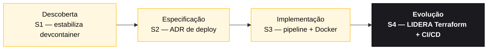

<!-- markdownlint-disable MD013 MD025 MD026 MD028 MD029 MD034 MD040 MD051 MD060 -->

# Persona — DevOps Engineer

## Onde você atua no SDLC

- **Par**: 5 · Operações (junto com Tech Writer)
- **Fases lideradas**: Evolução (S4) — Terraform + CI/CD
- **Recebe de**: Par 3 (Implementação) no H3 — código com build estável
- **Faz passagem para**: Demo + produção (em workshop, terraform plan suficiente)

## Quem é essa pessoa

Dono do caminho do código até algo que roda. No workshop, quem garante que `docker compose up` funciona em qualquer máquina do time, que o CI checa o que importa, e que o Terraform descreve a topologia-alvo no Azure mesmo que não seja aplicado no dia.

## Missão no workshop

Pipeline verde. Build reproduzível. Deploy descrito como código. Observabilidade funcional mínima (health check, logs estruturados).

## Seu papel no framework Agentic Legacy Modernization

- **Agentes relevantes**: Deployment Agent (S4), Security Agent (S3)
- **Fase do framework**: Coexistência e Migração de Tráfego
- **Seu papel**: provisionar infraestrutura e configurar pipeline CI/CD para deploy contínuo

## Onde você aparece em cada estágio

| Estágio                | Você faz isso                                                                                                        | Entregável que depende de você           |
| ---------------------- | -------------------------------------------------------------------------------------------------------------------- | ---------------------------------------- |
| 1. Arqueologia         | Estabiliza o devcontainer se algo estiver quebrado. Prepara docker-compose para PostgreSQL e ferramentas auxiliares. | Devcontainer e compose estáveis          |
| 2. Spec Moderna        | Escreve o ADR de estratégia de deploy (ADR 5 da referência) e participa do design de infra.                          | ADR 005 + draft do Terraform             |
| 3. Implementação       | Mantém GitHub Actions para build e testes. Publica imagem Docker. Mantém Terraform descrito.                         | Pipeline verde + `plan` Terraform válido |
| 4. Evolução com Agent  | Se o PR do Agent tocar no pipeline ou na infra, você é quem valida.                                                  | Pipeline continua verde depois do Agent  |

## Ferramentas e primitivas

- **Copilot Chat** para gerar workflows do GitHub Actions.
- **Copilot Plan** para Terraform em lote.
- **Azure / Terraform MCP** se habilitado no devcontainer.
- **GitHub Spec-Kit** — `/speckit.taskstoissues` e os gates operacionais passam por você.
- Spec de **Dev Containers** — você é quem entende o `devcontainer.json`.

## Cheat-sheets que você usa

- [`../cheat-sheets/spec-kit-workflow.md`](../../cheat-sheets/spec-kit-workflow.md) — `/speckit.taskstoissues`, `/speckit.analyze` e passagem para release.
- [`../cheat-sheets/copilot-3-modes.md`](../../cheat-sheets/copilot-3-modes.md) — você usa Agent bastante para cadeias longas de CI.

## Como você se sai bem

- `docker compose up -d` sobe aplicação + banco em menos de 60s.
- O pipeline `main` roda lint + test + build de imagem.
- `terraform plan` roda sem erro mesmo que não aplique.
- Logs estruturados (JSON) e endpoint `/actuator/health` já funcionam no Estágio 3.

## Como você se perde

- Deixa o devcontainer instável e o time perde 1 hora no início.
- CI que só roda unit test (sem build de imagem, sem lint).
- Terraform com 500 linhas e nenhuma saída que faça sentido.
- Secret real em `.env` versionado.

## Se você pegou duas personas

- **DevOps + DBA** — você cuida do Postgres + provisioning.
- **DevOps + Tech Writer** — no Estágio 4, você documenta o runbook enquanto monitora o Agent.

## 3 prompts de exemplo

1. **(Chat)** _"Crie um workflow GitHub Actions .github/workflows/ci.yml que: rode em push, configure Java 21 com cache do Maven, rode testes e construa uma imagem Docker."_
2. **(Plan)** _"Planeje a otimização do Dockerfile do backend: cache de dependências do Maven, imagem final menor e health check."_
3. **(Chat)** _"`docker compose up` demora 3 minutos para subir. Analise os Dockerfiles e o docker-compose.yml e proponha 3 otimizações."_

## Se travar (defaults de emergência)

- Docker compose não sobe? Checklist: (1) Docker Desktop rodando? (2) Portas 5432/8080/3000 livres? (3) `docker compose down && docker compose up -d` (4) `docker compose logs` para ver o erro.
- CI falhando? Olhe os logs do GitHub Actions. Erro mais comum: versão errada do Java ou cache miss.
- Terraform plan falhando? Verifique: (1) `terraform init` rodou? (2) versão do provider compatível? (3) variáveis obrigatórias preenchidas?
- Não conhece GitHub Actions? Copie o workflow em `.github/workflows/build.yml` e adapte.

## Dependências — Quem depende de você

| Persona              | Relação                 | Artefato                           |
| -------------------- | ----------------------- | ---------------------------------- |
| Technical Lead       | VOCÊ depende dele       | Build estável para o pipeline      |
| Enterprise Architect | VOCÊ depende dele       | Topologia para Terraform           |
| Developer            | Depende de VOCÊ         | Devcontainer funcionando, CI verde |
| DBA                  | Depende de VOCÊ (infra) | PostgreSQL provisionado            |
| QA Engineer          | Depende de VOCÊ         | Pipeline para rodar testes         |

## Como você é avaliado

- Rubrica A3 (Integridade Técnica): `docker compose up` funciona, CI verde
- Rubrica A4 (Copilot): uso de Agent para pipelines complexos
- Critério: "Build reproduzível. Qualquer máquina do time roda o compose em menos de 60s."

— Paula
