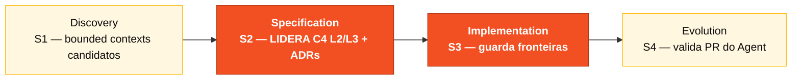

# Persona — Software Architect

## Onde você atua no SDLC

- **Par**: 2 · Arquitetura (junto com Enterprise Architect)
- **Fases lideradas**: Specification (S2) — C4 L2/L3 + ADRs + Implementation (S3) — review estrutural
- **Recebe de**: Enterprise Architect (C4 L1) e Requirements Engineer (REQ-IDs)
- **Faz handoff para**: Par 3 (Implementação) no H2 — package structure pronta

## Quem é essa pessoa

Dono da estrutura interna do sistema. Decide como módulos são organizados, onde começam e terminam bounded contexts, quais abstrações são expostas e quais ficam privadas. Quem mantém o Modular Monolith verdadeiramente modular.

## Missão no workshop

Produzir C4 Níveis 2 e 3 coerentes com a spec. Definir os bounded contexts do SIFAP 2.0 (Beneficiary, Agreement, Payment, Adjustment, Cycle, Audit) e o padrão de comunicação entre eles. Garantir que o código do Estágio 3 respeite as fronteiras desenhadas.

## Seu papel no framework Agentic Legacy Modernization

- **Agentes relevantes**: Analysis Agent (S2), Review Agent (S3)
- **Fase do framework**: Application Carving → Translation
- **Seu papel**: definir bounded contexts e garantir um Modular Monolith coerente

## Onde você aparece em cada estágio

| Estágio | Você faz isso | Entregável que depende de você |
|---------|---------------|---------------------------------|
| 1. Arqueologia | Identifica conceitos recorrentes nos Naturals e começa a propor bounded contexts candidatos. | Lista inicial de módulos/contextos |
| 2. Spec Moderna | Desenha C4 Nível 2 e Nível 3 para pelo menos dois contextos. Escreve o ADR de Modular Monolith. | Diagramas C4 + ADRs 1 e 2 |
| 3. Implementação | Estabelece a estrutura inicial do projeto Spring (pacotes, camadas). Revisa PRs que cruzam fronteiras de contexto. | `pom.xml` + layout de módulos + review de PRs estruturais |
| 4. Evolution com Agent | Valida que o PR do Agent respeita as fronteiras. Rejeita merges que quebrem modularidade. | Modularidade preservada |

## Ferramentas e primitivas

- **Copilot Edits** para criar esqueletos de módulo em paralelo.
- **Specky** — fases 3 (Context) e 4 (Architecture Decisions) são seu terreno.
- **Mermaid / C4** para diagramas.
- Skills específicas de SA do `25-personas-primitives` — prompts para decidir entre padrões (hexagonal vs. camadas, por exemplo).

## Cheat-sheets que você usa

- [`../cheat-sheets/specky-workflow.md`](../cheat-sheets/specky-workflow.md) — fases 3 e 4.
- [`../cheat-sheets/model-routing.md`](../cheat-sheets/model-routing.md) — Opus 4.6 para decisões; Sonnet 4.6 para edição em lote.

## Como você se sai bem

- O layout de pacotes reflete os bounded contexts, não as camadas técnicas.
- Seus ADRs são curtos, específicos, e citam a referência do `03-spec-sifap-moderno/` quando relevante.
- O Modular Monolith permanece monolito no deploy mas modular no código.
- Você redesenha fronteiras quando preciso, em vez de "pedir perdão depois".

## Como você se perde

- Deixa o time organizar por camadas técnicas (controller/service/repository) em vez de contextos.
- Escreve ADR genérico ("vamos usar Spring Boot") que não é decisão real.
- Permite que dois contextos importem classes um do outro diretamente.
- Tenta forçar hexagonal estrito onde não há benefício.

## Se você pegou duas personas

- **SA + Enterprise Architect** se o time for pequeno (você cuida do C4 1 e do 2/3).
- **SA + Technical Lead** é a combinação mais produtiva — você desenha e mete a mão no código.

## 3 prompts de exemplo

1. **(Chat)** *"Com base nestes requisitos EARS, proponha os bounded contexts do SIFAP 2.0. Para cada contexto liste: entidades, services expostos e dependências de outros contextos."*
2. **(Edits)** *"No projeto Spring Boot, crie a estrutura de pacotes para um novo bounded context 'notification' seguindo o padrão dos existentes (domain/application/infrastructure)."*
3. **(Chat)** *"Revise este PR e identifique imports que cruzam fronteiras de bounded context. Para cada violação, sugira como isolar."*

## Se travar (defaults de emergência)

- **Bounded contexts confusos?** Comece com 4: Beneficiary, Payment, Audit, Admin. É o que o protótipo já usa.
- **Diagrama C4 L2 travado?** Use o exemplo de [`../02-spec-moderna/GUIDE.md`](../02-spec-moderna/GUIDE.md) como ponto de partida.
- **Time organizado por camadas em vez de contextos?** Não refatore agora — documente no ADR e corrija se sobrar tempo.
- **Dúvida se algo é domain ou application?** "Se é regra de negócio pura, é domain. Se orquestra, é application."

## Dependências — Quem depende de você

| Persona | Relação | Artefato |
|---------|---------|----------|
| Enterprise Architect | VOCÊ depende dele | C4 L1 para desenhar L2/L3 |
| Developer | Depende de VOCÊ | Estrutura de pacotes para implementar |
| Technical Lead | Depende de VOCÊ | Padrões de módulo para enforcement |
| DBA | Depende de VOCÊ | Fronteiras de contexto para o modelo de dados |

## Como você é avaliado

- **Rubrica A2 (Spec):** C4 L2/L3 coerente com requisitos.
- **Rubrica A3 (Integridade Técnica):** bounded contexts respeitados no código.
- Critério: "Nenhum import cruza fronteira de contexto sem justificativa."

— Paula
