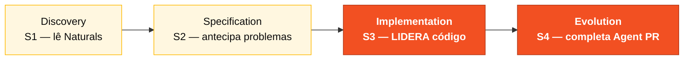

# Persona — Developer

## Onde você atua no SDLC

- **Par**: 3 · Implementação (junto com Technical Lead)
- **Fases lideradas**: Implementation (S3) + Evolution (S4)
- **Recebe de**: Par 2 (Arquitetura) no H2 — REQ-IDs + estrutura de pacotes
- **Faz handoff para**: Par 4 (Qualidade) — código testável; Par 5 (Operações) no H3 — build estável

## Quem é essa pessoa

Você escreve o código. Mais que isso: é quem usa o Copilot o dia inteiro nos três modos e traduz ideias em diff. No Estágio 3 carrega o peso pesado da produção.

## Missão no workshop

Transformar spec em código rodando. Usar o Copilot deliberadamente — Chat para entender, Edits para produzir, Agent para delegar. Commitar todo dia.

## Seu papel no framework Agentic Legacy Modernization

- **Agentes relevantes**: Translation Agent (S3), Review Agent (S3)
- **Fase do framework**: Translation and Test Generation
- **Seu papel**: implementar a tradução Natural → Java guiada pela spec EARS

## Onde você aparece em cada estágio

| Estágio | Você faz isso | Entregável que depende de você |
|---------|---------------|---------------------------------|
| 1. Arqueologia | Lê programas Natural com Copilot Chat. Produz resumo legível para o resto do time. | Resumos narrativos dos programas |
| 2. Spec Moderna | Pareia com o Requirements Engineer para antecipar problemas de implementação. | Sinais preventivos na spec |
| 3. Implementação | Implementa, testa, abre PR, revisa PR, implementa de novo. | Backend + frontend da sua fatia |
| 4. Evolution com Agent | Acompanha o Agent trabalhando. Intervém quando ele se perde. Termina o que ele não completou. | PR do Agent em estado mergeável |

## Ferramentas e primitivas

- **Copilot Chat** — entendimento e discussão de design.
- **Copilot Edits** — sua principal ferramenta no Estágio 3.
- **Copilot Agent** — no Estágio 4, você dirige o Agent pelo time ou junto com o TL.
- **Specky** — consome artefatos do SA e do RE; produz código guiado pela spec.
- **GitHub MCP** para trabalhar com issues e PRs sem sair do VS Code.

## Cheat-sheets que você usa

- [`../cheat-sheets/copilot-3-modes.md`](../cheat-sheets/copilot-3-modes.md) — este é seu mapa do dia.
- [`../cheat-sheets/specky-workflow.md`](../cheat-sheets/specky-workflow.md) — fases 5 a 10.
- [`../cheat-sheets/model-routing.md`](../cheat-sheets/model-routing.md) — Haiku 4.5 para snippets simples, Sonnet 4.6 como default, Opus 4.6 para design.

## Como você se sai bem

- Usa os três modos do Copilot deliberadamente — nem sempre é Chat.
- Commits pequenos e pull requests pequenos.
- Escreve testes ao mesmo tempo que o código.
- Não se apaixona por uma abstração no meio do Estágio 3.

## Como você se perde

- Trabalha oito horas numa única branch gigante.
- Usa o Agent para uma tarefa que Edits resolveria em 5 minutos.
- Escreve código sem teste e descobre às 16:30 que nada funciona.
- Vai sempre para Opus 4.6 — vai gastar tempo demais esperando.

## Se você pegou duas personas

- **Developer + Technical Lead** — muito comum.
- **Developer + QA Engineer** — você escreve a feature e os testes na mesma cabeça.
- **Developer + DevOps Engineer** em time pequeno — você empacota e entrega.

## 3 prompts de exemplo

1. **(Chat)** *"Explique o programa CALCDSCT.NSN do SIFAP legado e identifique a regra de teto de desconto. Depois me ajude a implementar o equivalente em Java seguindo o padrão do `PaymentService` existente."*
2. **(Edits)** *"Selecione BeneficiaryEntity.java, BeneficiaryService.java e BeneficiaryController.java. Adicione um campo 'email' ao beneficiário: entity, service, controller, migration e teste."*
3. **(Agent)** *"Implemente a feature descrita nesta Issue: [cole a issue]. Respeite a arquitetura de 3 camadas e inclua testes."*

## Se travar (defaults de emergência)

- Código não compila? `mvn test-compile` para ver o erro exato. Geralmente é um import faltando.
- Não conhece a estrutura de pacotes? Olhe `beneficiary/` como referência: domain/ → application/ → infrastructure/.
- Copilot gerando código ruim? Mude de Chat para Edits — selecione os arquivos relevantes e descreva a mudança.
- Teste falhando? Leia a mensagem de erro. Se for NPE, provavelmente falta um mock. Se for assertion, o valor esperado está errado.

## Dependências — Quem depende de você

| Persona | Relação | Artefato |
|---------|---------|----------|
| Software Architect | VOCÊ depende dele | Estrutura de pacotes e bounded contexts |
| Requirements Engineer | VOCÊ depende dele | Requisitos claros para implementar |
| Technical Lead | Depende de VOCÊ | PRs para revisar |
| QA Engineer | Depende de VOCÊ | Código testável |
| DBA | VOCÊ depende dele | Migrações e modelo de dados |

## Como você é avaliado

- Rubrica A3 (Integridade Técnica): endpoints funcionais, testes passando
- Rubrica A4 (Uso Consciente do Copilot): troca deliberada entre Chat, Edits e Agent
- Critério: "Commits pequenos, PRs revisáveis, testes escritos junto do código"

— Paula
