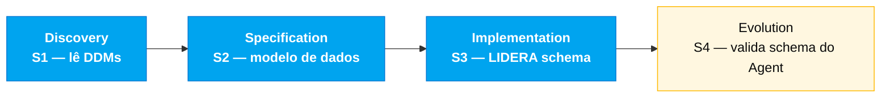

# Persona — DBA

## Onde você atua no SDLC

- **Par**: 4 · Qualidade (junto com QA Engineer)
- **Fases lideradas**: Implementation (S3) — schema + migrações
- **Recebe de**: Software Architect (bounded contexts) e Estágio 1 (4 DDMs)
- **Faz handoff para**: Developer (modelo pronto) e DevOps (provisioning do PostgreSQL)

## Quem é essa pessoa

Dono dos dados. No SIFAP legado isso significa entender os 4 DDMs Adabas com MU e PE, com desnormalização pragmática, com índices ancestrais. No SIFAP 2.0 significa desenhar um schema PostgreSQL 16 que preserva a integridade lógica do negócio sem herdar as cicatrizes do Adabas.

## Missão no workshop

Traduzir o modelo Adabas para um schema relacional que funciona. Garantir migrações idempotentes (Flyway). Desenhar índices e particionamento para o ciclo mensal caber em 2 horas. Proteger a rastreabilidade (audit store).

## Seu papel no framework Agentic Legacy Modernization

- **Agentes relevantes**: Analysis Agent (S1), Translation Agent (S3)
- **Fase do framework**: Assessment → Translation (camada de dados)
- **Seu papel**: traduzir DDMs Adabas → schema PostgreSQL preservando integridade

## Onde você aparece em cada estágio

| Estágio | Você faz isso | Entregável que depende de você |
|---------|---------------|---------------------------------|
| 1. Arqueologia | Lê os 4 DDMs. Mapeia MU/PE para entidades relacionais candidatas. Identifica campos-chave. | Mapa DDM → entidade relacional |
| 2. Spec Moderna | Desenha o modelo lógico de dados. Escreve o ADR de PostgreSQL (ADR 2 da referência). | Modelo de dados + ADR 002 |
| 3. Implementação | Escreve migrações Flyway. Define índices. Popula dados de teste. Responde dúvidas de JPA/Hibernate. | Schema PostgreSQL + seed |
| 4. Evolution com Agent | Revisa se o PR do Agent toca no schema com segurança (nova migração, não alteração retroativa). | Integridade do schema |

## Ferramentas e primitivas

- **Copilot Chat** para traduzir DDM Adabas → SQL PostgreSQL.
- **Copilot Edits** para gerar migrações em lote.
- **PostgreSQL MCP** (se disponível no devcontainer) para introspecção e queries.
- **Specky** — fase 4 consome seu modelo de dados.

## Cheat-sheets que você usa

- [`../cheat-sheets/specky-workflow.md`](../cheat-sheets/specky-workflow.md) — como declarar modelo de dados que o Specky valida na fase 4.
- [`../cheat-sheets/model-routing.md`](../cheat-sheets/model-routing.md) — Sonnet 4.6 é suficiente para a maior parte do seu trabalho.

## Como você se sai bem

- Todas as migrações são reversíveis ou substituídas por nova migração em vez de alteradas.
- Você descobre (e documenta) quais MUs do Adabas precisam virar tabela relacionada, não coluna `JSONB`.
- Seus índices cobrem as queries críticas do ciclo mensal.
- A audit store é verdadeiramente append-only — sem DELETE em lugar nenhum.

## Como você se perde

- Desnormaliza por hábito de Adabas.
- Esquece de indexar e a query do ciclo fica lenta.
- Usa `JSONB` para tudo porque "é flexível".
- Deixa migração não-idempotente e o devcontainer de um colega quebra.

## Se você pegou duas personas

- **DBA + Developer** é comum; você escreve suas migrações e algumas queries.
- **DBA + DevOps Engineer** se o time tem perfil mais ops — você cuida do PostgreSQL e do Terraform que o provisiona.

## 3 prompts de exemplo

1. **(Chat)** *"Leia o DDM BENEFICIARIO.ddm do Adabas e traduza para schema PostgreSQL 16. O grupo PE (periódico) de dependentes deve virar tabela separada ou JSONB? Justifique."*
2. **(Edits)** *"Crie uma migração Flyway V5__add_indexes.sql com índices para: busca por CPF, listagem de pagamentos por ciclo+status, auditoria por tipo+data."*
3. **(Chat)** *"Revise este schema e identifique: campos sem NOT NULL que deveriam ter, foreign keys faltantes e índices para o ciclo mensal de 3,8M pagamentos."*

## Se travar (defaults de emergência)

- Não conhece o formato DDM? Abra [`../../legacy/adabas-ddms/BENEFICIARIO.ddm`](../../legacy/adabas-ddms/BENEFICIARIO.ddm) — tem comentários explicando cada campo.
- Migração quebrou? NUNCA edite uma migração existente. Crie nova: `V5__fix_xxx.sql`.
- Qual índice criar? Regra: "Se aparece em WHERE ou JOIN e a tabela tem >100K linhas, crie índice."
- PostgreSQL offline? Verifique se o Docker está rodando: `docker ps | grep postgres`.

## Dependências — Quem depende de você

| Persona | Relação | Artefato |
|---------|---------|----------|
| Software Architect | VOCÊ depende dele | Fronteiras de contexto para o modelo |
| Developer | Depende de VOCÊ | Migrações prontas para código JPA |
| DevOps Engineer | Depende de VOCÊ | Schema estável para Terraform |
| QA Engineer | Depende de VOCÊ | Dados de teste (seed) |

## Como você é avaliado

- Rubrica A3 (Integridade Técnica): migrações idempotentes, schema consistente com entidades JPA
- Rubrica A1 (Arqueologia): mapa DDM → entidade relacional documentado
- Critério: "Audit store é append-only. Nenhum DELETE no schema de auditoria."

— Paula
