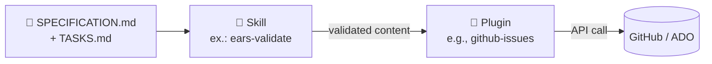

# Plugins Compartilhados

[← Kits de Persona](../persona-kits/) |
[🏠 Início do Kit](../) |
[Próximo: Guias Rápidos →](../cheat-sheets/)

## O que fica aqui

Plugins são extensões reutilizáveis do Copilot disponíveis para **todas as
personas em todas as equipes**, sem ficarem limitados a uma única função. Eles
preenchem a lacuna entre as skills por persona (conhecimento específico de
função) e as APIs das ferramentas subjacentes (GitHub, Azure DevOps etc.).

Pense neles assim:

- **Agent** = quem a IA representa.
- **Skill** = o que a IA sabe fazer em um domínio.
- **Prompt** = uma receita pré-escrita que a IA pode executar.
- **Plugin** = uma ponte para um sistema externo que a IA pode acionar.

Um plugin encapsula uma API externa com padrões opinativos para que uma persona
não precise aprender o SDK bruto a cada uso.

## Plugins disponíveis

| Plugin | Finalidade | Quando usar |
| --- | --- | --- |
| [github-issues](github-issues.plugin.md) | Criar/sincronizar issues | Converter `TASKS.md` em trabalho rastreado |
| [azure-boards](azure-boards.plugin.md) | Sincronizar itens SDD | Equipes ADO com hierarquia Epic/Feature/Story |

## Como plugins se relacionam com skills

Uma **skill** prepara o conteúdo (valida EARS, refina histórias). Um
**plugin** entrega o conteúdo ao sistema de destino (GitHub, ADO, Jira). Essa
separação mantém o conhecimento reutilizável e a entrega intercambiável.

## Modelo de segurança

Todos os plugins seguem estes pontos inegociáveis:

- **Credenciais somente por variáveis de ambiente**. Nunca inline.
- **`dry_run: true` por padrão**. Visualize antes de gravar.
- **Rastreabilidade por REQ-ID preservada** em todas as direções de sincronização.
- **Escopo mínimo somente leitura** sempre que possível; escopos de escrita
  justificados por ferramenta.

## Adicionando um novo plugin

1. Copie um dos arquivos de plugin existentes como template.
2. Mantenha a mesma estrutura de 5 seções: O quê / Quando / Ferramentas /
   Configuração / Segurança.
3. Liste todas as ferramentas expostas pelo plugin, com uma subseção por ferramenta.
4. Documente o método de autenticação e o escopo obrigatório.
5. Abra um PR referenciando o REQ-ID que motivou o plugin.

## Navegação

[← Kits de Persona](../persona-kits/) |
[🏠 Início do Kit](../) |
[Próximo: Guias Rápidos →](../cheat-sheets/)
